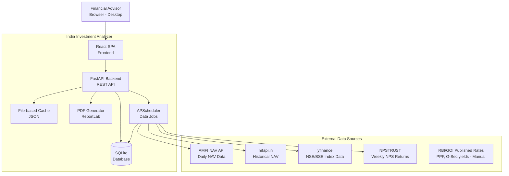
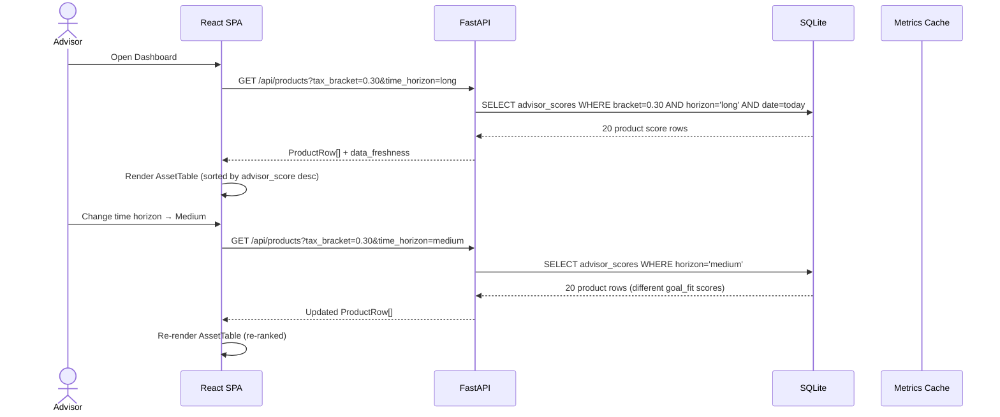
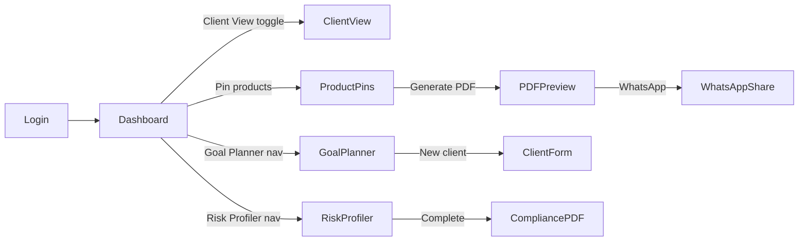

# Solution Design Document

## Validation Checklist

### CRITICAL GATES (Must Pass)

- [x] All required sections are complete
- [x] No [NEEDS CLARIFICATION] markers remain
- [x] Architecture pattern is clearly stated with rationale
- [x] All architecture decisions documented as ADRs
- [x] Every interface has specification

### QUALITY CHECKS (Should Pass)

- [x] Constraints → Strategy → Design path is logical
- [x] Every component has directory mapping
- [x] Error handling covers all error types
- [x] Quality requirements are specific and measurable
- [x] Component names consistent across diagrams
- [x] A developer could implement from this design
- [x] Complex queries include traced walkthroughs

---

## Constraints

**CON-1 Tech Stack:** Python (3.11+) backend required for financial calculation libraries (pandas, numpy, scipy). React + TypeScript frontend. Free/open-source libraries only for Phase 1.

**CON-2 Data Sources:** End-of-day data only. No real-time streaming. AMFI NAV API, mfapi.in, yfinance (NSE/BSE), NPSTRUST weekly snapshots, RBI/GOI published rate tables (PPF, G-Sec benchmark yields). No paid data vendor APIs in Phase 1.

**CON-3 Deployment:** Must deploy on a free/low-cost tier (Render, Railway, or VPS). SQLite acceptable for Phase 1 (single-user per advisor login). Target: < Rs 2,000/month infrastructure cost for initial advisors.

**CON-4 Compliance Boundary:** The platform produces research tools and document templates only. It is not itself a SEBI-registered entity. All generated documents must carry legal disclaimers. No personalized investment advice may be dispensed by the system.

**CON-5 Performance:** Dashboard must load in < 3 seconds. Score re-computation on filter change must complete in < 1 second (client-side where possible). PDF generation must complete in < 10 seconds.

**CON-6 Security:** All client data (names, risk profiles, goals) is sensitive personal financial information. Must be encrypted at rest and in transit. Advisor authentication required before any data access.

---

## Implementation Context

### Required Context Sources

#### External APIs
```yaml
- service: AMFI NAV API
  url: https://www.amfiindia.com/spages/NAVAll.txt
  relevance: HIGH
  why: Free daily NAV data for all ~2000 SEBI-registered mutual fund schemes. Pipe-delimited text format. Updated by 11 PM IST daily.

- service: mfapi.in
  url: https://www.mfapi.in/
  relevance: HIGH
  why: Free REST API wrapping AMFI data with historical NAV lookup by scheme code. Enables 5-10 year historical return calculations without AMFI scraping.

- service: yfinance (Python library)
  doc: https://pypi.org/project/yfinance/
  relevance: HIGH
  why: Free Yahoo Finance wrapper for NSE/BSE index historical data (^NSEI = Nifty 50, ^BSESN = Sensex, specific NSE stocks via .NS suffix). Used for equity and REIT index performance data.

- service: NPSTRUST Weekly Snapshot
  url: https://www.npstrust.org.in/content/performance-nps-scheme
  relevance: MEDIUM
  why: Weekly NPS fund returns by Pension Fund Manager and scheme. Scraped/downloaded weekly via scheduled job.

- service: Angel One SmartAPI
  url: https://smartapi.angelbroking.com/
  relevance: MEDIUM
  why: Free market data API (with Angel One account) for NSE/BSE live and historical equity prices. Fallback/supplement to yfinance. Requires API key from Angel One account.
```

### Implementation Boundaries

- **Must Build From Scratch:** Entire application — no existing codebase
- **Can Modify:** All code within the project boundary
- **Must Not Touch:** External API data format handling must be tolerant of upstream format changes (defensive parsing)

### External Interfaces

#### System Context Diagram



#### Interface Specifications

```yaml
# Inbound Interfaces
inbound:
  - name: "Advisor Web Interface"
    type: HTTPS
    format: REST JSON
    authentication: JWT (access token, 8-hour expiry; refresh token, 30-day)
    data_flow: "All advisor actions, queries, and mutations"

# Outbound Interfaces
outbound:
  - name: "AMFI NAV Feed"
    type: HTTPS
    format: Pipe-delimited text
    authentication: None (public)
    schedule: Daily at 11:30 PM IST
    criticality: HIGH

  - name: "mfapi.in Historical NAV"
    type: HTTPS REST
    format: JSON
    authentication: None (public)
    schedule: On-demand + nightly backfill
    criticality: HIGH

  - name: "yfinance NSE/BSE Data"
    type: HTTPS (Yahoo Finance)
    format: Python library (pandas DataFrame)
    authentication: None (public, rate-limited)
    schedule: Daily at 4:30 PM IST (after NSE close)
    criticality: HIGH

  - name: "NPSTRUST Returns"
    type: HTTPS (scrape/download)
    format: HTML table or PDF
    authentication: None (public)
    schedule: Weekly (Monday morning)
    criticality: MEDIUM

# Data Interfaces
data:
  - name: "Application Database"
    type: SQLite (Phase 1) / PostgreSQL (Phase 2)
    connection: SQLAlchemy ORM with connection pool
    data_flow: "All application state — advisor profiles, clients, goals, market data, computed metrics"

  - name: "Computed Metrics Cache"
    type: File-based JSON cache (disk)
    data_flow: "Pre-computed Advisor Scores, return time-series, risk metrics — invalidated on daily data refresh"

  - name: "PDF Output Storage"
    type: Local filesystem (Phase 1) / Object storage (Phase 2)
    data_flow: "Generated PDFs stored by advisor and client ID"
```

### Project Commands

```bash
# Install
pip install -r requirements.txt
cd frontend && npm install

# Development
python -m uvicorn app.main:app --reload --port 8000   # Backend
cd frontend && npm run dev                              # Frontend (port 5173)

# Database
python -m app.db.migrate                               # Run migrations
python -m app.db.seed                                  # Seed reference data (PPF rates, FD ranges, etc.)

# Data Jobs (manual trigger)
python -m app.jobs.ingest_amfi                         # Fetch today's AMFI NAV data
python -m app.jobs.compute_metrics                     # Compute returns and risk metrics for all products
python -m app.jobs.ingest_nps                          # Fetch NPS returns

# Tests
pytest tests/                                          # All tests
pytest tests/unit/                                     # Unit tests only
pytest tests/integration/                              # Integration tests

# Build
cd frontend && npm run build                           # Production React build
```

---

## Solution Strategy

- **Architecture Pattern:** Modular Monolith with a clear 4-layer separation: Data Ingestion → Analytics Engine → REST API → React SPA. Single deployable unit. No microservices overhead for Phase 1 team size.

- **Integration Approach:** All external data flows through a scheduled ingestion layer (APScheduler) that writes normalized data to SQLite. The FastAPI layer never calls external APIs during a user request — it only reads from the database and cache. This makes the UI fast and resilient to external API outages.

- **Key Technical Decisions:**
  - All financial calculations (CAGR, Sharpe, Sortino, score normalization) run in Python on the backend using pandas/numpy — not in the browser — for accuracy and testability
  - Advisor Scores are pre-computed nightly and cached; filter changes trigger lightweight re-ranking of cached scores in the browser, not full server-side recomputation (except on bracket change which must hit server for tax-adjusted numbers)
  - PDF generation uses ReportLab (pure Python, no headless browser dependency) for simplicity and portability
  - WhatsApp sharing uses the WhatsApp Web API link format (`https://wa.me/?text=...` with encoded file URL) — no WhatsApp Business API integration required in Phase 1

---

## Building Block View

### Components

```mermaid
graph TB
    subgraph "Frontend (React + TypeScript)"
        Dashboard[Dashboard Module<br/>Multi-asset table, filters, Advisor Score]
        PresentationMode[Presentation Mode<br/>Client view, PDF trigger]
        GoalPlanner[Goal Planner Module<br/>SIP calculator, allocation]
        RiskProfiler[Risk Profiler Module<br/>Questionnaire, compliance PDF]
        ScenarioPlanner[Scenario Planner<br/>What-if tools]
        AuthModule[Auth Module<br/>Login, JWT management]
        Charts[Charts Layer<br/>Recharts wrappers]
    end

    subgraph "Backend (FastAPI)"
        AuthService[Auth Service<br/>JWT, session]
        MarketDataAPI[Market Data API<br/>Products, returns, scores]
        TaxEngine[Tax Engine<br/>Post-tax calculation]
        ScoreEngine[Score Engine<br/>Composite scoring]
        GoalAPI[Goal API<br/>SIP, allocation logic]
        RiskProfileAPI[Risk Profile API<br/>Questionnaire, scoring]
        PDFService[PDF Service<br/>ReportLab generation]
        ClientAPI[Client API<br/>CRUD for advisor clients]
    end

    subgraph "Data Layer"
        IngestionJobs[Ingestion Jobs<br/>AMFI, yfinance, NPSTRUST]
        MetricsComputer[Metrics Computer<br/>CAGR, Sharpe, Sortino, max drawdown]
        DB[(SQLite Database)]
        MetricsCache[Metrics Cache<br/>JSON files]
        ReferenceData[Reference Data<br/>PPF, FD ranges, tax rules]
    end

    Dashboard --> MarketDataAPI
    Dashboard --> TaxEngine
    Dashboard --> ScoreEngine
    PresentationMode --> PDFService
    GoalPlanner --> GoalAPI
    RiskProfiler --> RiskProfileAPI
    RiskProfiler --> PDFService
    ScenarioPlanner --> GoalAPI

    MarketDataAPI --> DB
    MarketDataAPI --> MetricsCache
    TaxEngine --> ReferenceData
    ScoreEngine --> MetricsCache
    PDFService --> DB
    ClientAPI --> DB

    IngestionJobs --> DB
    MetricsComputer --> DB
    MetricsComputer --> MetricsCache
```



### Directory Map

```
investment/
├── backend/
│   ├── app/
│   │   ├── main.py                    # FastAPI app init, CORS, router registration
│   │   ├── config.py                  # Settings (env vars, DB path, cache path)
│   │   ├── auth/
│   │   │   ├── router.py              # POST /auth/login, POST /auth/refresh
│   │   │   ├── service.py             # JWT creation, validation, advisor lookup
│   │   │   └── models.py              # Advisor, Session ORM models
│   │   ├── market_data/
│   │   │   ├── router.py              # GET /products, GET /products/{id}/history
│   │   │   ├── service.py             # Product query logic, cache retrieval
│   │   │   └── models.py              # Product, NavHistory, AssetClass ORM models
│   │   ├── analytics/
│   │   │   ├── tax_engine.py          # TaxRule models; compute_post_tax_return()
│   │   │   ├── score_engine.py        # AdvisorScore computation, normalization
│   │   │   ├── returns.py             # CAGR, rolling returns, XIRR calculations
│   │   │   └── risk_metrics.py        # Sharpe, Sortino, max drawdown, std dev
│   │   ├── goals/
│   │   │   ├── router.py              # POST /goals, GET /goals/{id}/plan
│   │   │   ├── service.py             # SIP calculation, goal-fit scoring
│   │   │   └── models.py              # Goal, GoalAllocation ORM models
│   │   ├── risk_profiler/
│   │   │   ├── router.py              # POST /risk-profiles, GET /risk-profiles/{id}
│   │   │   ├── service.py             # Questionnaire scoring, category assignment
│   │   │   ├── questionnaire.py       # Question bank (15-20 questions), scoring weights
│   │   │   └── models.py              # RiskProfile, QuestionResponse ORM models
│   │   ├── clients/
│   │   │   ├── router.py              # CRUD /clients
│   │   │   ├── service.py             # Client management
│   │   │   └── models.py              # Client ORM model
│   │   ├── pdf/
│   │   │   ├── generator.py           # ReportLab PDF builder
│   │   │   ├── templates/
│   │   │   │   ├── client_report.py   # Client presentation PDF layout
│   │   │   │   └── compliance_pack.py # Risk profiling compliance PDF layout
│   │   │   └── router.py              # POST /pdf/client-report, POST /pdf/compliance-pack
│   │   ├── db/
│   │   │   ├── base.py                # SQLAlchemy Base, engine, session
│   │   │   ├── migrate.py             # Schema creation / Alembic wrapper
│   │   │   └── seed.py                # Reference data seeding (PPF rates, tax rules)
│   │   └── jobs/
│   │       ├── scheduler.py           # APScheduler setup, job registration
│   │       ├── ingest_amfi.py         # AMFI NAV daily ingestion
│   │       ├── ingest_mfapi.py        # mfapi.in historical NAV backfill
│   │       ├── ingest_equity.py       # yfinance NSE index data
│   │       ├── ingest_nps.py          # NPSTRUST weekly data
│   │       └── compute_metrics.py     # Nightly: CAGR, Sharpe, Sortino, scores
│   ├── tests/
│   │   ├── unit/
│   │   │   ├── test_tax_engine.py
│   │   │   ├── test_score_engine.py
│   │   │   ├── test_returns.py
│   │   │   └── test_risk_metrics.py
│   │   └── integration/
│   │       ├── test_dashboard_api.py
│   │       └── test_pdf_generation.py
│   └── requirements.txt
├── frontend/
│   ├── src/
│   │   ├── main.tsx
│   │   ├── App.tsx
│   │   ├── api/                       # Axios client, typed API wrappers
│   │   ├── components/
│   │   │   ├── Dashboard/
│   │   │   │   ├── AssetTable.tsx     # Sortable multi-asset ranking table
│   │   │   │   ├── FilterBar.tsx      # Tax bracket, time horizon, risk filter
│   │   │   │   ├── ScoreBreakdown.tsx # Side panel: 6 sub-scores
│   │   │   │   ├── RiskReturnPlot.tsx # Recharts scatter plot
│   │   │   │   └── DataFreshness.tsx  # Timestamp badges per data source
│   │   │   ├── Presentation/
│   │   │   │   ├── ClientView.tsx     # Jargon-free mode wrapper
│   │   │   │   ├── ProductPins.tsx    # Pinned products for PDF
│   │   │   │   └── ShareWhatsApp.tsx  # WhatsApp share button
│   │   │   ├── GoalPlanner/
│   │   │   │   ├── GoalForm.tsx
│   │   │   │   ├── SIPCalculator.tsx
│   │   │   │   ├── CorpusChart.tsx    # Recharts area chart
│   │   │   │   └── AllocationPie.tsx
│   │   │   ├── RiskProfiler/
│   │   │   │   ├── Questionnaire.tsx
│   │   │   │   ├── ScoreMeter.tsx     # SEBI riskometer visual
│   │   │   │   └── CompliancePack.tsx # Rationale entry + PDF trigger
│   │   │   ├── ScenarioPlanner/
│   │   │   │   ├── SIPModeler.tsx
│   │   │   │   ├── RateScenario.tsx
│   │   │   │   └── RetirementWithdrawal.tsx
│   │   │   └── common/
│   │   │       ├── SEBIDisclaimer.tsx
│   │   │       ├── DataBadge.tsx
│   │   │       └── Skeleton.tsx
│   │   ├── store/                     # Zustand state stores
│   │   │   ├── filterStore.ts         # Active filters (bracket, horizon, risk)
│   │   │   ├── dashboardStore.ts      # Fetched products + scores
│   │   │   └── clientStore.ts         # Active client context
│   │   └── utils/
│   │       ├── formatCurrency.ts      # Rs / lakh / crore formatting
│   │       ├── taxCalculator.ts       # Browser-side tax display helpers
│   │       └── riskLabel.ts           # SEBI risk level → plain language map
│   ├── package.json
│   └── vite.config.ts
├── data/
│   ├── reference/
│   │   ├── tax_rules.json             # India tax rules by asset class + effective date
│   │   ├── ppf_rates.json             # PPF rate history (quarterly)
│   │   ├── fd_rate_ranges.json        # Bank FD rate ranges by bank tier
│   │   └── stress_scenarios.json      # COVID 2020, 2008, 2022 drawdown data
│   └── cache/
│       └── metrics/                   # Pre-computed nightly metric JSONs
└── .start/specs/001-india-investment-analyzer/
```

### Interface Specifications

#### Data Storage Schema

```yaml
# Core Tables

Table: advisors
  id: TEXT PRIMARY KEY (UUID)
  email: TEXT UNIQUE NOT NULL
  password_hash: TEXT NOT NULL
  name: TEXT NOT NULL
  firm_name: TEXT
  logo_path: TEXT               # uploaded logo file path
  primary_color: TEXT           # hex color for PDF branding
  contact_phone: TEXT
  sebi_registration: TEXT       # RIA/MFD registration number (optional)
  created_at: TIMESTAMP
  updated_at: TIMESTAMP

Table: clients
  id: TEXT PRIMARY KEY (UUID)
  advisor_id: TEXT FOREIGN KEY(advisors.id)
  name: TEXT NOT NULL
  age: INTEGER
  tax_bracket: REAL             # 0.0, 0.05, 0.10, 0.20, 0.30
  risk_category: TEXT           # Conservative|ModeratelyConservative|Moderate|ModeratelyAggressive|Aggressive
  created_at: TIMESTAMP
  updated_at: TIMESTAMP

Table: asset_classes
  id: TEXT PRIMARY KEY           # e.g., 'equity_largecap', 'debt_liquid', 'gold_etf', 'ppf'
  name: TEXT NOT NULL
  category: TEXT NOT NULL        # Equity|Debt|Gold|Fixed|NPS|REIT|Bond|Crypto
  sub_category: TEXT             # e.g., 'Large Cap', 'Short Duration'
  sebi_risk_level: INTEGER       # 1=Low, 2=Low-Moderate, 3=Moderate, 4=Moderately High, 5=High, 6=Very High
  data_source: TEXT              # amfi|yfinance|npstrust|manual
  min_investment_inr: REAL
  typical_exit_load_days: INTEGER
  lock_in_days: INTEGER          # 0 if none; 5475 for PPF (15Y); -1 for NPS (until 60)
  expense_ratio_typical: REAL    # Annual %; 0 for PPF/FD/G-Sec
  is_crypto: BOOLEAN DEFAULT FALSE
  is_active: BOOLEAN DEFAULT TRUE

Table: mutual_funds
  scheme_code: TEXT PRIMARY KEY  # AMFI scheme code
  scheme_name: TEXT NOT NULL
  asset_class_id: TEXT FOREIGN KEY(asset_classes.id)
  amfi_category: TEXT            # SEBI scheme category (e.g., 'Large Cap Fund')
  amc_name: TEXT
  direct_plan: BOOLEAN
  expense_ratio: REAL
  fund_manager: TEXT
  aum_crore: REAL
  inception_date: DATE
  updated_at: TIMESTAMP

Table: nav_history
  scheme_code: TEXT FOREIGN KEY(mutual_funds.scheme_code)
  nav_date: DATE
  nav: REAL
  PRIMARY KEY (scheme_code, nav_date)

Table: index_history
  ticker: TEXT                   # e.g., '^NSEI', 'GOLD_INR'
  price_date: DATE
  close_price: REAL
  PRIMARY KEY (ticker, price_date)

Table: computed_metrics
  product_id: TEXT              # asset_class_id or scheme_code
  product_type: TEXT            # 'asset_class' | 'mutual_fund'
  computed_date: DATE
  cagr_1y: REAL
  cagr_3y: REAL
  cagr_5y: REAL
  cagr_10y: REAL
  std_dev_3y: REAL              # Annualized standard deviation
  sharpe_3y: REAL               # Risk-free rate: current G-sec 10Y yield
  sortino_3y: REAL
  max_drawdown_5y: REAL         # As negative decimal (e.g., -0.38)
  expense_ratio: REAL
  PRIMARY KEY (product_id, product_type, computed_date)

Table: advisor_scores
  product_id: TEXT
  product_type: TEXT
  tax_bracket: REAL             # 0.0 to 0.30
  time_horizon: TEXT            # 'short'|'medium'|'long'
  computed_date: DATE
  score_total: REAL             # 0-100
  score_risk_adjusted: REAL
  score_tax_yield: REAL
  score_liquidity: REAL
  score_expense: REAL
  score_consistency: REAL
  score_goal_fit: REAL
  post_tax_return_3y: REAL
  PRIMARY KEY (product_id, product_type, tax_bracket, time_horizon, computed_date)

Table: risk_profiles
  id: TEXT PRIMARY KEY (UUID)
  client_id: TEXT FOREIGN KEY(clients.id)
  advisor_id: TEXT FOREIGN KEY(advisors.id)
  completed_at: TIMESTAMP
  risk_score: REAL              # Raw numeric score
  risk_category: TEXT
  question_responses: TEXT      # JSON blob: [{question_id, answer, score}]
  advisor_rationale: TEXT       # Free-text suitability rationale
  compliance_pdf_path: TEXT
  acknowledged_at: TIMESTAMP    # When advisor confirmed the pack
  retention_until: DATE         # completed_at + 5 years

Table: goals
  id: TEXT PRIMARY KEY (UUID)
  client_id: TEXT FOREIGN KEY(clients.id)
  name: TEXT NOT NULL           # e.g., "Retirement", "Riya's MBA Fund"
  target_amount_inr: REAL
  target_date: DATE
  current_corpus_inr: REAL
  monthly_sip_inr: REAL
  annual_stepup_pct: REAL
  inflation_rate: REAL DEFAULT 0.06
  expected_return_rate: REAL
  created_at: TIMESTAMP

Table: tax_rules
  id: TEXT PRIMARY KEY
  asset_class_pattern: TEXT     # regex or exact match for asset_class_id
  holding_period_type: TEXT     # 'short'|'long'|'all'
  holding_period_months: INTEGER # Threshold for long-term (e.g., 12 for equity)
  tax_rate_expression: TEXT     # e.g., '0.125', 'slab_rate', '0.0'
  annual_exemption_inr: REAL    # e.g., 125000 for equity LTCG
  special_rule: TEXT            # e.g., 'sgb_maturity_tax_free', 'ppf_eee'
  effective_from: DATE
  effective_until: DATE         # NULL if currently applicable
  notes: TEXT
```

#### Internal API Changes

```yaml
# Authentication
POST /api/auth/login
  Request: { email: string, password: string }
  Response: { access_token: string, refresh_token: string, advisor: AdvisorProfile }
  Errors: 401 (invalid credentials)

POST /api/auth/refresh
  Request: { refresh_token: string }
  Response: { access_token: string }
  Errors: 401 (expired/invalid refresh token)

# Market Data & Scoring
GET /api/products
  Query: tax_bracket=0.30&time_horizon=long&risk_filter=all&sort_by=score_total&sort_dir=desc
  Response:
    products: [ProductRow]
    data_freshness: { amfi: ISO_datetime, equity: ISO_datetime, nps: ISO_datetime }
  ProductRow:
    id: string
    name: string
    asset_class: string
    category: string
    sebi_risk_level: 1-6
    sebi_risk_label: string       # "Low"|"Low to Moderate"|...|"Very High"
    cagr_1y: number | null
    cagr_3y: number | null
    cagr_5y: number | null
    cagr_10y: number | null
    post_tax_return_3y: number    # At requested tax bracket
    std_dev_3y: number | null
    sharpe_3y: number | null
    max_drawdown_5y: number | null
    expense_ratio: number
    min_investment_inr: number
    liquidity_label: string       # "Same Day"|"T+1"|"T+2-3"|"7-15 Days"|"Lock-in"
    advisor_score: number         # 0-100 at requested bracket+horizon
    score_breakdown: ScoreBreakdown
    data_available_since: ISO_date | null
    is_crypto: boolean
    crypto_disclaimer: string | null

GET /api/products/{product_id}/history
  Query: period=5y
  Response:
    returns_series: [{ date: ISO_date, value: number }]
    rolling_1y: [{ date: ISO_date, return: number }]
    rolling_3y: [{ date: ISO_date, return: number }]

# Tax Engine
POST /api/tax/compute
  Request:
    asset_class_id: string
    holding_period_years: number
    gross_return: number
    investment_amount_inr: number
    tax_bracket: number
  Response:
    post_tax_return: number
    tax_applied: string           # "LTCG 12.5%"|"Slab Rate 30%"|"Tax Free (EEE)"|...
    annual_exemption_used: number | null
    tax_rule_id: string
    tax_year: string              # "FY2025-26"

# Goals
POST /api/goals
  Request: { client_id, name, target_amount_inr, target_date, current_corpus_inr, monthly_sip_inr, annual_stepup_pct, inflation_rate }
  Response: Goal object

GET /api/goals/{goal_id}/plan
  Response:
    inflation_adjusted_target: number
    corpus_at_current_trajectory: number
    gap_amount: number
    required_sip: number
    recommended_allocation: [{ asset_class: string, pct: number, rationale: string }]
    goal_probability: number      # 0-1, based on historical return distribution
    nps_highlight: boolean        # True if long-term + tax bracket >= 20%
    corpus_projection: [{ year: number, conservative: number, base: number, optimistic: number }]

# Risk Profiler
GET /api/risk-profiler/questions
  Response: [{ id, text, options: [{ value, label, score }], category }]

POST /api/risk-profiles
  Request: { client_id, responses: [{ question_id, selected_value }], advisor_rationale: string }
  Response: { id, risk_score, risk_category, risk_description }

GET /api/risk-profiles/{id}/compliance-pdf
  Response: Binary PDF file
  Headers: Content-Disposition: attachment; filename="compliance_pack_{client}_{date}.pdf"

# PDF Generation
POST /api/pdf/client-report
  Request:
    client_id: string
    product_ids: string[]         # Max 5
    tax_bracket: number
    time_horizon: string
    include_sebi_disclaimer: true
  Response: Binary PDF file

POST /api/pdf/compliance-pack
  Request:
    risk_profile_id: string
  Response: Binary PDF file

# Clients
GET /api/clients                  # List advisor's clients
POST /api/clients                 # Create client
GET /api/clients/{id}
PATCH /api/clients/{id}
```

#### Application Data Models

```pseudocode
# Tax Engine — Core Logic

ENTITY: TaxRule
  FIELDS:
    asset_class_pattern: regex  # matches asset_class_id
    holding_period_type: 'short'|'long'|'all'
    holding_period_months: int  # threshold (12 for equity, 24 for gold/RE, 0 for debt)
    tax_rate: float | 'slab'    # fixed rate or income-slab rate
    annual_exemption_inr: float # 0 for most; 125000 for equity LTCG
    special_rule: Optional[str] # 'tax_free', 'eee', 'sgb_maturity_free'

  METHOD: compute_post_tax_return(gross_return, investment_amount, tax_bracket, holding_years)
    IF special_rule == 'eee' OR special_rule == 'tax_free':
      RETURN gross_return  # No tax
    IF special_rule == 'sgb_maturity_free' AND holding_years >= 8:
      RETURN gross_return + 0.025  # Gold return + 2.5% annual interest, tax-free
    IF tax_rate == 'slab':
      effective_rate = tax_bracket
    ELSE:
      effective_rate = tax_rate
    gain_amount = investment_amount * ((1 + gross_return) ** holding_years - 1)
    taxable_gain = MAX(0, gain_amount - annual_exemption_inr)
    tax_paid = taxable_gain * effective_rate
    net_amount = investment_amount + gain_amount - tax_paid
    RETURN (net_amount / investment_amount) ** (1 / holding_years) - 1

ENTITY: AdvisorScoreComponents
  FIELDS:
    raw_sharpe: float
    raw_sortino: float
    post_tax_return_3y: float
    liquidity_days: int          # effective lock-in in days
    expense_ratio: float
    return_std_dev_5y: float
    time_horizon: 'short'|'medium'|'long'
    sebi_risk_level: int

  METHOD: compute_score()
    # Each sub-score normalized to 0-100 relative to universe of products
    risk_adjusted = normalize(0.5 * sharpe_percentile + 0.5 * sortino_percentile)
    tax_yield = normalize(post_tax_return_percentile)
    liquidity = compute_liquidity_score(liquidity_days)  # inverse: 0 days → 100, lock-in → 10
    expense = normalize(1 - expense_ratio_percentile)    # lower cost → higher score
    consistency = normalize(1 - std_dev_percentile)      # lower variance → higher score
    goal_fit = compute_goal_fit(sebi_risk_level, time_horizon)

    RETURN (
      risk_adjusted * 0.30 +
      tax_yield * 0.25 +
      liquidity * 0.15 +
      expense * 0.10 +
      consistency * 0.10 +
      goal_fit * 0.10
    )

  METHOD: compute_liquidity_score(lock_in_days)
    IF lock_in_days == 0: RETURN 100          # Same-day liquid
    IF lock_in_days <= 1: RETURN 90           # T+1
    IF lock_in_days <= 3: RETURN 75           # T+2-3 (equity MFs)
    IF lock_in_days <= 365: RETURN 50         # < 1 year (ELSS, FD with penalty)
    IF lock_in_days == -1: RETURN 10          # NPS (until age 60)
    IF lock_in_days >= 5475: RETURN 20        # PPF (15Y)
    RETURN MAX(10, 70 - (lock_in_days / 365) * 10)

  METHOD: compute_goal_fit(sebi_risk_level, time_horizon)
    # Alignment matrix
    IF time_horizon == 'short':
      IF sebi_risk_level <= 2: RETURN 100
      IF sebi_risk_level == 3: RETURN 70
      IF sebi_risk_level >= 4: RETURN 30
    IF time_horizon == 'medium':
      IF sebi_risk_level <= 2: RETURN 60
      IF sebi_risk_level in [3,4]: RETURN 100
      IF sebi_risk_level >= 5: RETURN 50
    IF time_horizon == 'long':
      IF sebi_risk_level <= 2: RETURN 40
      IF sebi_risk_level == 3: RETURN 70
      IF sebi_risk_level >= 4: RETURN 100
```

### Implementation Examples

#### Example: Tax-Adjusted Return Computation for SGB vs Gold ETF

**Why this example:** SGB's tax-free maturity is the single most impactful tax rule in Indian investing and must be computed correctly to differentiate from Gold ETFs. The comparison is non-obvious and critical to advisor credibility.

```python
# In: app/analytics/tax_engine.py
# Scenario: Client in 30% tax bracket comparing SGB vs Gold ETF over 8 years
# Gold appreciation: 12% CAGR; SGB also earns 2.5% annual interest

def compute_sgb_post_tax_return(
    holding_years: float,
    gold_cagr: float,  # e.g., 0.12
    tax_bracket: float,  # e.g., 0.30
    investment_inr: float = 100_000
) -> dict:
    """
    SGB special rules:
    - If held to 8-year maturity by resident: ALL gains (gold appreciation + 2.5% interest) are FULLY tax-free
    - If exited early (secondary market, after 5Y): LTCG at 12.5%, no exemption
    """
    if holding_years >= 8:
        # Tax-free at maturity — no LTCG, no tax on interest
        gross_return = (1 + gold_cagr) ** 8 * (1 + 0.025) ** 8  # Approximate
        # Net = gross (tax_rate = 0%)
        effective_cagr = (gross_return) ** (1/8) - 1
        return {"post_tax_cagr": effective_cagr, "rule": "sgb_maturity_tax_free", "effective_tax_rate": 0.0}
    else:
        # Secondary market exit: LTCG at 12.5% (holding > 3Y assumed)
        gain = investment_inr * ((1 + gold_cagr) ** holding_years - 1)
        tax = gain * 0.125  # 12.5% LTCG, no exemption threshold
        net = investment_inr + gain - tax
        effective_cagr = (net / investment_inr) ** (1 / holding_years) - 1
        return {"post_tax_cagr": effective_cagr, "rule": "ltcg_12.5pct", "effective_tax_rate": 0.125}


def compute_gold_etf_post_tax_return(
    holding_years: float,
    gold_cagr: float,
    tax_bracket: float,
    investment_inr: float = 100_000
) -> dict:
    """
    Gold ETF: LTCG at 12.5% if held > 12 months. No annual exemption threshold.
    No additional interest income (unlike SGB).
    """
    if holding_years >= 1:
        gain = investment_inr * ((1 + gold_cagr) ** holding_years - 1)
        tax = gain * 0.125  # 12.5% LTCG
        net = investment_inr + gain - tax
        effective_cagr = (net / investment_inr) ** (1 / holding_years) - 1
        return {"post_tax_cagr": effective_cagr, "rule": "ltcg_12.5pct"}
    else:
        gain = investment_inr * ((1 + gold_cagr) ** holding_years - 1)
        tax = gain * tax_bracket  # STCG at slab rate
        net = investment_inr + gain - tax
        effective_cagr = (net / investment_inr) ** (1 / holding_years) - 1
        return {"post_tax_cagr": effective_cagr, "rule": "stcg_slab"}

# Traced walkthrough for 30% bracket, 8-year hold, 12% gold CAGR, Rs 1 lakh investment:
#
# SGB:
#   gross_corpus = 1,00,000 * 1.12^8 * 1.025^8 ≈ 1,00,000 * 2.476 * 1.218 ≈ 3,01,564
#   tax = 0  (tax-free at maturity)
#   net_corpus = 3,01,564
#   post_tax_cagr = (3.01564)^(1/8) - 1 ≈ 14.8%
#
# Gold ETF (same 12% CAGR, 8Y hold):
#   gross_corpus = 1,00,000 * 1.12^8 ≈ 2,47,596
#   gain = 1,47,596
#   tax = 1,47,596 * 0.125 = 18,450
#   net_corpus = 2,47,596 - 18,450 = 2,29,146
#   post_tax_cagr = (2.29146)^(1/8) - 1 ≈ 10.9%
#
# Advisor talking point: "For an 8-year hold, SGB delivers ~14.8% post-tax vs Gold ETF ~10.9%
# — a 3.9% gap entirely due to tax treatment, not gold performance."
```

#### Example: Composite Score Normalization

**Why this example:** The percentile-based normalization is non-obvious. If implemented incorrectly, scores will be biased toward a particular asset class. The normalization universe (all products vs same-category peers) is a critical design choice.

```python
# In: app/analytics/score_engine.py
import numpy as np
from scipy import stats

def normalize_to_percentile(value: float, universe: list[float]) -> float:
    """
    Convert a raw metric value to a 0-100 score representing its percentile rank
    within the universe of all active products.

    Universe = ALL asset classes in the dashboard (not just same-category peers).
    This is intentional: it allows FDs and equity to compete on the same scale.
    """
    if len(universe) <= 1 or value is None:
        return 50.0  # Default to median if insufficient data
    # scipy.stats.percentileofscore gives 0-100 rank
    percentile = stats.percentileofscore(universe, value, kind='rank')
    return round(percentile, 1)

def compute_sharpe_ratio(returns_series: list[float], risk_free_rate: float = 0.068) -> float:
    """
    risk_free_rate: current 10Y G-sec yield (default 6.8%; updated from RBI data)
    returns_series: list of annual returns (e.g., [0.12, -0.05, 0.18, 0.08, 0.15])
    """
    if len(returns_series) < 3:
        return None
    excess_returns = [r - risk_free_rate for r in returns_series]
    if np.std(excess_returns) == 0:
        return None
    return np.mean(excess_returns) / np.std(excess_returns)

# Traced walkthrough for score computation:
# Universe of 20 products; FD has Sharpe=None (no volatility data → assigned 0)
# Sharpe values in universe: [None, 0.3, 0.45, 0.8, 1.1, 0.6, 0.2, ...]
# → after filtering None and assigning 0: [0, 0.3, 0.45, 0.8, 1.1, 0.6, 0.2, 0.9, ...]
# Large-cap equity fund with Sharpe=0.8: percentileofscore([0,0.2,0.3,...,1.1], 0.8) → ~72nd percentile → score=72
# Liquid fund with Sharpe=0 (no volatility): score=10th percentile → ~10
# This is correct: liquid funds should not score high on risk-adjusted return
```

#### Example: AMFI NAV Ingestion

**Why this example:** AMFI's pipe-delimited format has irregular line structure that can trip up naive CSV parsers. A developer unfamiliar with AMFI data will waste time on this.

```python
# In: app/jobs/ingest_amfi.py
# AMFI NAV format: https://www.amfiindia.com/spages/NAVAll.txt
# Format example:
#   Scheme Code;ISIN Div Payout/ ISIN Growth;ISIN Div Reinvestment;Scheme Name;Net Asset Value;Date
#   119551;INF209KA12Z1;INF209KA13Z9;Aditya Birla Sun Life Liquid Fund -Direct Plan-Growth;324.5432;04-Mar-2026
# Irregular: scheme type headers like "Open Ended Schemes(Debt Scheme - Liquid Fund)" appear between data rows

import requests
import csv
from io import StringIO
from datetime import date

AMFI_URL = "https://www.amfiindia.com/spages/NAVAll.txt"

def parse_amfi_nav(raw_text: str) -> list[dict]:
    """
    Parse AMFI's pipe-delimited NAV file. Skip header/category rows.
    Returns list of {scheme_code, scheme_name, nav, nav_date} dicts.
    """
    records = []
    for line in raw_text.strip().splitlines():
        parts = line.split(";")
        if len(parts) != 6:
            continue  # Skip header rows and category labels
        scheme_code, isin_div, isin_growth, scheme_name, nav_str, date_str = parts
        if not scheme_code.strip().isdigit():
            continue  # Skip non-data rows
        try:
            nav = float(nav_str.strip())
            nav_date = datetime.strptime(date_str.strip(), "%d-%b-%Y").date()
            records.append({
                "scheme_code": scheme_code.strip(),
                "scheme_name": scheme_name.strip(),
                "nav": nav,
                "nav_date": nav_date
            })
        except (ValueError, IndexError):
            continue  # Malformed row; skip gracefully
    return records
```

---

## Runtime View

### Primary Flow: Dashboard Load with Tax-Adjusted Scores

1. Advisor opens dashboard with default filters (tax_bracket=0.30, time_horizon=long, sort=advisor_score)
2. React SPA sends `GET /api/products?tax_bracket=0.30&time_horizon=long`
3. FastAPI reads pre-computed `advisor_scores` rows from DB for `(tax_bracket=0.30, time_horizon=long, computed_date=today)`
4. If today's scores not found (e.g., data not yet refreshed): falls back to yesterday's scores; returns `data_freshness` with stale flag
5. Products serialized as `ProductRow` list, returned to frontend
6. React renders `AssetTable` with scores; `FilterBar` shows active context; `DataFreshness` shows timestamps
7. Advisor changes time horizon to "medium" → React dispatches store action → `GET /api/products?tax_bracket=0.30&time_horizon=medium` → repeat from step 3



### Secondary Flow: PDF Generation

```mermaid
sequenceDiagram
    actor Advisor
    participant SPA as React SPA
    participant API as FastAPI
    participant PDF as PDF Service

    Advisor->>SPA: Select 3 products + click "Generate Client PDF"
    SPA->>API: POST /api/pdf/client-report {client_id, product_ids:[...], tax_bracket:0.30}
    API->>API: Fetch product data from DB
    API->>API: Load advisor branding (logo, firm name, color)
    API->>PDF: build_client_report(products, client, advisor_branding)
    PDF->>PDF: Compose ReportLab PDF (table + charts + SEBI disclaimer)
    PDF-->>API: PDF bytes
    API-->>SPA: Binary PDF response (Content-Type: application/pdf)
    SPA->>SPA: Create blob URL; open in new tab / trigger download
    Advisor->>SPA: Click "Share via WhatsApp"
    SPA->>SPA: Open wa.me URL with encoded PDF download link
```

### Error Handling

| Error Scenario | Backend Response | Frontend Behavior |
|---|---|---|
| AMFI API down during scheduled job | Log failure; retain yesterday's data; set `data_freshness.amfi` to yesterday | Banner: "MF data as of [yesterday's date]. Refresh pending." |
| Requested tax bracket not in pre-computed scores | Compute on-the-fly for that bracket (slower path); return result with `computed_realtime: true` | Loading spinner; no timeout |
| Invalid/unrecognized scheme code in product_ids for PDF | Return 400 with `{error: "PRODUCT_NOT_FOUND", ids: [...]}` | Toast error: "One or more selected products not found" |
| PDF generation timeout (> 15s) | Return 503 | Toast: "PDF generation took too long. Try with fewer products." |
| JWT expired during session | Return 401 | SPA auto-refreshes token using refresh_token; retries original request once |
| mfapi.in rate limit (HTTP 429) | Backoff 60s and retry; log warning | No user impact if historical data already exists |

### Complex Logic: Nightly Metrics Computation

```
ALGORITHM: compute_metrics (runs at 11:45 PM IST daily after AMFI data ingested)
INPUT: nav_history table (all schemes, all dates), index_history table
OUTPUT: computed_metrics table, advisor_scores table

FOR EACH product IN all_active_products:
  1. FETCH nav/price series for past 10Y from nav_history or index_history
  2. COMPUTE annual returns: resample to annual, compute year-over-year returns
  3. COMPUTE:
     - cagr_1y = (nav_today / nav_1y_ago)^(1/1) - 1
     - cagr_3y = (nav_today / nav_3y_ago)^(1/3) - 1
     - cagr_5y = (nav_today / nav_5y_ago)^(1/5) - 1
     - cagr_10y = (nav_today / nav_10y_ago)^(1/10) - 1 (NULL if history < 10Y)
     - std_dev_3y = annualized_std(daily_returns_3y)
     - sharpe_3y = (cagr_3y - risk_free_rate) / std_dev_3y
     - sortino_3y = (cagr_3y - risk_free_rate) / downside_std_3y
     - max_drawdown_5y = min((rolling_price / rolling_peak) - 1) over 5Y
  4. UPSERT INTO computed_metrics

FOR EACH tax_bracket IN [0.0, 0.05, 0.10, 0.20, 0.30]:
  FOR EACH time_horizon IN ['short', 'medium', 'long']:
    COLLECT universe = [all products' sharpe_3y, post_tax_return_3y, ...]
    FOR EACH product:
      5. COMPUTE post_tax_return_3y using TaxRule for this product + bracket + 3Y holding
      6. COMPUTE 6 sub-scores using percentile normalization against universe
      7. COMPUTE advisor_score = weighted_sum(6 sub-scores)
      8. UPSERT INTO advisor_scores

PERFORMANCE NOTE: ~2000 MF schemes + ~20 index products = ~2020 products
  × 5 tax brackets × 3 horizons = 30,300 score rows to compute
  Estimated time with pandas vectorization: ~30-60 seconds. Acceptable for nightly batch.
```

---

## Deployment View

### Single Application Deployment

- **Environment:** Single server (VPS or Render/Railway cloud). FastAPI serves the REST API; Vite-built React SPA served as static files by FastAPI via `StaticFiles` mount (no separate web server needed in Phase 1).
- **Configuration:**
  ```
  DATABASE_URL=sqlite:///./data/investment_analyzer.db
  CACHE_DIR=./data/cache/
  PDF_OUTPUT_DIR=./data/pdfs/
  REFERENCE_DATA_DIR=./data/reference/
  JWT_SECRET_KEY=<random 32-byte secret>
  JWT_ACCESS_EXPIRE_MINUTES=480
  JWT_REFRESH_EXPIRE_DAYS=30
  RISK_FREE_RATE=0.068          # 10Y G-sec yield, updated manually when RBI changes
  ANGEL_ONE_API_KEY=<optional>  # Fallback equity data source
  LOG_LEVEL=INFO
  ```
- **Dependencies:** Python 3.11+, Node.js 20+ (build only), SQLite (bundled with Python).
- **Performance:** APScheduler runs inside the FastAPI process for Phase 1 (no separate worker). Computed metrics cached in JSON files for sub-100ms score reads. Target: < 3s dashboard load, < 10s PDF generation.
- **Backup:** SQLite DB backed up to a second file daily. PDFs are re-generatable from DB data.

---

## Cross-Cutting Concepts

### Pattern Documentation

```yaml
- pattern: Repository Pattern
  relevance: HIGH
  why: "All DB access goes through service classes, not direct ORM calls in routers. Enables easy testing with mock repositories."

- pattern: Scheduled Background Jobs (APScheduler)
  relevance: HIGH
  why: "All external API calls happen in background jobs, never during user requests. Keeps UI responsive."

- pattern: Pre-computed Scores with Invalidation
  relevance: HIGH
  why: "Advisor Scores are expensive to compute (cross-product normalization). Pre-compute nightly; invalidate when tax rules change."

- pattern: Dual-Mode UI (Advisor Mode / Client View)
  relevance: HIGH
  why: "Same data, different presentation contract. Client View is a React context that suppresses advisor-only components."
```

### User Interface & UX

**Information Architecture:**
- **Navigation:** Top nav with 5 items: Dashboard, Goal Planner, Risk Profiler, Scenario Tools, Clients. No sidebar — full-width content area for data density.
- **Content Organization:** Dashboard is the home screen. Filter bar always visible at top. Table scrolls vertically; columns fixed horizontally. Score Breakdown slides in from right (not modal — advisor can compare while it's open).

**Design System:**
- **Components:** Shadcn/ui component library (Radix primitives + Tailwind CSS) — professional, accessible, no-opinion on colors
- **Color Palette:** Advisor-configurable accent color; default: deep blue (#1E3A5F). SEBI risk levels use standardized colors: Green (Low) → Yellow (Moderate) → Orange (High) → Red (Very High)
- **Typography:** Inter for data; system font for body text

**Interaction Design:**
- **Filter changes:** Optimistic update — table re-sorts immediately from cached scores in Zustand store; API call runs in background for tax-adjusted values
- **Score Breakdown panel:** Slide-in from right, dismissible with Escape key; never blocks table
- **Client View toggle:** Prominent toggle in top-right labeled "Client View" with camera icon; background changes to lighter shade to indicate mode change
- **Loading states:** Skeleton rows for initial load; no spinner for re-sorts (instant from cache)

**ASCII Wireframe — Dashboard:**
```
┌──────────────────────────────────────────────────────────────────┐
│  India Investment Analyzer                      [Client View 📊] │
├──────────────────────────────────────────────────────────────────┤
│  Tax Bracket: [30% ▾]  Horizon: [Long (7Y+) ▾]  Risk: [All ▾]  │
│  ⚠️ Post-tax returns shown — FY2025-26 tax rules                 │
├──────────────────────────────────────────────────────────────────┤
│  📌 Pin  ASSET CLASS            RISK  1Y   3Y   5Y  POST-TAX  SCORE │
│  [ ] 📊 Large-Cap Equity MF    ●●●●○ 14%  15%  16%   13.1%   82  │
│  [ ] 📊 Flexi-Cap Equity MF    ●●●●○ 13%  14%  18%   12.5%   79  │
│  [ ] 🥇 Sovereign Gold Bond    ●●●○○  ..   ..  13%   14.8%   77  │  ← SGB scores high post-tax
│  [ ] 🏢 REIT (India avg.)      ●●●○○  ..  11%   ..   9.6%    71  │
│  [ ] 📈 Mid-Cap Equity MF      ●●●●● 18%  22%  24%   19.2%   68  │
│  [ ] 🏦 Corporate Bond Fund    ●●●○○  8%   7%   7%    4.9%   55  │
│  [ ] 💰 NPS - Equity (Tier 1)  ●●●●○  ..  12%  13%   12.0%   54  │ ← Lock-in penalty on score
│  [ ] 🔒 PPF                    ●○○○○  7%   7%   7%    7.1%   48  │ ← Tax-free but low return
│  [ ] 🏦 Bank FD (major bank)   ●○○○○  7%   7%   7%    4.9%   42  │
│  ...                                                              │
├──────────────────────────────────────────────────────────────────┤
│  Data: MFs as of 04-Mar-26 · Equity as of 04-Mar-26 · NPS 03-Mar-26 │
└──────────────────────────────────────────────────────────────────┘
```

**Screen Flow:**


### System-Wide Patterns

- **Security:** JWT auth on all `/api/*` routes except `/api/auth/login`. All client data scoped to `advisor_id` — no cross-advisor data leakage possible. Passwords hashed with bcrypt. HTTPS only in production. No client PII in PDF filenames.
- **Error Handling:** All FastAPI exceptions return `{error: CODE, message: string, details: object}`. Frontend uses Axios interceptors to handle 401 (token refresh) and 503 (stale data fallback) globally.
- **Performance:** Pre-computed nightly scores for all bracket/horizon combinations. Browser-side sort/filter on cached product list for instant response. Charts use `canvas` not SVG for large time-series datasets.
- **Logging:** Structured JSON logging via Python `structlog`. Log fields: `timestamp, level, advisor_id, endpoint, duration_ms, error`. No PII (client names) in logs.
- **India-Specific:** All currency formatted as Rs / Lakh / Crore (not USD or M/B). Dates in DD-Mon-YYYY format. SEBI disclaimers injected at component mount, not conditionally.

---

## Architecture Decisions

- [x] **ADR-1: Modular Monolith over Microservices**
  - Choice: Single deployable Python FastAPI application with clear internal module boundaries
  - Rationale: Single-developer Phase 1; low operational complexity; financial calculations benefit from in-process communication (no serialization overhead for analytics pipelines)
  - Trade-offs: Harder to scale individual components independently; acceptable for advisory tool with < 500 concurrent users
  - Confirmed: Yes (recommended default)

- [x] **ADR-2: SQLite for Phase 1 Database**
  - Choice: SQLite with SQLAlchemy ORM; PostgreSQL-compatible schema via Alembic migrations
  - Rationale: Zero-infrastructure, zero-cost; sufficient for single-advisor accounts; Alembic ensures migration path to PostgreSQL for Phase 2 multi-tenant
  - Trade-offs: No concurrent write support; not suitable for > 5 simultaneous advisor sessions; acceptable for Phase 1
  - Confirmed: Yes

- [x] **ADR-3: Pre-Computed Nightly Advisor Scores**
  - Choice: Compute all 30,300 product×bracket×horizon score combinations nightly; store in DB; serve from cache during day
  - Rationale: Score normalization requires the full product universe — cannot be computed incrementally per request without assembling all products. Pre-computation makes dashboard load < 1s.
  - Trade-offs: Scores are up to 24 hours stale; new products added during the day won't appear until next computation. Acceptable — daily data is the cadence.
  - Confirmed: Yes

- [x] **ADR-4: ReportLab for PDF Generation**
  - Choice: ReportLab (pure Python) over WeasyPrint (HTML→PDF) or headless Chrome (Puppeteer)
  - Rationale: No browser dependency; deterministic layout; good Python library support; smaller Docker image if containerized. Tradeoff: programmatic layout is more verbose than HTML templates.
  - Trade-offs: Less flexible visual design than CSS-based PDF; charts must be embedded as images (generate with matplotlib, embed in ReportLab). Acceptable for structured advisor reports.
  - Confirmed: Yes

- [x] **ADR-5: WhatsApp Sharing via Web Share / wa.me URL**
  - Choice: WhatsApp Deep Link (`https://wa.me/?text=...`) with PDF served as a download URL, not native WhatsApp Business API
  - Rationale: No WhatsApp API approval, fees, or business verification required. The advisor shares PDFs from their personal WhatsApp — the same channel they already use.
  - Trade-offs: Requires the PDF to have a public (or advisor-accessible) URL. In Phase 1: PDF download endpoint behind JWT; advisor copies the link or the platform opens WhatsApp with a pre-filled message and the PDF auto-downloads first.
  - Confirmed: Yes

- [x] **ADR-6: Tax Rules as Data (JSON), Not Code**
  - Choice: India tax rules stored in `data/reference/tax_rules.json` with effective dates, not hardcoded in Python
  - Rationale: Budget changes happen annually; tax rule updates should require JSON edits, not code deploys. The `effective_from` and `effective_until` fields allow the engine to apply the correct rules for any historical period.
  - Trade-offs: More complex loading logic; JSON format must be validated on startup. Acceptable: simple JSON schema validation.
  - Confirmed: Yes

- [x] **ADR-7: React + Zustand (no Redux)**
  - Choice: React 18 + TypeScript + Zustand for state management + Recharts for data visualization + Shadcn/ui for components
  - Rationale: Zustand is simpler than Redux for this scale; Recharts is React-native and sufficient for line/bar/scatter charts; Shadcn/ui provides accessible, unstyled components the advisor can theme.
  - Trade-offs: Zustand lacks Redux DevTools ecosystem depth; acceptable for a data-heavy but UI-simple application.
  - Confirmed: Yes

---

## Quality Requirements

- **Performance:** Dashboard initial load < 3 seconds (including product list and scores). Score re-sort on filter change < 500ms (client-side). PDF generation < 10 seconds. Nightly computation job < 5 minutes.
- **Usability:** Dashboard usable without training by any financial advisor with basic computer literacy. Client View contains zero financial jargon. All charts have data labels. WhatsApp share accessible in ≤ 2 clicks from PDF preview.
- **Security:** All API endpoints require valid JWT. Advisor data isolated by `advisor_id` foreign key — no route allows cross-advisor data access. PDFs stored in per-advisor directories. No client PII stored in logs.
- **Reliability:** Stale data (AMFI API down) surfaced to user within 5 minutes of detection. Risk profiling compliance packs never silently fail — if PDF generation fails, user sees explicit error and is prompted to retry. No data loss on process restart (SQLite persists to disk).
- **Data Accuracy:** Tax calculations validated against known scenarios in unit tests (FD post-tax at 30%, SGB maturity tax-free, equity LTCG with exemption). Any discrepancy between computed returns and AMFI-published returns > 0.5% triggers a data quality alert in the logs.

---

## Acceptance Criteria

**Dashboard Loading:**
- [ ] WHEN the advisor opens the dashboard, THE SYSTEM SHALL return a ranked product list within 3 seconds with pre-computed advisor scores
- [ ] THE SYSTEM SHALL display a data freshness timestamp for each data source category (MF NAVs, equity index, NPS)
- [ ] WHEN data is more than 48 hours old for any source, THE SYSTEM SHALL display a prominent staleness warning

**Tax Overlay:**
- [ ] WHEN the advisor sets tax bracket to 30%, THE SYSTEM SHALL compute SGB (8Y maturity hold) post-tax return as equal to gross return (0% effective tax)
- [ ] WHEN the advisor sets tax bracket to 30%, THE SYSTEM SHALL compute Debt MF post-tax return using the slab rate (30%), not LTCG rate
- [ ] THE SYSTEM SHALL display the active tax year (e.g., "FY2025-26") alongside all post-tax return figures

**Score Engine:**
- [ ] WHEN any product has fewer than 3 years of history, THE SYSTEM SHALL display "N/A" for its Consistency Score sub-component and flag with a data badge
- [ ] WHEN the advisor changes the time horizon filter, THE SYSTEM SHALL recalculate goal-fit sub-scores and re-rank the product list without requiring page refresh

**PDF Generation:**
- [ ] WHEN the advisor generates a client PDF, THE SYSTEM SHALL include the SEBI disclaimer text exactly: "Investment in securities market are subject to market risks. Read all the related documents carefully before investing."
- [ ] WHEN the advisor generates a client PDF, THE SYSTEM SHALL NOT include Sharpe ratios, Sortino ratios, or numerical sub-scores in the client-facing output
- [ ] THE SYSTEM SHALL complete PDF generation within 10 seconds for up to 5 selected products

**Compliance Pack:**
- [ ] WHEN a compliance pack PDF is generated, THE SYSTEM SHALL store it with a `retention_until` date set to 5 years from generation date
- [ ] WHEN an advisor searches for a client's compliance pack by name, THE SYSTEM SHALL return all packs within 2 seconds

**Goal Planner:**
- [ ] WHEN a goal's time horizon is ≥ 15 years and the advisor's active tax bracket is ≥ 20%, THE SYSTEM SHALL highlight NPS Tier 1 with the note about Section 80CCD(1B) additional deduction
- [ ] WHEN the advisor adjusts the Annual Step-Up % field, THE SYSTEM SHALL update the projected corpus chart within 500ms (client-side calculation)

---

## Risks and Technical Debt

### Known Technical Issues

- **AMFI text format fragility:** AMFI's pipe-delimited format has no formal schema. Category header rows appear interspersed without consistent markers. The parser must be robust to line variations. Mitigation: extensive parsing tests with sample AMFI data fixtures.
- **yfinance rate limiting:** Yahoo Finance rate-limits high-frequency requests. Historical data for 2000+ funds is not available via yfinance (only index/ETF data). mfapi.in covers MF historical NAV; yfinance covers index only.
- **NPSTRUST data format:** NPSTRUST publishes returns in PDF or HTML tables that may change format without notice. Mitigation: weekly scrape with output validation; fallback to manually entered NPS returns if scraping fails.

### Technical Debt

- **Single-user SQLite:** The SQLite choice means no concurrent writes. Phase 2 must migrate to PostgreSQL before onboarding multiple advisors to the same server. Alembic migrations are designed with this in mind.
- **APScheduler in-process:** Running scheduled jobs inside the FastAPI process means a crashed/restarted server during job execution may leave metrics partially computed. Phase 2 should move to Celery + Redis for robust job management.
- **ReportLab chart embedding:** Charts in PDFs are rendered server-side via matplotlib, saved as PNG, embedded in ReportLab. This works but is slower than client-side chart rendering. Phase 2 could generate PDFs from client-rendered HTML using Puppeteer.

### Implementation Gotchas

- **Annual LTCG exemption (Rs 1.25L):** The exemption applies per investor per year across ALL equity LTCG transactions. The platform cannot know how much of the exemption a client has already used against other transactions. Default assumption: the platform computes "if all gains in this product are the only gains this year." Advisors must be warned that actual post-tax returns may differ.
- **Debt MF taxation since April 2023:** ALL debt mutual funds (including overnight, liquid, gilt) are taxed at slab rate regardless of holding period since April 1, 2023. The `tax_rules.json` must have an `effective_from: 2023-04-01` entry for all debt MF patterns. Liquid funds should not be shown as "tax-efficient" options for long holding periods.
- **NPS age dependency:** NPS lock-in is until age 60, not a fixed number of years. The liquidity score for NPS should consider the advisor's client age (from the client profile). A 30-year-old gets score 5 (30-year lock-in); a 55-year-old gets score 60 (5-year lock-in). The `GET /api/products` endpoint should accept optional `client_age` parameter to enable age-adjusted NPS liquidity scoring.
- **SGB discontinuation:** The Government of India stopped issuing new SGB series in FY2023-24. Existing SGBs trade on NSE/BSE secondary market with thin liquidity. The platform should show SGBs as a "No new issuance" product with a note that secondary market liquidity is limited, but maturity returns (for existing holders) remain tax-free.

---

## Glossary

### Domain Terms

| Term | Definition | Context |
|------|------------|---------|
| IFA | Independent Financial Advisor — typically AMFI-registered MFDs operating independently | Primary user persona |
| MFD | Mutual Fund Distributor — AMFI-registered; earns trail commissions; not a fiduciary | Primary user persona |
| RIA | Registered Investment Adviser — SEBI-registered; fee-only; fiduciary obligation | Secondary user persona |
| AMFI | Association of Mutual Funds in India — industry body; publishes daily NAVs and fund data | Data source |
| NAV | Net Asset Value — per-unit price of a mutual fund scheme | Core data entity |
| CAGR | Compound Annual Growth Rate — the annualized return over a multi-year period | Key metric displayed |
| LTCG | Long-Term Capital Gains — gains from assets held beyond the long-term threshold (varies: 12M for equity, 24M for gold/real estate) | Tax calculation input |
| STCG | Short-Term Capital Gains — gains from assets held below the long-term threshold; taxed at slab rate or higher fixed rate | Tax calculation input |
| EEE | Exempt-Exempt-Exempt — tax status where investment, interest, and maturity proceeds are all tax-free (PPF) | Tax rule variant |
| SGB | Sovereign Gold Bond — Government of India bond denominated in grams of gold; pays 2.5% annual interest; tax-free at 8-year maturity | Asset class |
| SEBI Riskometer | 6-level graphical risk classification system mandated by SEBI for all mutual fund schemes | Risk display component |
| SIP | Systematic Investment Plan — regular fixed-amount investments (typically monthly) into a mutual fund scheme | Goal planner feature |
| Step-Up SIP | SIP where the monthly amount increases by a fixed percentage annually | Goal planner feature |
| Sharpe Ratio | (Portfolio Return − Risk-Free Rate) / Portfolio Standard Deviation — measures return per unit of total risk | Score sub-component |
| Sortino Ratio | Like Sharpe but divides by downside deviation only — penalizes only bad volatility | Score sub-component |
| NPS | National Pension System — PFRDA-regulated retirement account; lock-in until age 60; 60% lump sum tax-free | Asset class |
| REIT | Real Estate Investment Trust — SEBI-regulated listed vehicle for real estate income; mandatory 90% distribution | Asset class |
| G-Sec | Government Securities — bonds issued by Government of India; sovereign guarantee | Asset class |

### Technical Terms

| Term | Definition | Context |
|------|------------|---------|
| APScheduler | Advanced Python Scheduler — library for in-process job scheduling | Nightly ingestion/computation |
| ReportLab | Python library for programmatic PDF generation | PDF service |
| Recharts | React charting library built on D3 — used for all frontend visualizations | Frontend charts |
| Shadcn/ui | Unstyled, accessible React component library built on Radix UI + Tailwind | Frontend UI components |
| Zustand | Lightweight React state management library | Frontend store |
| SQLAlchemy | Python ORM for database access | Backend data layer |
| Alembic | Database migration tool for SQLAlchemy | Schema versioning |
| Percentile Normalization | Converting a raw metric to its rank within the universe (0–100 percentile) | Score engine |
| mfapi.in | Free Indian mutual fund historical NAV REST API | Data source |
| yfinance | Python library wrapping Yahoo Finance for historical price data | Data source |
