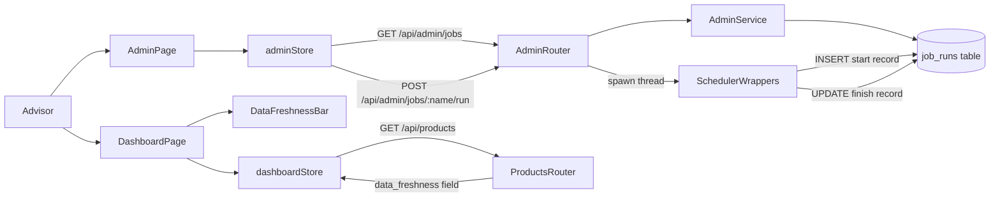
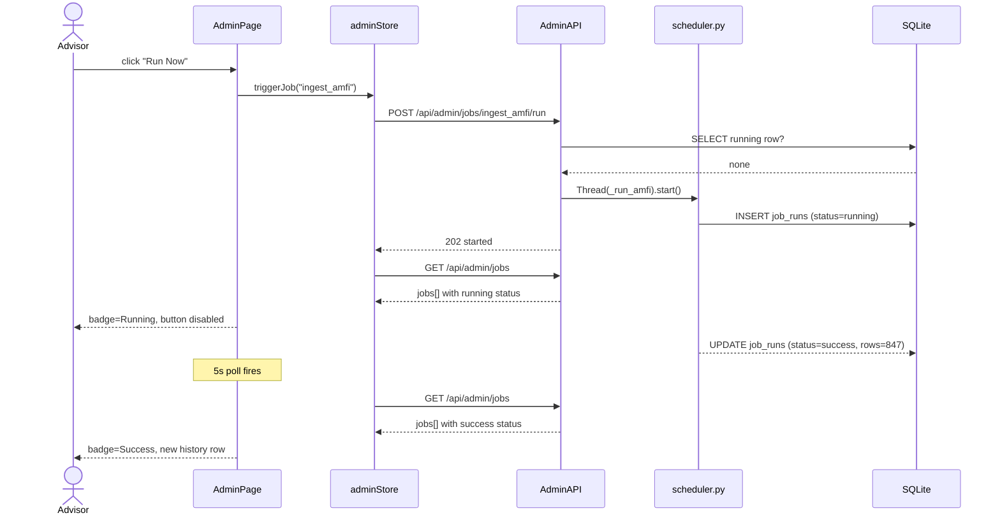
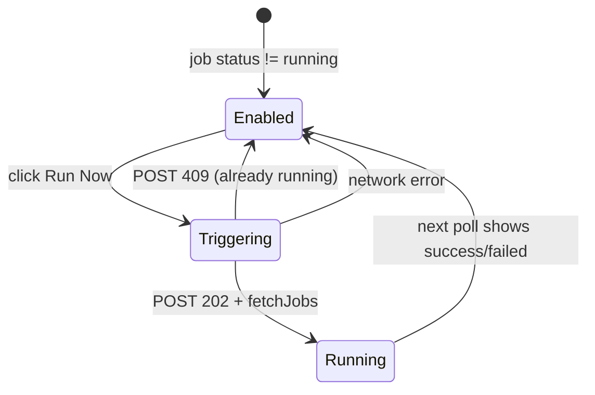

# Solution Design Document

## Validation Checklist

### CRITICAL GATES (Must Pass)

- [x] All required sections are complete
- [x] No [NEEDS CLARIFICATION] markers remain
- [x] Architecture pattern is clearly stated with rationale
- [x] **All architecture decisions confirmed by user**
- [x] Every interface has specification

### QUALITY CHECKS (Should Pass)

- [x] All context sources are listed with relevance ratings
- [x] Project commands are discovered from actual project files
- [x] Constraints → Strategy → Design → Implementation path is logical
- [x] Every component in diagram has directory mapping
- [x] Error handling covers all error types
- [x] Quality requirements are specific and measurable
- [x] Component names consistent across diagrams
- [x] A developer could implement from this design
- [x] Implementation examples use actual schema column names (not pseudocode), verified against migration files
- [x] Complex queries include traced walkthroughs with example data showing how the logic evaluates

---

## Constraints

CON-1 **Stack is fixed.** Backend: FastAPI + SQLite + SQLAlchemy 2.0 (Mapped[] ORM) + APScheduler + JWT auth. Frontend: React 18 + Zustand 5 + TailwindCSS + React Router v7. No new runtime dependencies unless strictly necessary.

CON-2 **Single-file SQLite database.** All data lives in `backend/data/investment_analyzer.db`. No external DB, no Redis, no message queue.

CON-3 **JWT auth is the only access control.** The `/admin` page requires a valid JWT (same `get_current_advisor` dependency used by all other protected routes). No separate admin role.

CON-4 **Job execution is synchronous and fast.** All 6 jobs complete in under 2 minutes. The manual trigger spawns a `threading.Thread` — no async task queue (Celery, RQ, etc.) is needed or permitted.

CON-5 **DataFreshness component exists and must be reused.** `frontend/src/components/Dashboard/DataFreshness.tsx` is functionally correct. Wire it up; do not rewrite it.

CON-6 **Alembic manages schema.** Any new table requires a new migration file in `backend/alembic/versions/`.

---

## Implementation Context

### Required Context Sources

#### Code Context

```yaml
- file: backend/app/jobs/scheduler.py
  relevance: HIGH
  why: "6 _run_*() wrappers to be modified to record job history"

- file: backend/app/db/base.py
  relevance: HIGH
  why: "SessionLocal and Base — new model and session usage pattern"

- file: backend/app/main.py
  relevance: HIGH
  why: "FastAPI app + lifespan; new admin router registered here"

- file: backend/app/auth/dependencies.py
  relevance: HIGH
  why: "get_current_advisor dependency — all admin routes use this"

- file: backend/app/market_data/router.py
  relevance: HIGH
  why: "Canonical router pattern: prefix, tags, Depends(get_db), Depends(get_current_advisor)"

- file: backend/app/market_data/models.py
  relevance: HIGH
  why: "Canonical Mapped[] model pattern to follow for JobRun model"

- file: backend/alembic/versions/0001_initial_schema.py
  relevance: HIGH
  why: "Existing migration — new 0002 migration must follow same structure"

- file: frontend/src/App.tsx
  relevance: HIGH
  why: "AppNav and route definitions — new /admin route added here"

- file: frontend/src/store/dashboardStore.ts
  relevance: HIGH
  why: "Already fetches dataFreshness — DataFreshnessBar wired in here"

- file: frontend/src/components/Dashboard/DataFreshness.tsx
  relevance: HIGH
  why: "Existing component to be wired up, not rewritten"

- file: frontend/src/store/goalStore.ts
  relevance: MEDIUM
  why: "Canonical Zustand store pattern with apiClient calls"

- file: backend/requirements.txt
  relevance: MEDIUM
  why: "No new dependencies should be added"
```

### Implementation Boundaries

- **Must Preserve:** All existing routes, auth flow, JWT behavior, APScheduler cron triggers, existing job `run()` functions (no modifications inside individual job files)
- **Can Modify:** `scheduler.py` (wrap `_run_*()` functions), `App.tsx` (add route + wire DataFreshness), `dashboardStore.ts` (surface `dataFreshness` to component), `main.py` (register admin router)
- **Must Not Touch:** Individual job files (`ingest_amfi.py`, `ingest_equity.py`, etc.), auth logic, existing migrations

### External Interfaces

#### System Context Diagram

```mermaid
graph TB
    Advisor[Advisor Browser] -->|HTTPS REST + JWT| FastAPI[FastAPI Backend]
    FastAPI --> SQLite[(SQLite DB)]
    FastAPI --> APScheduler[APScheduler]
    APScheduler -->|fires _run_*()| JobWrappers[Job Wrappers in scheduler.py]
    JobWrappers --> SQLite
    Advisor -->|direct URL /admin| FastAPI
```

#### Interface Specifications

```yaml
inbound:
  - name: "Admin Page"
    type: HTTP
    format: REST JSON
    authentication: JWT Bearer
    data_flow: "GET /api/admin/jobs → job cards; POST /api/admin/jobs/{name}/run → trigger"

  - name: "Dashboard Freshness"
    type: HTTP
    format: REST JSON
    authentication: JWT Bearer
    data_flow: "Already embedded in GET /api/products response as data_freshness field"

data:
  - name: "SQLite job_runs table"
    type: SQLite
    connection: SessionLocal (SQLAlchemy)
    data_flow: "Write on every job start/finish; read for history API"
```

### Project Commands

```bash
# Backend
Install:  cd backend && pip install -r requirements.txt
Dev:      cd backend && uvicorn app.main:app --reload
Test:     cd backend && pytest
Migrate:  cd backend && alembic upgrade head

# Frontend
Install:  cd frontend && npm install
Dev:      cd frontend && npm run dev
Test:     cd frontend && npm test
Build:    cd frontend && npm run build
Typecheck: cd frontend && npm run typecheck
```

---

## Solution Strategy

- **Architecture Pattern:** Vertical slice. One new backend module (`app/admin/`) provides the data model, service layer, and router. One new frontend page (`AdminPage`) with a new Zustand store (`adminStore`). The DataFreshness component is wired into the existing dashboard page with zero new API calls (the `data_freshness` field is already returned by `GET /api/products`).

- **Integration Approach:**
  - Backend: `scheduler.py` wrappers gain try/finally blocks that write `job_runs` records. A new `app/admin/` module owns the model, the service (queries), and the FastAPI router. The router is registered in `main.py`.
  - Frontend: A new `/admin` React route is added in `App.tsx` (protected, not in NAV_LINKS). A new `adminStore.ts` handles fetching and triggering. `dashboardStore.ts` already exposes `dataFreshness` — the `DataFreshnessBar` component is simply imported into `DashboardPage`.

- **Justification:** Keeps all tracking logic in one file (scheduler.py), avoids touching individual job implementations, reuses every existing pattern (Mapped[], router template, Zustand store template), and adds no new dependencies.

- **Key Decisions:** See ADR-1 through ADR-4 in the Architecture Decisions section.

---

## Building Block View

### Components



### Directory Map

**Component: backend**

```
backend/
├── alembic/
│   └── versions/
│       ├── 0001_initial_schema.py           # existing
│       └── 0002_add_job_runs.py             # NEW: job_runs table migration
├── app/
│   ├── admin/                               # NEW module
│   │   ├── __init__.py                      # NEW
│   │   ├── models.py                        # NEW: JobRun SQLAlchemy model
│   │   ├── service.py                       # NEW: query + trigger logic
│   │   └── router.py                        # NEW: GET /api/admin/jobs, POST run
│   ├── jobs/
│   │   └── scheduler.py                     # MODIFY: wrap _run_*() with tracking
│   └── main.py                              # MODIFY: register admin router
```

**Component: frontend**

```
frontend/src/
├── App.tsx                                  # MODIFY: add /admin route, wire DataFreshnessBar
├── store/
│   └── adminStore.ts                        # NEW: fetch jobs, trigger run
├── components/
│   ├── Dashboard/
│   │   └── DataFreshness.tsx                # existing (no changes needed)
│   └── Admin/
│       ├── JobCard.tsx                      # NEW: one card per job
│       └── RunHistoryTable.tsx              # NEW: last-10-runs table inside each card
```

### Interface Specifications

#### Data Storage Changes

```yaml
Table: job_runs (NEW)
  id:            INTEGER, PRIMARY KEY AUTOINCREMENT
  job_name:      TEXT NOT NULL              # e.g. "ingest_amfi"
  started_at:    DATETIME NOT NULL
  finished_at:   DATETIME NULL              # NULL while running
  status:        TEXT NOT NULL              # "running" | "success" | "failed"
  rows_affected: INTEGER NULL               # populated on success
  error_msg:     TEXT NULL                  # populated on failure

  INDEX: idx_job_runs_job_name_started (job_name, started_at DESC)
  # Supports: SELECT last 10 per job; SELECT running rows for concurrency check
```

**Schema reference:** Verified against `backend/alembic/versions/0001_initial_schema.py`. The `job_runs` table does not exist in 0001 — it will be created in `0002_add_job_runs.py`.

#### Internal API Changes

```yaml
Endpoint: List job history
  Method: GET
  Path: /api/admin/jobs
  Auth: JWT Bearer (get_current_advisor)
  Response (200):
    jobs: array of JobSummary
      job_name: string          # "ingest_amfi"
      latest_status: string     # "success" | "failed" | "running" | "never_run"
      latest_started_at: string | null   # ISO 8601
      latest_duration_seconds: float | null
      runs: array of RunRow     # last 10, most recent first
        id: integer
        started_at: string
        finished_at: string | null
        status: string
        duration_seconds: float | null
        rows_affected: integer | null
        error_msg: string | null

Endpoint: Trigger job run
  Method: POST
  Path: /api/admin/jobs/{job_name}/run
  Auth: JWT Bearer (get_current_advisor)
  Path Param: job_name — one of the 6 known job names
  Response (202): { "status": "started", "job_name": "ingest_amfi" }
  Response (409): { "detail": "Job already running" }
  Response (404): { "detail": "Unknown job" }
```

#### Application Data Models

```pseudocode
ENTITY: JobRun (NEW — backend/app/admin/models.py)
  FIELDS:
    id:            Mapped[int]          # primary key, autoincrement
    job_name:      Mapped[str]          # NOT NULL
    started_at:    Mapped[datetime]     # NOT NULL
    finished_at:   Mapped[datetime | None]
    status:        Mapped[str]          # "running" | "success" | "failed"
    rows_affected: Mapped[int | None]
    error_msg:     Mapped[str | None]

ENTITY: AdminJobSummary (frontend TypeScript — adminStore.ts)
  FIELDS:
    job_name:                string
    latest_status:           "success" | "failed" | "running" | "never_run"
    latest_started_at:       string | null
    latest_duration_seconds: number | null
    runs:                    RunRow[]

ENTITY: RunRow (frontend TypeScript — adminStore.ts)
  FIELDS:
    id:               number
    started_at:       string
    finished_at:      string | null
    status:           "success" | "failed" | "running"
    duration_seconds: number | null
    rows_affected:    number | null
    error_msg:        string | null
```

#### Integration Points

```yaml
- from: scheduler.py _run_*() wrappers
  to: job_runs table
  protocol: SQLAlchemy SessionLocal (direct write)
  data_flow: "INSERT on start; UPDATE status/finished_at/rows_affected/error_msg on finish"

- from: admin router POST /run
  to: scheduler.py _run_*() wrappers
  protocol: threading.Thread (in-process)
  data_flow: "Spawn thread running same _run_*() wrapper as scheduler uses"

- from: adminStore.ts
  to: GET /api/admin/jobs
  protocol: HTTP REST (axios apiClient)
  data_flow: "Fetch full job history every 5s (when any job running) or 30s (otherwise)"

- from: DashboardPage
  to: dashboardStore.dataFreshness
  protocol: Zustand state (already populated by fetchProducts)
  data_flow: "Pass dataFreshness prop to DataFreshnessBar — no new API call"
```

### Implementation Examples

#### Example: scheduler.py tracking wrapper pattern

**Why this example:** The wrapping logic must handle three outcomes (success with row count, failure, crash) and ensure `finished_at` is always written even if the job throws. The session must be closed after each write to avoid lock contention with the scheduler's own thread.

```python
# backend/app/jobs/scheduler.py — modified _run_amfi() as template

def _run_amfi():
    from app.jobs.ingest_amfi import run
    from app.admin.service import record_start, record_finish
    run_id = record_start("ingest_amfi")
    try:
        rows = run()                           # run() returns int (rows affected)
        record_finish(run_id, "success", rows_affected=rows)
    except Exception as e:
        record_finish(run_id, "failed", error_msg=str(e))
        raise                                  # re-raise so APScheduler logs it

# backend/app/admin/service.py

def record_start(job_name: str) -> int:
    with SessionLocal() as db:
        run = JobRun(job_name=job_name, started_at=datetime.utcnow(), status="running")
        db.add(run)
        db.commit()
        db.refresh(run)
        return run.id

def record_finish(run_id: int, status: str, *, rows_affected=None, error_msg=None):
    with SessionLocal() as db:
        run = db.get(JobRun, run_id)
        if run:
            run.finished_at = datetime.utcnow()
            run.status = status
            run.rows_affected = rows_affected
            run.error_msg = error_msg
            db.commit()
        _prune(db, run.job_name)              # keep last 100 per job

def _prune(db, job_name: str):
    # Delete records beyond the 100 most recent for this job
    subq = (
        db.query(JobRun.id)
        .filter(JobRun.job_name == job_name)
        .order_by(JobRun.started_at.desc())
        .limit(100)
        .subquery()
    )
    db.query(JobRun).filter(
        JobRun.job_name == job_name,
        ~JobRun.id.in_(subq)
    ).delete(synchronize_session=False)
    db.commit()
```

**Note on `run()` return values:** Each job's `run()` currently returns `None`. The wrappers will need each `run()` to return an `int` (rows affected) or `0`. The individual job files require a small return-value change — this is the only modification to job files.

#### Example: Concurrency guard in trigger endpoint

**Why this example:** The check-then-insert must be atomic enough for SQLite. Since APScheduler uses a thread pool (not async), and our trigger also uses a thread, we need to check for a `running` record before spawning.

```python
# backend/app/admin/router.py

@router.post("/jobs/{job_name}/run", status_code=202)
def trigger_job(
    job_name: str,
    db: Session = Depends(get_db),
    _advisor_id: str = Depends(get_current_advisor),
):
    if job_name not in JOB_REGISTRY:
        raise HTTPException(404, detail="Unknown job")

    existing = db.query(JobRun).filter(
        JobRun.job_name == job_name,
        JobRun.status == "running"
    ).first()
    if existing:
        raise HTTPException(409, detail="Job already running")

    import threading
    fn = JOB_REGISTRY[job_name]          # e.g. _run_amfi from scheduler.py
    threading.Thread(target=fn, daemon=True).start()
    return {"status": "started", "job_name": job_name}

# JOB_REGISTRY maps job_name strings → _run_*() wrapper functions
JOB_REGISTRY = {
    "ingest_amfi": _run_amfi,
    "ingest_equity": _run_equity,
    "ingest_nps": _run_nps,
    "ingest_mfapi": _run_mfapi_backfill,
    "compute_metrics": _run_compute_metrics,
    "compute_scores": _run_compute_scores,
}
```

**Traced concurrency walkthrough:**

| Scenario | DB state before trigger | Check result | Action |
|---|---|---|---|
| Scheduler not running, advisor clicks Run Now | No `running` row for `ingest_amfi` | `existing = None` | Spawn thread → 202 |
| Scheduler fired `ingest_amfi` 10s ago, advisor clicks Run Now | One row: `status='running'` | `existing` is set | Return 409 — no second thread |
| Previous run failed cleanly | Row with `status='failed'` | `existing = None` (filter is `status='running'`) | Spawn thread → 202 |
| Previous run crashed without `record_finish` | Row with `status='running'`, no `finished_at` | `existing` is set | Returns 409 (stale lock — acceptable for single-user app) |

#### Example: Adaptive polling in adminStore

**Why this example:** The interval must be recalculated on every response so it reacts dynamically to job state changes without unmounting/remounting the interval.

```typescript
// frontend/src/store/adminStore.ts

interface AdminState {
  jobs: AdminJobSummary[]
  isLoading: boolean
  fetchJobs: () => Promise<void>
  triggerJob: (jobName: string) => Promise<void>
}

export const useAdminStore = create<AdminState>((set) => ({
  jobs: [],
  isLoading: false,
  fetchJobs: async () => {
    set({ isLoading: true })
    try {
      const { data } = await apiClient.get('/admin/jobs')
      set({ jobs: data.jobs, isLoading: false })
    } catch {
      set({ isLoading: false })
    }
  },
  triggerJob: async (jobName) => {
    await apiClient.post(`/admin/jobs/${jobName}/run`)
    // Immediately re-fetch so "Running" badge appears
    const { data } = await apiClient.get('/admin/jobs')
    set({ jobs: data.jobs })
  },
}))

// In AdminPage component:
useEffect(() => {
  fetchJobs()
  const hasRunning = jobs.some((j) => j.latest_status === 'running')
  const interval = hasRunning ? 5_000 : 30_000
  const id = setInterval(fetchJobs, interval)
  return () => clearInterval(id)
}, [jobs])          // re-create interval when jobs changes (state transition)
```

---

## Runtime View

### Primary Flow: Advisor triggers a failed job

1. Advisor opens `/admin` → `AdminPage` mounts → `fetchJobs()` called → renders 6 `JobCard` components.
2. Advisor sees `ingest_amfi` card with `status=failed`, clicks "Run Now".
3. `triggerJob("ingest_amfi")` calls `POST /api/admin/jobs/ingest_amfi/run`.
4. Router checks `job_runs` for a `running` row — none found → spawns daemon thread running `_run_amfi()`.
5. `_run_amfi()` calls `record_start("ingest_amfi")` → inserts row with `status="running"`.
6. Router returns `202 { "status": "started" }` → `triggerJob` immediately calls `fetchJobs()`.
7. `JobCard` re-renders: badge shows "Running", "Run Now" button disabled.
8. Polling interval switches to 5 seconds.
9. Job finishes → `record_finish(run_id, "success", rows_affected=847)`.
10. Next 5-second poll fetches updated history → badge switches to "Success", new row appears at top of `RunHistoryTable`.
11. Polling reverts to 30-second interval.



### Secondary Flow: Dashboard freshness bar

1. Advisor opens `/dashboard` → `DashboardPage` mounts → `fetchProducts()` called.
2. `GET /api/products` response includes `data_freshness: { amfi, equity, nps }` timestamps.
3. `dashboardStore` sets `dataFreshness`.
4. `DashboardPage` passes `dataFreshness` prop to `DataFreshnessBar`.
5. `DataFreshnessBar` renders: each source shows date; sources older than 48h show red ⚠ stale.

### Error Handling

| Error | Backend behaviour | Frontend behaviour |
|---|---|---|
| Job already running | 409 `{ "detail": "Job already running" }` | Toast/error message; button re-enables |
| Unknown job name | 404 `{ "detail": "Unknown job" }` | Error message shown |
| Job throws during execution | `record_finish(run_id, "failed", error_msg=...)` | Next poll shows Failed badge + error in history |
| Network error during poll | — | Last known state preserved; polling continues silently |
| GET /api/admin/jobs fails | 500 from FastAPI | isLoading=false; shows empty state or last known data |
| `record_start` DB write fails | Exception propagates; job does not run | Next poll: no new running row visible |

---

## Deployment View

No change to existing deployment configuration. This feature:
- Adds one SQLite table (via Alembic migration — run `alembic upgrade head` before first use)
- Adds one new FastAPI router mounted under `/api/admin`
- Adds one new React route at `/admin`

**Migration required before deploy:**

```bash
cd backend && alembic upgrade head
```

**No new environment variables, no new external services, no infrastructure changes.**

---

## Cross-Cutting Concepts

### User Interface & UX

**Information Architecture:**

- `/admin` is accessible by direct URL only — NOT added to `NAV_LINKS` in `App.tsx`
- Uses same `AppNav` component as all other pages (title: "System Health", sign-out button present)
- One card per job — 6 cards in a responsive grid

**ASCII wireframe — /admin page:**

```
┌─────────────────────────────────────────────────────────────────┐
│  India Investment Analyzer  Dashboard  Goals  Risk  Scenarios   │
├─────────────────────────────────────────────────────────────────┤
│  System Health                                                  │
│                                                                 │
│  ┌──────────────────────┐  ┌──────────────────────┐            │
│  │ ingest_amfi          │  │ ingest_equity        │            │
│  │ ● Success            │  │ ✗ Failed             │            │
│  │ Last run: 23:30 today│  │ Last run: 16:30 yest │            │
│  │ Duration: 12s        │  │ Duration: 45s        │            │
│  │ [Run Now]            │  │ [Run Now]            │            │
│  │ ▼ Last 10 runs       │  │ ▼ Last 10 runs       │            │
│  │  23:30 Success 12s   │  │  16:30 Failed 45s    │            │
│  │  23:30 Success 11s   │  │  Error: yfinance...  │            │
│  └──────────────────────┘  └──────────────────────┘            │
│  ... (4 more cards)                                             │
└─────────────────────────────────────────────────────────────────┘
```

**ASCII wireframe — Dashboard freshness bar (new addition to existing page):**

```
┌─────────────────────────────────────────────────────────────────┐
│  India Investment Analyzer  Dashboard  Goals  Risk  Scenarios   │
├─────────────────────────────────────────────────────────────────┤
│  [Client View] [Advisor View]         AMFI: 08 Mar ⚠ stale     │
│                                       Equity: 07 Mar            │
│                                       NPS: 03 Mar ⚠ stale      │
├─────────────────────────────────────────────────────────────────┤
│  Filter Bar ...                                                 │
```

**Component States — Run Now button:**



### System-Wide Patterns

- **Security:** All `/api/admin/*` routes protected by `get_current_advisor` (JWT Bearer). No new auth mechanism.
- **Error Handling:** Backend raises HTTP exceptions with specific status codes (404, 409, 500). Frontend adminStore catches errors silently and preserves last known state during polling.
- **Logging:** `scheduler.py` wrappers use structlog (existing pattern). `record_start/record_finish` service functions do not add extra log calls — APScheduler already logs job events.
- **Pruning:** `_prune()` runs after every `record_finish`. Keeps last 100 rows per job. SQLite table stays bounded at ≤600 rows total across 6 jobs.

---

## Architecture Decisions

- [x] **ADR-1 — Job tracking placement: Wrap in scheduler.py**
  - Choice: Modify the 6 existing `_run_*()` wrapper functions in `scheduler.py` to call `record_start` / `record_finish`. Zero changes to individual job module files.
  - Rationale: All tracking logic in one file. Individual job `run()` functions stay pure. Scheduler and manual trigger use the same wrapper → history is uniform.
  - Trade-offs: Each job's `run()` must return an int (rows affected) instead of `None` — small change to 6 return statements.
  - User confirmed: **Yes**

- [x] **ADR-2 — Concurrency guard: DB status check**
  - Choice: Before spawning a trigger thread, query `job_runs` for a `status='running'` row for that job. If found, return 409.
  - Rationale: Survives server restarts. Consistent with the state already persisted in the DB. No in-memory shared state needed.
  - Trade-offs: If a job crashes without calling `record_finish`, the row stays in `running` state permanently (stale lock). Acceptable for single-user app — advisor can diagnose via history table.
  - User confirmed: **Yes**

- [x] **ADR-3 — Frontend polling: Adaptive interval**
  - Choice: Poll `GET /api/admin/jobs` every 5 seconds when any job has `status='running'`; every 30 seconds otherwise.
  - Rationale: Matches PRD specification exactly. No new dependencies. Simple to implement and debug.
  - Trade-offs: 5s polling while a job runs is light load (SQLite query on a small table). Does not work if browser tab is closed — acceptable per PRD ("advisor closes browser mid-run → job continues, result recorded").
  - User confirmed: **Yes**

- [x] **ADR-4 — History pruning: Prune on write**
  - Choice: After every `record_finish`, delete rows for that job beyond the 100 most recent.
  - Rationale: Table stays bounded with zero background jobs or scheduled cleanup. Fires at the exact right moment — after new data arrives.
  - Trade-offs: `record_finish` does two DB operations (UPDATE + DELETE subquery). Negligible for SQLite at this scale.
  - User confirmed: **Yes**

---

## Quality Requirements

- **Performance:** `GET /api/admin/jobs` must respond in under 200ms. Query reads at most 600 rows (6 jobs × 100 max rows) with an index on `(job_name, started_at DESC)`.
- **Reliability:** `record_finish` is called inside a `finally` block in every `_run_*()` wrapper, ensuring status is always written even if the job raises.
- **Usability:** "Run Now" button transitions to disabled within 2 seconds of click (per PRD). No double-click triggers a duplicate job.
- **Security:** `/api/admin/*` returns 401 for unauthenticated requests (same as all other protected routes). `/admin` frontend route redirects to `/login` if no valid token via `ProtectedRoute`.
- **Data integrity:** `job_name` column is constrained to the 6 known names via application-layer validation in the router (JOB_REGISTRY lookup). The DB column is plain TEXT with no constraint — validation is at the API boundary.

---

## Acceptance Criteria

**Job Run History (PRD Feature 1)**

- [ ] WHEN the advisor opens `/admin`, THE SYSTEM SHALL render one `JobCard` for each of the 6 jobs: `ingest_amfi`, `ingest_equity`, `ingest_nps`, `ingest_mfapi`, `compute_metrics`, `compute_scores`.
- [ ] WHEN a job has at least one run, THE SYSTEM SHALL display the most recent run's status badge, timestamp, and duration on the card face without expansion.
- [ ] WHEN a job has failed at least once, THE SYSTEM SHALL show the error message string in the history table row for that failure.
- [ ] WHEN a job has never run, THE SYSTEM SHALL show a "Never run" badge instead of a status or empty state.
- [ ] THE SYSTEM SHALL display at most 10 run history rows per job card, ordered most-recent first.
- [ ] WHILE a job is running, THE SYSTEM SHALL show a "Running" badge with a spinner on its card.

**Manual Trigger (PRD Feature 2)**

- [ ] WHEN the advisor clicks "Run Now" on an idle job, THE SYSTEM SHALL begin execution and change the badge to "Running" within 2 seconds.
- [ ] WHILE a job is running, THE SYSTEM SHALL disable the "Run Now" button for that job only; other jobs' buttons remain enabled.
- [ ] WHEN a triggered job completes successfully, THE SYSTEM SHALL append a new "Success" row at the top of the history table with rows-affected count.
- [ ] WHEN a triggered job fails, THE SYSTEM SHALL append a new "Failed" row with the error message.
- [ ] IF a job is already running and the advisor clicks "Run Now", THEN THE SYSTEM SHALL return a 409 response and display a "Job already running" message without starting a second instance.

**Data Freshness Bar (PRD Feature 3)**

- [ ] WHEN the advisor opens `/dashboard`, THE SYSTEM SHALL render the `DataFreshnessBar` showing last-update dates for AMFI, Equity, and NPS.
- [ ] IF any data source timestamp is more than 48 hours old, THEN THE SYSTEM SHALL display a red ⚠ stale indicator for that source.
- [ ] WHILE products are loading, THE SYSTEM SHALL show a loading state in the freshness bar rather than empty dates.

**Admin Page Access (PRD Feature 4)**

- [ ] WHEN an authenticated advisor navigates to `/admin`, THE SYSTEM SHALL load the page and display all job cards.
- [ ] WHEN an unauthenticated user navigates to `/admin`, THE SYSTEM SHALL redirect to `/login`.
- [ ] THE SYSTEM SHALL NOT include any "Admin" or "System Health" link in the `AppNav` navigation bar.
- [ ] WHEN `/admin` renders, THE SYSTEM SHALL use the same `AppNav` component as other pages.

**Auto-refresh (PRD Should Have)**

- [ ] THE SYSTEM SHALL automatically refresh job status every 30 seconds while `/admin` is open and no job is running.
- [ ] WHILE any job is running, THE SYSTEM SHALL refresh job status every 5 seconds.

---

## Risks and Technical Debt

### Known Technical Issues

- The `DataFreshness` type in `frontend/src/types/product.ts` must expose `amfi`, `equity`, and `nps` timestamp fields that match what `GET /api/products` returns in `data_freshness`. Verify the actual field names against `backend/app/market_data/service.py` before wiring.

### Technical Debt

- APScheduler `BackgroundScheduler` does not expose job execution state via its Python API in a way that survives restarts. The DB-based concurrency guard (ADR-2) was chosen specifically to avoid relying on APScheduler internal state. If a job crashes without calling `record_finish`, a stale `running` row remains. A cleanup on app startup (mark rows with `status='running'` and no `finished_at` after >5 minutes as `failed`) would eliminate this, but is deferred to a future iteration.

### Implementation Gotchas

- **SQLite write contention:** APScheduler fires jobs in background threads. The manual trigger also uses a thread. Both write to `job_runs` via `SessionLocal()`. Since `SessionLocal` creates one session per call and `check_same_thread=False` is set, this is safe. Do NOT share a single session across threads.
- **`record_finish` called in `finally`:** The re-raise after `record_finish` in the failure path ensures APScheduler still logs the exception. Do not swallow it.
- **`run()` return value change:** 6 job files each need `return total_inserted` (or equivalent integer) at the end of `run()`. Without this, `rows_affected` will always be `None`.
- **Alembic migration must run before app start:** The app will crash on first job completion if `job_runs` doesn't exist. Add a startup check or document the migration step prominently.
- **`data_freshness` field in products API:** Confirm the exact field names returned by `GET /api/products` before wiring `DataFreshnessBar`. The component expects `{ amfi: string|null, equity: string|null, nps: string|null }`.

---

## Glossary

### Domain Terms

| Term | Definition | Context |
|------|------------|---------|
| Ingestion job | A scheduled background process that fetches market data from an external source and writes it to the database | 6 jobs: ingest_amfi, ingest_equity, ingest_nps, ingest_mfapi, compute_metrics, compute_scores |
| Run history | The record of every execution of a job, including status, duration, and error details | Stored in `job_runs` table; displayed as last-10 rows per card |
| Data freshness | How recently the three primary data sources (AMFI, Equity, NPS) were successfully ingested | Shown on dashboard as passive staleness indicator |
| Stale | A data source whose last successful update is more than 48 hours ago | Triggers red ⚠ indicator in DataFreshnessBar |

### Technical Terms

| Term | Definition | Context |
|------|------------|---------|
| APScheduler | Python background job scheduler library (BackgroundScheduler) | Fires the 6 cron jobs; runs in background threads |
| `_run_*()` | Thin wrapper functions in `scheduler.py` that import and call individual job `run()` functions | These are the functions modified to add tracking |
| `record_start` / `record_finish` | Service functions in `app/admin/service.py` that write to `job_runs` | Called from every `_run_*()` wrapper |
| Adaptive polling | Dynamically changing the polling interval based on current job state | 5s when any job is running; 30s otherwise |
| Prune on write | Deleting old history rows immediately after inserting a new one | Keeps `job_runs` table bounded at ≤100 rows per job |
| JOB_REGISTRY | Dict in `admin/router.py` mapping job name strings to `_run_*()` functions | Used to validate `job_name` path param and dispatch trigger |

### API/Interface Terms

| Term | Definition | Context |
|------|------------|---------|
| `latest_status` | The status of the most recent run for a job | `"success"`, `"failed"`, `"running"`, or `"never_run"` if no runs exist |
| `rows_affected` | Integer count of DB rows inserted or updated by a successful job run | Populated by the job's `run()` return value; `null` on failure |
| `error_msg` | The string representation of the exception raised during a failed job run | `str(e)` from the except block in `_run_*()` |
| 409 Conflict | HTTP status returned when a trigger is requested but the job is already running | Frontend shows "Job already running" message |
