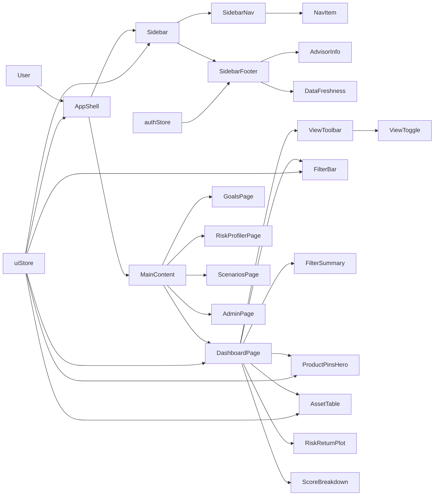
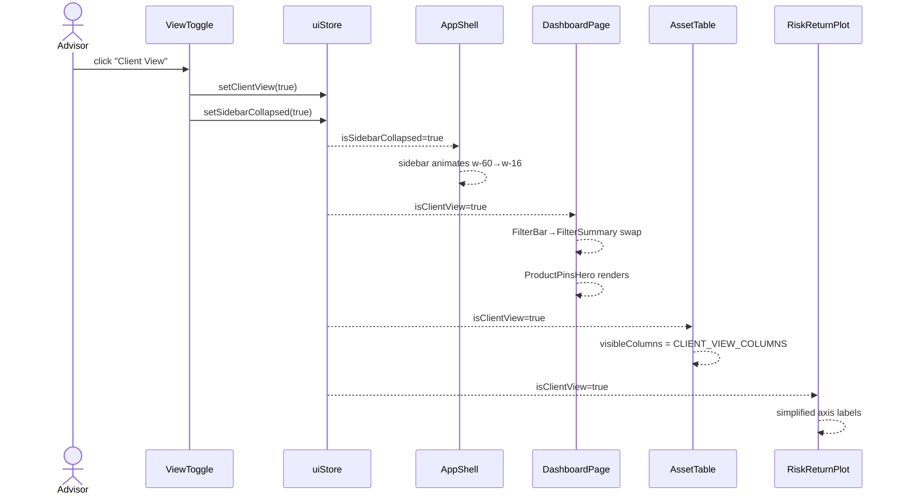
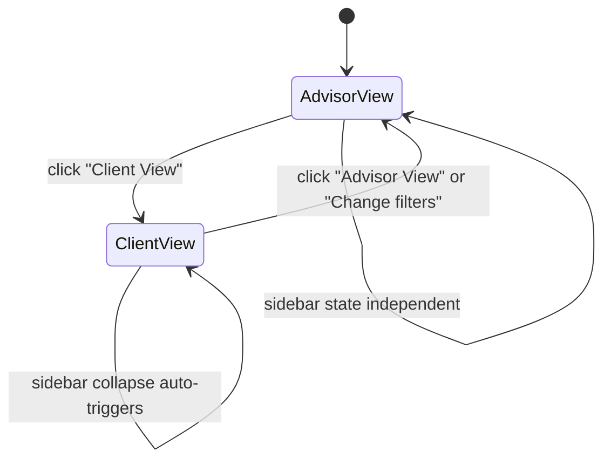

# Solution Design Document

## Validation Checklist

### CRITICAL GATES (Must Pass)

- [x] All required sections are complete
- [x] No [NEEDS CLARIFICATION] markers remain
- [x] Architecture pattern is clearly stated with rationale
- [x] All architecture decisions confirmed by user
- [x] Every interface has specification

### QUALITY CHECKS (Should Pass)

- [x] All context sources are listed with relevance ratings
- [x] Project commands are discovered from actual project files
- [x] Constraints → Strategy → Design → Implementation path is logical
- [x] Every component in diagram has directory mapping
- [x] Error handling covers all error types
- [x] Quality requirements are specific and measurable
- [x] Component names consistent across diagrams
- [x] A developer could implement from this design

---

## Constraints

CON-1: Frontend only — no new backend API endpoints. All changes are in `frontend/src/`.
CON-2: Tailwind CSS v3.4.x — must not upgrade to v4 in this phase.
CON-3: No Framer Motion — all animations via Tailwind `transition-*` utilities only.
CON-4: Bundle size increase ≤ 50KB gzipped from all additions (shadcn/ui ~5KB, Inter font ~15KB).
CON-5: `isClientView` in `uiStore` remains the single source of truth for audience view mode.
CON-6: All existing functionality must work identically after migration (no regressions).
CON-7: shadcn/ui CSS variable token strategy: Option B (coexistence) — new components use CSS vars, existing components keep Tailwind color classes. Only `--primary` HSL is overridden to match blue-600.

---

## Implementation Context

### Required Context Sources

#### Code Context
```yaml
- file: frontend/src/App.tsx
  relevance: HIGH
  why: Current top-nav layout shell; will be replaced with sidebar shell

- file: frontend/src/store/uiStore.ts
  relevance: HIGH
  why: isClientView state lives here; isSidebarCollapsed added here

- file: frontend/src/store/authStore.ts
  relevance: HIGH
  why: Advisor name pulled from here for sidebar footer

- file: frontend/src/components/Dashboard/AssetTable.tsx
  relevance: HIGH
  why: Column visibility logic extended for client-safe allowlist

- file: frontend/src/components/Dashboard/FilterBar.tsx
  relevance: HIGH
  why: Hidden in client view; replaced with static filter summary

- file: frontend/src/components/Dashboard/RiskReturnPlot.tsx
  relevance: HIGH
  why: Axis labels simplified in client view

- file: frontend/src/components/Presentation/ProductPins.tsx
  relevance: HIGH
  why: Redesigned as hero card grid in client view

- file: frontend/src/components/Presentation/ClientViewToggle.tsx
  relevance: MEDIUM
  why: Replaced with segmented control component

- file: frontend/src/components/Dashboard/DataFreshness.tsx
  relevance: MEDIUM
  why: Moves from top bar to sidebar footer

- file: frontend/tailwind.config.ts
  relevance: HIGH
  why: darkMode: 'class' added; fontFamily.sans updated; CSS variable tokens added

- file: frontend/src/index.css
  relevance: HIGH
  why: shadcn init adds CSS variable block; Inter font imports added

- file: frontend/package.json
  relevance: MEDIUM
  why: New deps: @fontsource/inter; shadcn adds Radix sub-packages as needed
```

### Implementation Boundaries

- **Must Preserve**: `isClientView` uiStore API, `useAuthStore`, all existing route paths, all existing Zustand store shapes (additive only), existing test IDs and component props
- **Can Modify**: `App.tsx` layout shell, `AppNav` component (replaced by Sidebar), `ClientViewToggle` (replaced by segmented control), `AssetTable` column rendering, `FilterBar` visibility, `ProductPins` layout, `tailwind.config.ts`, `src/index.css`
- **Must Not Touch**: Backend code, all store fetch logic, chart data transformations, auth flow, existing component test files (tests updated in final phase only)

### Project Commands

```bash
# Frontend
Install:  cd frontend && npm install
Dev:      cd frontend && npm run dev          # Vite on port 5173
Test:     cd frontend && npm test             # Vitest
Lint:     cd frontend && npm run lint
Build:    cd frontend && npm run build
Types:    cd frontend && npm run typecheck

# shadcn/ui setup (one-time)
Init:     cd frontend && npx shadcn@latest init
Add:      cd frontend && npx shadcn@latest add button input card badge select skeleton tooltip separator
```

---

## Solution Strategy

- **Architecture Pattern**: Additive component layer — new `src/components/ui/` directory for shadcn/ui components; existing feature components migrate opportunistically. Shell layout refactored in `App.tsx` from top-nav to sidebar.
- **Integration Approach**: `uiStore` extended with `isSidebarCollapsed: boolean`. New `AppShell` component wraps all authenticated pages, providing sidebar + main content layout. `DashboardPage` updated to consume new view state. All other pages (`GoalsPage`, `RiskProfilerPage`, etc.) slot into the new shell unchanged.
- **Justification**: Pure frontend change with no API impact. Incremental component adoption prevents regression. Flexbox + width transition is the simplest performant approach for collapsible sidebars confirmed by UX research.
- **Key Decisions**: ADR-1 through ADR-4 confirmed by user (see Architecture Decisions section).

---

## Building Block View

### Components



### Directory Map

**Frontend: `src/`**
```
src/
├── components/
│   ├── ui/                              # NEW: shadcn/ui components (auto-generated)
│   │   ├── button.tsx                   # NEW: Button component
│   │   ├── badge.tsx                    # NEW: Badge component
│   │   ├── card.tsx                     # NEW: Card + CardHeader + CardContent + CardFooter
│   │   ├── input.tsx                    # NEW: Input component
│   │   ├── select.tsx                   # NEW: Select component
│   │   ├── skeleton.tsx                 # NEW: Skeleton loader
│   │   ├── tooltip.tsx                  # NEW: Tooltip wrapper
│   │   └── separator.tsx               # NEW: Separator line
│   │
│   ├── Layout/                          # NEW: App shell components
│   │   ├── AppShell.tsx                 # NEW: Flexbox shell (sidebar + main)
│   │   ├── Sidebar.tsx                  # NEW: Dark collapsible sidebar
│   │   ├── SidebarNav.tsx               # NEW: Nav items with active indicator
│   │   └── SidebarFooter.tsx            # NEW: Advisor info + sign out + DataFreshness
│   │
│   ├── Dashboard/
│   │   ├── FilterBar.tsx                # MODIFY: hidden when isClientView
│   │   ├── FilterSummary.tsx            # NEW: static label + "Change filters" link
│   │   ├── AssetTable.tsx               # MODIFY: CLIENT_VIEW_COLUMNS allowlist
│   │   ├── RiskReturnPlot.tsx           # MODIFY: simplified axis labels in client view
│   │   ├── ScoreBreakdown.tsx           # NO CHANGE
│   │   └── DataFreshness.tsx            # NO CHANGE (moved to SidebarFooter)
│   │
│   ├── Presentation/
│   │   ├── ProductPins.tsx              # MODIFY: hero card grid in client view
│   │   ├── ProductPinCard.tsx           # NEW: individual hero card component
│   │   ├── ViewToggle.tsx               # NEW: segmented control (replaces ClientViewToggle)
│   │   ├── ClientViewToggle.tsx         # DEPRECATE: replaced by ViewToggle
│   │   └── ShareWhatsApp.tsx            # NO CHANGE
│   │
│   ├── Admin/
│   │   ├── JobCard.tsx                  # MODIFY: use Card, Badge from ui/
│   │   └── RunHistoryTable.tsx          # NO CHANGE
│   │
│   └── Login/
│       └── LoginForm.tsx                # MODIFY: use Button, Input from ui/
│
├── store/
│   └── uiStore.ts                       # MODIFY: add isSidebarCollapsed state
│
├── lib/
│   └── utils.ts                         # NEW: cn() utility (shadcn init generates)
│
├── index.css                            # MODIFY: Inter imports + CSS variable block
└── App.tsx                              # MODIFY: replace AppNav with AppShell
```

### Interface Specifications

#### Data Storage Changes

No database schema changes. Frontend-only feature.

#### Internal API Changes

No new or modified backend API endpoints.

#### Application Data Models

**uiStore extension** (additive — no existing fields removed):

```
STORE: uiStore (MODIFIED)
  EXISTING FIELDS (unchanged):
    isClientView: boolean
    selectedProduct: Product | null
    setSelectedProduct: (p: Product | null) => void
    setClientView: (v: boolean) => void

  NEW FIELDS:
    + isSidebarCollapsed: boolean          (default: false)
    + toggleSidebar: () => void            (flips isSidebarCollapsed)
    + setSidebarCollapsed: (v: boolean) => void

  PERSISTENCE:
    isSidebarCollapsed syncs to localStorage key 'sidebar_collapsed'
    On store init: read from localStorage, default false if absent
```

**CLIENT_VIEW_COLUMNS allowlist** (new constant in AssetTable):

```
CONSTANT: CLIENT_VIEW_COLUMNS (NEW, in AssetTable.tsx)
  Type: string[]
  Value: ['name', 'sebi_risk_level', 'cagr_1y', 'cagr_3y', 'cagr_5y', 'post_tax_return_3y']
  Behavior: When isClientView=true, only columns whose key appears in this list are rendered.
            The 'breakdown' action column is excluded (not in list, never shown to clients).
            Any future column added to AssetTable is hidden in client view by default.
```

**ViewToggle props interface** (new component):

```
COMPONENT: ViewToggle (NEW)
  Props: none (reads isClientView from uiStore directly)
  Emits: calls uiStore.setClientView() on change
  Behavior:
    - Renders two-option segmented control: "Advisor View" | "Client View"
    - Active option shows white bg + shadow-sm pill
    - Switching to Client View: sets isClientView=true, sets isSidebarCollapsed=true
    - Switching to Advisor View: sets isClientView=false (does NOT force sidebar expanded)
```

**ProductPinCard props interface** (new component):

```
COMPONENT: ProductPinCard (NEW)
  Props:
    product: {
      name: string
      asset_class: string
      sebi_risk_level: number        // 1-6
      post_tax_return_3y: number     // percentage
      cagr_5y: number | null         // percentage, optional secondary
    }
    onUnpin: (productId: string) => void
  Renders:
    - Product name (text-lg font-semibold, 2-line clamp with tooltip for overflow)
    - Asset class badge (gray)
    - SEBI risk badge (color-coded: 1-2=green, 3=yellow, 4=orange, 5-6=red)
    - Post-tax 3Y return (text-2xl font-bold text-blue-600)
    - 5Y CAGR if available (text-sm text-gray-500)
    - Unpin star icon (bottom-right, onClick calls onUnpin)
```

#### Integration Points

```yaml
# Intra-component communication
- from: ViewToggle
  to: uiStore
  protocol: Zustand store call
  data_flow: "setClientView(boolean), setSidebarCollapsed(true) on client view activation"

- from: Sidebar
  to: uiStore
  protocol: Zustand store call
  data_flow: "reads isSidebarCollapsed, calls toggleSidebar on collapse button click"

- from: SidebarFooter
  to: authStore
  protocol: Zustand store read
  data_flow: "reads advisor.name and advisor.email for display"

- from: DashboardPage
  to: uiStore
  protocol: Zustand store read
  data_flow: "reads isClientView to conditionally render FilterBar vs FilterSummary, ProductPinsHero"

- from: AssetTable
  to: uiStore
  protocol: Zustand store read
  data_flow: "reads isClientView to apply CLIENT_VIEW_COLUMNS allowlist filter"

- from: FilterSummary
  to: dashboardStore
  protocol: Zustand store read
  data_flow: "reads current taxBracket and timeHorizon to display static summary text"
```

### Implementation Examples

#### Example: Sidebar width collapse via Flexbox + Tailwind transition

**Why this example**: The sidebar must animate smoothly between expanded (240px) and collapsed (64px) without affecting the main content layout jump. The key is `transition-[width]` (not `transition-all`) for GPU performance.

```tsx
// AppShell.tsx — shell layout pattern
// Sidebar width drives the layout; main content fills remaining space via flex-1
<div className="flex h-screen overflow-hidden bg-gray-50">
  <nav
    className={cn(
      "bg-gray-900 flex flex-col shrink-0 transition-[width] duration-300 ease-in-out",
      isSidebarCollapsed ? "w-16" : "w-60"
    )}
  >
    {/* Sidebar content */}
  </nav>
  <main className="flex-1 overflow-auto">
    {/* Page content */}
  </main>
</div>
```

#### Example: Active nav item with left accent bar

**Why this example**: The left accent bar is a pseudo-element pattern. Using Tailwind's `before:` prefix avoids adding a real DOM element, keeping the nav item semantic.

```tsx
// SidebarNav.tsx — NavItem active state pattern
// Use NavLink's isActive callback with cn() to compose classes
<NavLink
  to={link.to}
  className={({ isActive }) =>
    cn(
      "relative flex items-center gap-3 px-4 py-3 text-sm font-medium",
      "transition-colors duration-150 rounded-sm",
      isActive
        ? "bg-gray-800 text-white before:absolute before:left-0 before:top-0 before:bottom-0 before:w-0.5 before:bg-blue-500"
        : "text-gray-400 hover:text-gray-100 hover:bg-gray-800"
    )
  }
>
  <Icon className="w-4 h-4 shrink-0" />
  {!isSidebarCollapsed && <span className="truncate">{label}</span>}
</NavLink>
```

#### Example: CLIENT_VIEW_COLUMNS allowlist in AssetTable

**Why this example**: The allowlist must be applied at the column definition level, not at render time with conditional JSX, to avoid the "hidden column" still taking space.

```tsx
// AssetTable.tsx — column filtering pattern
const CLIENT_VIEW_COLUMNS = [
  'name', 'sebi_risk_level', 'cagr_1y', 'cagr_3y', 'cagr_5y', 'post_tax_return_3y'
] as const

// ALL_COLUMNS is the existing full column definition array
// Filter it before rendering headers and cells
const visibleColumns = isClientView
  ? ALL_COLUMNS.filter(col => CLIENT_VIEW_COLUMNS.includes(col.key as any))
  : ALL_COLUMNS

// Both <thead> and <tbody> use visibleColumns, so hidden columns take zero space
```

#### Example: FilterSummary with "Change filters" link

**Why this example**: The "Change filters" link must switch back to Advisor View, not navigate. It calls `setClientView(false)` directly.

```tsx
// FilterSummary.tsx — static summary with switch-back affordance
// Reads current filter values from dashboardStore
// "Change filters" calls uiStore.setClientView(false)
<div className="flex items-center gap-2 text-sm text-gray-500">
  <span>
    Filtered: {taxBracketLabel} tax · {timeHorizonLabel} horizon · {riskLabel}
  </span>
  <button
    onClick={() => setClientView(false)}
    className="text-blue-600 hover:text-blue-700 underline-offset-2 hover:underline"
  >
    Change filters
  </button>
</div>
```

#### Example: ViewToggle segmented control (peer-checked pattern)

**Why this example**: The peer-checked approach uses CSS state only — no JS for the visual pill. The underlying radio inputs drive styling via `peer-checked:*` Tailwind variants.

```tsx
// ViewToggle.tsx — segmented control with CSS-only sliding pill
<fieldset className="inline-flex bg-gray-100 rounded-lg p-1">
  <label className="flex items-center cursor-pointer">
    <input
      type="radio" name="view-mode" value="advisor"
      checked={!isClientView}
      onChange={() => { setClientView(false) }}
      className="sr-only peer"
    />
    <span className={cn(
      "px-4 py-1.5 rounded-md text-sm font-medium transition-all duration-200",
      "peer-checked:bg-white peer-checked:text-gray-900 peer-checked:shadow-sm",
      "text-gray-600"
    )}>
      Advisor View
    </span>
  </label>
  <label className="flex items-center cursor-pointer">
    <input
      type="radio" name="view-mode" value="client"
      checked={isClientView}
      onChange={() => { setClientView(true); setSidebarCollapsed(true) }}
      className="sr-only peer"
    />
    <span className={cn(
      "px-4 py-1.5 rounded-md text-sm font-medium transition-all duration-200",
      "peer-checked:bg-white peer-checked:text-gray-900 peer-checked:shadow-sm",
      "text-gray-600"
    )}>
      Client View
    </span>
  </label>
</fieldset>
```

---

## Runtime View

### Primary Flow: Advisor switches to Client View

1. Advisor is on Dashboard in Advisor View (full sidebar, all columns, FilterBar visible)
2. Advisor clicks "Client View" in the ViewToggle segmented control
3. `ViewToggle` calls `uiStore.setClientView(true)` and `uiStore.setSidebarCollapsed(true)`
4. `AppShell` re-renders: sidebar width transitions from `w-60` to `w-16` (300ms ease-in-out)
5. `DashboardPage` re-renders: `FilterBar` unmounts; `FilterSummary` mounts with current filter values
6. `AssetTable` re-renders: `visibleColumns` filtered to `CLIENT_VIEW_COLUMNS`; Breakdown button column absent
7. `ProductPins` re-renders as hero card grid (if pinned products exist)
8. `RiskReturnPlot` re-renders with `isClientView=true` prop: axis labels simplified, legend hidden
9. `SidebarNav` re-renders: Goal Planner, Risk Profiler, Scenarios links absent; Dashboard only shown
10. `SidebarFooter` remains: advisor name/sign-out visible, DataFreshness remains in footer



### Primary Flow: Skeleton → Content transition (AssetTable)

1. `DashboardPage` mounts; `useDashboardStore.fetchProducts()` fires
2. `isLoading=true`: `AssetTable` renders 5 `<Skeleton>` rows matching column widths
3. Skeleton rows have `h-10` height matching table row height (prevents CLS)
4. `fetchProducts()` resolves; `isLoading=false`
5. Skeleton rows unmount; real data rows mount in place (same height = zero CLS)

### Error Handling

| Error | Location | Behavior |
|---|---|---|
| shadcn/ui `cn()` import missing | Any component | TypeScript compile error — caught at build time |
| `isSidebarCollapsed` missing from uiStore | Sidebar/AppShell | TypeScript error — store type enforces field presence |
| `CLIENT_VIEW_COLUMNS` contains typo key | AssetTable | Column silently hidden in all views — caught by column visibility test |
| Advisor name not in authStore (null) | SidebarFooter | Render fallback: display email or "Advisor" generic label |
| FilterSummary reads undefined dashboardStore values | FilterSummary | Render dashes: "Filtered: — tax · — horizon" |
| Sidebar collapse animation jank | AppShell | Only `width` is transitioned; `transition-[width]` prevents other property animation |

### Complex Logic: Client View nav item filtering

```
ALGORITHM: GetVisibleNavLinks
INPUT: isClientView: boolean
OUTPUT: NavLink[]

ALL_NAV_LINKS = [
  { to: '/dashboard', label: 'Dashboard', icon: LayoutDashboard },
  { to: '/goals',     label: 'Goal Planner', icon: Target },
  { to: '/risk-profiler', label: 'Risk Profiler', icon: Shield },
  { to: '/scenarios', label: 'Scenarios', icon: TrendingUp },
]

STAFF_NAV_LINK = { to: '/admin', label: 'System Health', icon: Activity }

IF isClientView:
  RETURN [ALL_NAV_LINKS[0]]   // Dashboard only
ELSE:
  RETURN [...ALL_NAV_LINKS, STAFF_NAV_LINK]

NOTE: STAFF_NAV_LINK rendered with separator above it and muted text (text-gray-500)
      in both views; hidden entirely in client view.
```

---

## Deployment View

Frontend-only change. No backend deployment required.

- **Environment**: Browser (Vite SPA, served as static files)
- **Configuration**: No new environment variables
- **Dependencies**: `@fontsource/inter` added to package.json; shadcn/ui components copied to `src/components/ui/` (no new npm package)
- **Performance**: Inter font ~15KB gzipped; shadcn/ui components ~5KB gzipped; sidebar CSS transition GPU-accelerated. Total bundle increase ≤ 20KB gzipped.
- **Rollout**: Single frontend deploy. No feature flags needed — sidebar replaces top nav entirely. No partial rollout risk.

---

## Cross-Cutting Concepts

### Pattern Documentation

```yaml
- pattern: Flexbox app shell (sidebar + flex-1 main)
  relevance: CRITICAL
  why: Foundation for all authenticated pages; sidebar collapse depends on this

- pattern: Zustand store for UI state
  relevance: CRITICAL
  why: isSidebarCollapsed added to uiStore following existing isClientView pattern

- pattern: shadcn/ui component adoption (copy-paste, own the code)
  relevance: HIGH
  why: All new UI primitives follow shadcn/ui conventions; custom variants via CVA

- pattern: CLIENT_VIEW_COLUMNS allowlist
  relevance: HIGH
  why: Safe-by-default column visibility; prevents accidental data exposure in client view

- pattern: peer-checked segmented control
  relevance: MEDIUM
  why: CSS-only view toggle; no JavaScript for visual state
```

### User Interface & UX

**Information Architecture:**
- Navigation: Left sidebar (primary nav) + toolbar strip (view toggle, dashboard-only)
- Content Organization: Sidebar = persistent navigation + context; Main = page content only
- User Flows: Advisor View → Client View is a one-step toggle; all other flows unchanged

**Design System:**
- Components: shadcn/ui Button, Badge, Card, Input, Select, Skeleton, Tooltip, Separator
- Tokens: Inter font (400/500/600); CSS variable `--primary` = blue-600 HSL; sidebar uses explicit `bg-gray-900` (not CSS var)
- Patterns: Skeleton loaders for async data; peer-checked segmented control for view toggle; left-accent nav items

**Interaction Design:**
- State: `uiStore` owns `isClientView` + `isSidebarCollapsed`; persistence via localStorage for collapse state
- Feedback: Sidebar animates on collapse; segmented control transitions pill on click; skeleton fades to content (same height)
- Accessibility: NavLink active state uses both color and left accent (not color-only); shadcn/ui components inherit Radix ARIA; ViewToggle uses `<fieldset>` + `<input type="radio">` for screen reader compatibility

**Sidebar Wireframe:**
```
┌─────────────────────────────────────────────────────┐
│ ╔════╗  India Investment Analyzer                    │
│ ║ IA ║                                              │
│ ╚════╝                                              │
│ ▌ Dashboard          ← active (left accent + bg)   │
│   Goal Planner                                      │
│   Risk Profiler                                     │
│   Scenarios                                         │
│ ─────────────────────────── ← separator             │
│   System Health         ← dimmer, staff only        │
│                                                     │
│ [SPACER]                                            │
│                                                     │
│ ─────────────────────────── ← separator             │
│ ● Rajan Mehta                                       │
│   rajan@example.com                                 │
│   DataFreshness: updated 5m ago                    │
│   Sign out                                          │
└─────────────────────────────────────────────────────┘
```

**Dashboard ViewToolbar Wireframe (Advisor View):**
```
┌──────────────────────────────────────────────────────┐
│  [Filtered: 20% tax · 7Y · All]    ┌──────────────┐ │
│  (client view shows this row)      │ Advisor View ││ │
│                                    └──────────────┘ │
│  [FilterBar full controls]  ← advisor view only     │
└──────────────────────────────────────────────────────┘
```

**Component State Diagram: ViewToggle**


### System-Wide Patterns

- **Security**: `isClientView` is presentation-only — no backend authorization change. Advisor-only routes (`/admin`) remain protected by `ProtectedRoute`. Client view is purely a UI filter.
- **Error Handling**: Missing advisor name in sidebar → fallback to "Advisor"; missing filter values in FilterSummary → fallback to dashes. No error thrown.
- **Performance**: `transition-[width]` (not `transition-all`) ensures only width is GPU-animated. Skeleton heights must match content heights to achieve CLS=0. Inter font loaded via `@fontsource/inter` (no network request, bundled).
- **Accessibility**: WCAG AA minimum. Collapsed sidebar provides Radix Tooltip labels for icon-only nav. ViewToggle uses semantic radio inputs (`sr-only`). All color indicators have non-color supplement (accent bar, text labels).

---

## Architecture Decisions

- [x] **ADR-1: shadcn/ui CSS Token Strategy** — Option B: Coexistence
  - Rationale: New shadcn/ui components use CSS variables; existing components keep Tailwind color classes. Only `--primary` HSL overridden to `219 90% 56%` (blue-600). Zero migration risk.
  - Trade-offs: Two token systems coexist temporarily; future full migration required for complete consistency.
  - User confirmed: ✅ 2026-03-08

- [x] **ADR-2: App Shell Layout Mechanism** — Flexbox (`flex h-screen`)
  - Rationale: Sidebar collapse animates via `transition-[width]`; main content fills remaining space via `flex-1`. GPU-accelerated, universally supported.
  - Trade-offs: CSS Grid would be more structured for complex multi-panel layouts; deferred if needed.
  - User confirmed: ✅ 2026-03-08

- [x] **ADR-3: Sidebar Collapse State Location** — Zustand `uiStore`
  - Rationale: `uiStore` already owns `isClientView`; `isSidebarCollapsed` is the same category of UI state. Accessible from any component. localStorage persistence added alongside store init.
  - Trade-offs: UI state in global store (vs local) — acceptable since sidebar collapse affects multiple unrelated components (DataFreshness position, main content width).
  - User confirmed: ✅ 2026-03-08

- [x] **ADR-4: AssetTable Client View Column Strategy** — Explicit allowlist
  - Rationale: `CLIENT_VIEW_COLUMNS` constant defaults to hidden for any column not listed. Safe by default — future columns require deliberate addition to the allowlist to appear in client view.
  - Trade-offs: New advisor-only columns automatically hidden in client view until explicitly reviewed. This is a feature, not a bug.
  - User confirmed: ✅ 2026-03-08

---

## Quality Requirements

- **Performance**: Sidebar collapse animation completes in 300ms with zero layout jank; `transition-[width]` only
- **Usability**: WCAG AA compliance; collapsed sidebar icons have tooltip labels; ViewToggle uses semantic radio inputs
- **Bundle size**: Total increase ≤ 50KB gzipped (Inter ~15KB + shadcn/ui ~5KB + new components ~5KB)
- **CLS (Cumulative Layout Shift)**: Score = 0 for skeleton-to-content transitions; skeleton heights match content heights
- **Reliability**: `isClientView=true` must never render advisor-only columns, FilterBar controls, or System Health nav link
- **Regression**: All existing Vitest tests pass without modification after Phase 1 (shell + sidebar)

---

## Acceptance Criteria

**Sidebar Navigation:**
- [ ] WHEN the app shell renders, THE SYSTEM SHALL display a dark (`bg-gray-900`) collapsible sidebar with all nav items
- [ ] WHEN the collapse toggle is clicked, THE SYSTEM SHALL animate sidebar width between 240px and 64px using `transition-[width] duration-300`
- [ ] WHILE sidebar is collapsed, THE SYSTEM SHALL show Radix Tooltip labels on nav icon hover
- [ ] WHEN a nav item is active, THE SYSTEM SHALL render a left blue accent bar (`w-0.5 bg-blue-500`) and white text
- [ ] THE SYSTEM SHALL read advisor name from authStore and display it in sidebar footer; fallback to "Advisor" if null
- [ ] THE SYSTEM SHALL persist sidebar collapse state to localStorage key `sidebar_collapsed`

**Dual-Audience View Switch:**
- [ ] WHEN "Client View" is selected in ViewToggle, THE SYSTEM SHALL set `isClientView=true` AND `isSidebarCollapsed=true` simultaneously
- [ ] WHILE `isClientView=true`, THE SYSTEM SHALL render only `CLIENT_VIEW_COLUMNS` in AssetTable (name, sebi_risk_level, cagr_1y, cagr_3y, cagr_5y, post_tax_return_3y)
- [ ] WHILE `isClientView=true`, THE SYSTEM SHALL hide FilterBar and render FilterSummary with current filter values and "Change filters" link
- [ ] WHEN "Change filters" link is clicked, THE SYSTEM SHALL set `isClientView=false`
- [ ] WHILE `isClientView=true`, THE SYSTEM SHALL render Dashboard nav item only; hide Goal Planner, Risk Profiler, Scenarios, System Health
- [ ] WHILE `isClientView=true`, THE SYSTEM SHALL render ProductPins as hero card grid (if pinned products exist)
- [ ] WHILE `isClientView=true`, THE SYSTEM SHALL render RiskReturnPlot with simplified axis labels and no Advisor Score legend

**Skeleton Loaders:**
- [ ] WHILE `isLoading=true` in dashboardStore, THE SYSTEM SHALL render 5 skeleton rows in AssetTable at the same height as data rows
- [ ] WHILE `isLoading=true` in adminStore with empty jobs, THE SYSTEM SHALL render 6 skeleton cards matching JobCard dimensions
- [ ] IF `prefers-reduced-motion` is set, THE SYSTEM SHALL disable skeleton pulse animation

**shadcn/ui + Inter Font:**
- [ ] THE SYSTEM SHALL render Inter as the sans-serif font across the application
- [ ] THE SYSTEM SHALL use tabular-nums font variant for numeric columns in AssetTable
- [ ] THE SYSTEM SHALL use shadcn/ui Button in LoginForm, FilterBar, JobCard, and all form submit actions

---

## Risks and Technical Debt

### Known Technical Issues

- `ClientViewToggle.tsx` will be deprecated but not deleted in this phase — existing tests reference it. Delete after test suite is updated in final phase.
- `AppNav` component in `App.tsx` is replaced wholesale — any component that imports `AppNav` directly (if any) must be updated.
- `DataFreshness` currently receives `freshness` prop from `DashboardPage`; after moving to `SidebarFooter`, it must read from `dashboardStore` directly.

### Technical Debt

- Existing components use inline Tailwind class strings for buttons/inputs — migrated opportunistically to `Button`/`Input` shadcn components. Full migration is Phase 2+ work.
- `FilterBar` uses raw Radix Select wiring (~60 lines of custom styling); migrating to shadcn `Select` is a "should have" improvement, not required for Phase 1.

### Implementation Gotchas

- **`transition-[width]` not `transition-all`**: Using `transition-all` on the sidebar will also animate any future box-shadow or other property changes, causing unintended visual artifacts. Always use `transition-[width]`.
- **Skeleton height must match content height**: If `h-10` skeleton rows are used but actual table rows render at `h-12`, there will be a visible CLS jump. Measure actual rendered heights before setting skeleton dimensions.
- **`isSidebarCollapsed=true` when switching to Client View**: The sidebar auto-collapses on client view activation, but manually expanding while in client view must be respected (ADR-3 Business Rule 3). Do not re-collapse on every render — only set `isSidebarCollapsed=true` once on the toggle event.
- **`sr-only` radio inputs in ViewToggle**: The `<input type="radio">` must remain in the DOM (not `display:none`) for `peer-checked` CSS to work. Using `sr-only` keeps it accessible and visually hidden.
- **shadcn/ui `cn()` utility**: Import from `@/lib/utils` (generated by `npx shadcn@latest init`), not from `tailwind-merge` directly. The `cn()` function combines `clsx` + `tailwind-merge` with the correct merge strategy.

---

## Glossary

### Domain Terms

| Term | Definition | Context |
|------|------------|---------|
| Advisor View | Default dashboard mode showing all columns, controls, and navigation items for the financial advisor | `isClientView=false` in uiStore |
| Client View | Simplified presentation mode showing only client-safe data, hero cards, and minimal navigation | `isClientView=true` in uiStore |
| ProductPins Hero | The card-grid layout of pinned products displayed as the primary content area in Client View | `ProductPinCard` components in responsive grid |
| CLIENT_VIEW_COLUMNS | Explicit allowlist of AssetTable column keys visible in Client View | Constant in AssetTable.tsx |
| Filter Summary | Static text label showing active filter values, shown in place of FilterBar in Client View | `FilterSummary.tsx` component |

### Technical Terms

| Term | Definition | Context |
|------|------------|---------|
| shadcn/ui | Copy-paste component library built on Radix UI + Tailwind CSS + CVA; components are owned by the project | All `src/components/ui/` files |
| CVA | Class Variance Authority — library for managing Tailwind class variants with type safety | Used inside all shadcn/ui components |
| peer-checked | Tailwind CSS variant that applies styles to an element when a sibling `<input>` is in `:checked` state | ViewToggle segmented control |
| `cn()` | Utility combining `clsx` (conditional classes) and `tailwind-merge` (dedup conflicting classes) | `src/lib/utils.ts`, used in all shadcn components |
| CLS | Cumulative Layout Shift — Core Web Vital measuring visual stability during page load | Target: 0 for skeleton-to-content transitions |
| `transition-[width]` | Tailwind utility that restricts CSS transition to the `width` property only; GPU-accelerated | Sidebar collapse animation |
| Coexistence (ADR-1) | Running shadcn/ui CSS variable tokens alongside existing Tailwind color classes without full migration | Token strategy for this phase |

### API/Interface Terms

| Term | Definition | Context |
|------|------------|---------|
| `isSidebarCollapsed` | Boolean uiStore field controlling sidebar width state | Added to uiStore; persisted to localStorage |
| `toggleSidebar()` | uiStore action that flips `isSidebarCollapsed` | Called by collapse toggle button in Sidebar |
| `setSidebarCollapsed(v)` | uiStore action that sets `isSidebarCollapsed` to a specific value | Called by ViewToggle on client view activation |
| `sidebar_collapsed` | localStorage key for persisting sidebar collapse state across sessions | Read on uiStore initialization |
