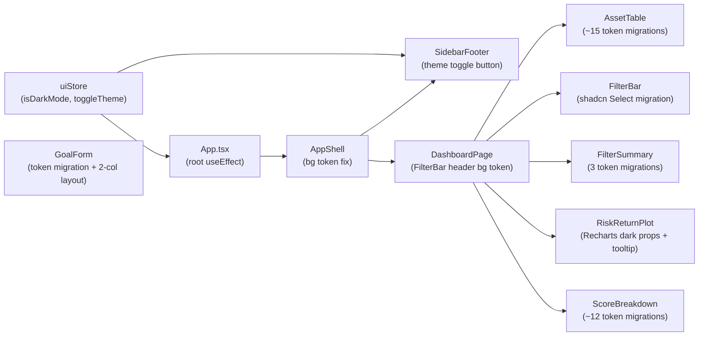
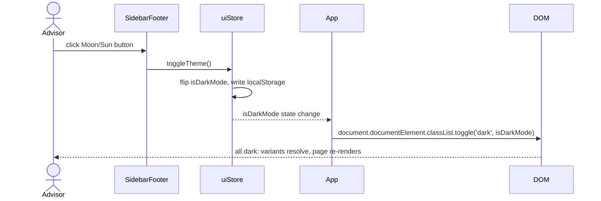

# Solution Design Document

## Validation Checklist

### CRITICAL GATES (Must Pass)

- [x] All required sections are complete
- [x] No [NEEDS CLARIFICATION] markers remain
- [x] Architecture pattern is clearly stated with rationale
- [x] All architecture decisions confirmed by user
- [x] Every interface has specification

### QUALITY CHECKS (Should Pass)

- [x] All context sources are listed with relevance ratings
- [x] Project commands are discovered from actual project files
- [x] Constraints → Strategy → Design → Implementation path is logical
- [x] Every component in diagram has directory mapping
- [x] Error handling covers all error types
- [x] Quality requirements are specific and measurable
- [x] Component names consistent across diagrams
- [x] A developer could implement from this design
- [x] Implementation examples reference actual class/token names verified against source files

---

## Constraints

CON-1 **Frontend-only change** — no backend modifications, no API changes, no Alembic migrations.

CON-2 **No new npm packages** — shadcn `Select` is already installed at `frontend/src/components/ui/select.tsx`. Recharts, Lucide React, and Zustand are all existing dependencies.

CON-3 **Tailwind CSS v3 + shadcn/ui token system** — all color decisions must use the CSS custom-property token names already defined in `frontend/src/index.css` under `.dark {}`. No arbitrary hex colors in className strings (except for Recharts SVG props which cannot consume CSS variables — those must use `hsl(var(--token))` string literals).

CON-4 **Existing Vitest tests must remain green** — component logic and prop interfaces must not change. Only className strings and store shape are modified.

CON-5 **Auth flow and filterStore logic are frozen** — `handleTaxBracketChange`, `handleTimeHorizonChange`, `handleRiskFilterChange` logic in FilterBar must be preserved exactly. Only the rendering layer (raw Radix → shadcn Select) changes.

---

## Implementation Context

### Required Context Sources

#### Code Context
```yaml
- file: frontend/src/store/uiStore.ts
  relevance: HIGH
  why: "Adding isDarkMode + toggleTheme — must extend, not replace, existing state shape"

- file: frontend/src/App.tsx
  relevance: HIGH
  why: "Root useEffect for dark class; page container max-w-* removal"

- file: frontend/src/components/Layout/AppShell.tsx
  relevance: HIGH
  why: "bg-gray-50 on the outer wrapper — one token migration"

- file: frontend/src/components/Layout/SidebarFooter.tsx
  relevance: HIGH
  why: "Theme toggle button added here"

- file: frontend/src/components/Dashboard/AssetTable.tsx
  relevance: HIGH
  why: "~15 hardcoded color replacements; Radix Tooltip.Content also needs token migration"

- file: frontend/src/components/Dashboard/FilterBar.tsx
  relevance: HIGH
  why: "Full migration from raw @radix-ui/react-select to shadcn Select"

- file: frontend/src/components/Dashboard/FilterSummary.tsx
  relevance: MEDIUM
  why: "3 token replacements"

- file: frontend/src/components/Dashboard/RiskReturnPlot.tsx
  relevance: HIGH
  why: "Recharts SVG props need explicit dark-safe hsl() strings; CustomTooltip needs token migration"

- file: frontend/src/components/Dashboard/ScoreBreakdown.tsx
  relevance: HIGH
  why: "~12 replacements; Dialog.Content background is the most visible dark mode gap"

- file: frontend/src/components/GoalPlanner/GoalForm.tsx
  relevance: HIGH
  why: "Token migration + two-column layout restructure"

- file: frontend/src/components/ui/select.tsx
  relevance: HIGH
  why: "shadcn Select — already installed, already dark-mode-aware via bg-popover/bg-accent tokens"

- file: frontend/src/index.css
  relevance: CRITICAL
  why: "Source of truth for all CSS custom property values in both :root and .dark"
```

### Implementation Boundaries

- **Must Preserve**: `isSidebarCollapsed`, `toggleSidebar`, `setSidebarCollapsed`, `selectedProduct`, `setSelectedProduct`, `isClientView`, `setClientView` in `uiStore.ts` — existing consumers must not break.
- **Must Preserve**: All `filterStore` handler logic in `FilterBar.tsx` — only the JSX rendering changes.
- **Must Preserve**: All existing Vitest component tests — no prop interface changes.
- **Must Preserve**: `aria-label` attributes on interactive elements in `AssetTable.tsx` and `ScoreBreakdown.tsx`.
- **Can Modify**: Any `className` string. The `uiStore` state shape (additive only). JSX structure inside page functions in `App.tsx`.
- **Must Not Touch**: `backend/` directory. `filterStore.ts`. `authStore.ts`. `dashboardStore.ts`. `goalStore.ts`. Any `.test.tsx` files.

### Project Commands

```bash
# Frontend dev
cd frontend && npm run dev         # Vite dev server on :5173

# Frontend validation
cd frontend && npm run typecheck   # tsc --noEmit
cd frontend && npm run lint        # ESLint
cd frontend && npm test            # Vitest

# Build
cd frontend && npm run build       # tsc + vite build
```

---

## Solution Strategy

- **Architecture Pattern**: Incremental CSS token migration within existing component tree. No structural reorganization.
- **Integration Approach**: Single Zustand state field (`isDarkMode`) drives a class toggle on `document.documentElement` via a root `useEffect`. All shadcn/ui and Tailwind dark-variant classes respond automatically. Recharts requires explicit prop overrides since SVG attributes cannot read CSS variables.
- **Justification**: The `.dark {}` token system is already complete in `index.css`. The only missing pieces are (1) the class never being applied to `<html>`, (2) components using hardcoded colors instead of semantic tokens, and (3) Recharts needing explicit overrides. This approach requires no new libraries and no architectural changes.
- **Key Decisions**: See ADR-1 through ADR-5 below.

---

## Building Block View

### Components



### Directory Map

```
frontend/src/
├── store/
│   └── uiStore.ts                    # MODIFY: add isDarkMode, toggleTheme
├── App.tsx                           # MODIFY: root dark useEffect, remove max-w-* from page containers
├── components/
│   ├── Layout/
│   │   ├── AppShell.tsx              # MODIFY: bg-gray-50 → bg-background
│   │   └── SidebarFooter.tsx         # MODIFY: add Moon/Sun icon button
│   └── Dashboard/
│       ├── AssetTable.tsx            # MODIFY: ~15 token migrations
│       ├── FilterBar.tsx             # MODIFY: raw Radix → shadcn Select
│       ├── FilterSummary.tsx         # MODIFY: 3 token migrations
│       ├── RiskReturnPlot.tsx        # MODIFY: Recharts dark props + tooltip tokens
│       └── ScoreBreakdown.tsx        # MODIFY: ~12 token migrations
│   └── GoalPlanner/
│       └── GoalForm.tsx              # MODIFY: token migration + two-column layout
```

### Data Models

```pseudocode
ENTITY: UIState (MODIFIED)
  EXISTING FIELDS:
    selectedProduct: ProductRow | null
    setSelectedProduct: (product: ProductRow | null) => void
    isClientView: boolean
    setClientView: (v: boolean) => void
    isSidebarCollapsed: boolean
    toggleSidebar: () => void
    setSidebarCollapsed: (v: boolean) => void

  + NEW FIELDS:
    isDarkMode: boolean   (default: true, persisted to localStorage key 'theme')
    toggleTheme: () => void
```

### Interface Specifications

#### Data Storage Changes

No database changes. The only persistence change is a new `localStorage` key:

```yaml
localStorage:
  - key: 'theme'
    values: ['dark', 'light']
    default: 'dark'   # isDarkMode defaults to true
    existing key: 'sidebar_collapsed'  # already in use — do not conflict
```

#### Internal API Changes

No API endpoint changes. This spec is purely frontend.

#### Integration Points

```yaml
# Intra-component (state → DOM)
- from: uiStore (isDarkMode)
  to: document.documentElement
  mechanism: useEffect in App.tsx
  behavior: >
    classList.toggle('dark', isDarkMode)
    — adds 'dark' when true, removes when false

# Intra-component (user action → state)
- from: SidebarFooter (button click)
  to: uiStore.toggleTheme
  behavior: >
    toggles isDarkMode, persists to localStorage 'theme'
```

---

## Implementation Examples

### Example 1: uiStore — Adding isDarkMode + toggleTheme

**Why this example**: The existing store uses a specific localStorage pattern for `isSidebarCollapsed`. The new field must follow the same pattern. The initializer reads `localStorage` at module load time and defaults to dark (true) if no key exists yet.

```typescript
// frontend/src/store/uiStore.ts — ADDITIVE CHANGE ONLY
// Append to the UIState interface and the create() call.
// Do NOT remove any existing fields.

interface UIState {
  // ... existing fields unchanged ...
  isDarkMode: boolean
  toggleTheme: () => void
}

export const useUIStore = create<UIState>((set) => ({
  // ... existing fields unchanged ...

  isDarkMode: typeof window !== 'undefined'
    ? localStorage.getItem('theme') !== 'light'   // defaults to dark
    : true,

  toggleTheme: () => set((state) => {
    const next = !state.isDarkMode
    localStorage.setItem('theme', next ? 'dark' : 'light')
    return { isDarkMode: next }
  }),
}))
```

Key notes:
- `localStorage.getItem('theme') !== 'light'` means: if the key is absent (first visit) OR set to 'dark', `isDarkMode` is `true`. Only an explicit 'light' value produces `false`.
- The SSR guard `typeof window !== 'undefined'` follows the existing pattern on `isSidebarCollapsed`.

---

### Example 2: App.tsx — Root dark class useEffect

**Why this example**: The useEffect must subscribe to `isDarkMode` changes and apply/remove the class in the same render cycle. It must be placed in the `App` function component (not in a page component) so it runs regardless of which route is active.

```typescript
// frontend/src/App.tsx
// Add inside the App() function component, before the return statement.
// Import useUIStore at the top alongside other store imports.

function App() {
  const isDarkMode = useUIStore((s) => s.isDarkMode)

  useEffect(() => {
    document.documentElement.classList.toggle('dark', isDarkMode)
  }, [isDarkMode])

  return (
    <BrowserRouter>
      {/* ... existing routes unchanged ... */}
    </BrowserRouter>
  )
}
```

Page container changes in the same file — remove `max-w-*` constraints:

```typescript
// BEFORE
function GoalsPage() {
  return <main className="max-w-4xl mx-auto px-6 py-6"><GoalForm /></main>
}
function RiskProfilerPage() {
  return <main className="max-w-4xl mx-auto px-6 py-6"><Questionnaire /></main>
}
function ScenariosPage() {
  return <main className="max-w-5xl mx-auto px-6 py-6 space-y-8">...</main>
}
// DashboardPage inner <main> had max-w-7xl — also remove

// AFTER (each page)
function GoalsPage() {
  return <main className="px-6 py-4"><GoalForm /></main>
}
function RiskProfilerPage() {
  return <main className="px-6 py-4"><Questionnaire /></main>
}
function ScenariosPage() {
  return <main className="px-6 py-4 space-y-8">...</main>
}
// DashboardPage <main>: remove max-w-7xl mx-auto, py-6 → py-4
```

Also in DashboardPage, the filter bar header div uses `bg-white` — migrate:
```typescript
// BEFORE
<div className="px-6 py-3 flex items-center justify-between border-b bg-white">
// AFTER
<div className="px-6 py-3 flex items-center justify-between border-b bg-card">
```

---

### Example 3: AppShell.tsx — bg-background token

**Why this example**: The outer wrapper uses `bg-gray-50` which shows through when the content area is scrolled past or when no child fills the full height. One targeted replacement.

```typescript
// BEFORE
<div className="flex h-screen overflow-hidden bg-gray-50">
// AFTER
<div className="flex h-screen overflow-hidden bg-background">
```

The `<main>` element already has no background set — no change needed there.

---

### Example 4: SidebarFooter.tsx — Theme toggle button

**Why this example**: The button must adapt to collapsed/expanded sidebar state (icon-only vs icon+label) matching the existing LogOut button pattern. The Moon icon shows in dark mode (click to go light); Sun icon shows in light mode (click to go dark).

```typescript
import { LogOut, User, Moon, Sun } from 'lucide-react'
import { useUIStore } from '@/store/uiStore'

export function SidebarFooter() {
  const advisor = useAuthStore((s) => s.advisor)
  const logout = useAuthStore((s) => s.logout)
  const dataFreshness = useDashboardStore((s) => s.dataFreshness)
  const isSidebarCollapsed = useUIStore((s) => s.isSidebarCollapsed)
  const isDarkMode = useUIStore((s) => s.isDarkMode)
  const toggleTheme = useUIStore((s) => s.toggleTheme)
  const navigate = useNavigate()

  const advisorName = advisor?.name ?? 'Advisor'

  return (
    <div className="mt-auto border-t border-gray-700 p-3 space-y-2">
      {!isSidebarCollapsed && dataFreshness && (
        <DataFreshnessBar freshness={dataFreshness} />
      )}
      {/* Theme toggle row */}
      <div className="flex items-center gap-2">
        <button
          onClick={toggleTheme}
          className="flex items-center gap-2 text-gray-400 hover:text-gray-100 transition-colors"
          aria-label={isDarkMode ? 'Switch to light mode' : 'Switch to dark mode'}
        >
          {isDarkMode
            ? <Moon className="w-4 h-4 shrink-0" />
            : <Sun className="w-4 h-4 shrink-0" />
          }
          {!isSidebarCollapsed && (
            <span className="text-xs">{isDarkMode ? 'Dark' : 'Light'}</span>
          )}
        </button>
      </div>
      {/* Existing advisor + logout row — unchanged */}
      <div className="flex items-center justify-between gap-2">
        {/* ... existing content unchanged ... */}
      </div>
    </div>
  )
}
```

---

### Example 5: Token migration map (all affected files)

**Why this example**: A single canonical reference prevents inconsistency across the ~40 replacements spread across 7 files. Apply these substitutions everywhere they appear.

| Old Tailwind class | New Tailwind class | Files affected |
|---|---|---|
| `bg-white` | `bg-card` | AssetTable (tbody), RiskReturnPlot (wrapper), ScoreBreakdown (Dialog.Content), GoalForm (form wrapper, result cards) |
| `bg-gray-50` | `bg-muted` | AppShell (outer div), AssetTable (thead), ScoreBreakdown (composite score section) |
| `hover:bg-gray-50` | `hover:bg-muted/50` | AssetTable (tr hover) |
| `bg-gray-100` | `bg-muted` | ScoreBreakdown (score bar track) |
| `text-gray-900` | `text-foreground` | AssetTable (product name td), GoalForm (h2, result card values) |
| `text-gray-800` | `text-foreground` | ScoreBreakdown (sub-score title), FilterSummary (filter value spans) |
| `text-gray-700` | `text-muted-foreground` | AssetTable (sebi_risk_level, cagr cells), GoalForm (labels) |
| `text-gray-600` | `text-muted-foreground` | FilterBar (label), ScoreBreakdown (Advisor Score label), FilterSummary (outer text) |
| `text-gray-500` | `text-muted-foreground` | AssetTable (thead), ScoreBreakdown (sub-score description), GoalForm (result card labels) |
| `text-gray-400` | `text-muted-foreground` | ScoreBreakdown (Sub-Score Breakdown heading, score weight), AssetTable (empty state) |
| `border-gray-200` | `border-border` | AssetTable (outer border), RiskReturnPlot (wrapper), ScoreBreakdown (header border, composite border), Tooltip.Content |
| `divide-gray-100` | `divide-border` | AssetTable (tbody divider) |
| `hover:bg-gray-100` | `hover:bg-muted` | ScoreBreakdown (Dialog.Close button hover), AssetTable (thead th hover) |
| `bg-yellow-50` | `bg-yellow-500/10` | AssetTable (pinned row background) |
| `bg-blue-50` | `bg-primary/10` | AssetTable (post_tax_return_3y cell, highlight header), FilterBar (post-tax notice), GoalForm (add client panel) |
| `text-blue-700` | `text-primary` | AssetTable (highlight header text), FilterBar (post-tax notice text) |
| `text-blue-800` | `text-primary` | AssetTable (post_tax_return_3y value), GoalForm (NPS banner text) |
| `border-blue-200` | `border-primary/30` | GoalForm (add client panel border) |

---

### Example 6: Recharts dark-safe color props

**Why this example**: Recharts renders SVG. SVG `stroke` and `fill` attributes are resolved at paint time against the current DOM, not against Tailwind or CSS variables. You must pass `hsl(var(--token))` as a string literal prop. This is the only exception to the "no hardcoded colors" rule.

```typescript
// frontend/src/components/Dashboard/RiskReturnPlot.tsx

// CartesianGrid — add stroke prop
<CartesianGrid
  strokeDasharray="3 3"
  stroke="hsl(var(--border))"
/>

// XAxis — add tick prop with explicit fill
<XAxis
  dataKey="x"
  type="number"
  name={xLabel}
  label={{ value: xLabel, position: 'insideBottom', offset: -10, fill: 'hsl(var(--muted-foreground))' }}
  domain={['auto', 'auto']}
  tick={{ fill: 'hsl(var(--muted-foreground))' }}
/>

// YAxis — same pattern
<YAxis
  dataKey="y"
  type="number"
  name={yLabel}
  label={{ value: yLabel, angle: -90, position: 'insideLeft', fill: 'hsl(var(--muted-foreground))' }}
  domain={['auto', 'auto']}
  tick={{ fill: 'hsl(var(--muted-foreground))' }}
/>

// CustomTooltip — use semantic className tokens
function CustomTooltip({ active, payload, isClientView }: CustomTooltipProps) {
  if (!active || !payload?.length) return null
  const point = payload[0].payload
  return (
    <div className="bg-card border border-border rounded p-3 shadow text-sm text-foreground">
      <p className="font-semibold">{point.name}</p>
      <p>{isClientView ? 'Risk Level' : 'Risk (Std Dev)'}: {point.x.toFixed(2)}%</p>
      <p>{isClientView ? 'Annual Return' : 'Post-Tax 3Y'}: {point.y.toFixed(2)}%</p>
      {!isClientView && <p>Advisor Score: {Math.round(point.r * 5)}</p>}
    </div>
  )
}

// RiskReturnPlot wrapper div
// BEFORE: <div className="bg-white rounded-lg border p-4">
// AFTER:  <div className="bg-card rounded-lg border border-border p-4">
```

The CATEGORY_COLORS map for scatter dots uses explicit hex values — these are data-series colors (blue spectrum, green, purple, gold, etc.) and should NOT be migrated to tokens. They remain unchanged.

---

### Example 7: FilterBar — shadcn Select migration

**Why this example**: The raw Radix Select requires fully custom styling and doesn't respond to `.dark`. The shadcn Select wraps Radix with pre-wired dark-mode classes. The handler logic (fetchProducts calls) must not change.

```typescript
// frontend/src/components/Dashboard/FilterBar.tsx
// Replace the import and the SimpleSelect component.
// The handler functions and option arrays are unchanged.

// REMOVE: import * as Select from '@radix-ui/react-select'
// ADD:
import {
  Select,
  SelectContent,
  SelectItem,
  SelectTrigger,
  SelectValue,
} from '@/components/ui/select'

// Replace SimpleSelect component:
function SimpleSelect({ label, value, options, onValueChange }: SimpleSelectProps) {
  return (
    <div className="flex flex-col gap-1">
      <label className="text-xs font-medium text-muted-foreground">{label}</label>
      <Select value={value} onValueChange={onValueChange}>
        <SelectTrigger className="min-w-[160px]">
          <SelectValue />
        </SelectTrigger>
        <SelectContent>
          {options.map((opt) => (
            <SelectItem key={opt.value} value={opt.value}>
              {opt.label}
            </SelectItem>
          ))}
        </SelectContent>
      </Select>
    </div>
  )
}

// Post-tax notice div (in FilterBar return):
// BEFORE: <div className="rounded bg-blue-50 px-3 py-2 text-sm text-blue-700">
// AFTER:  <div className="rounded bg-primary/10 px-3 py-2 text-sm text-primary">
```

The `onValueChange` handlers (`handleTaxBracketChange`, `handleTimeHorizonChange`, `handleRiskFilterChange`) are identical — shadcn Select passes a plain `string` to `onValueChange` just like the raw Radix version.

---

### Example 8: GoalForm — two-column layout

**Why this example**: The GoalForm currently stacks form and results vertically inside a single `space-y-6` div. The two-column layout splits them into a CSS grid on `lg:` screens. The form column stays on the left; results (skeleton, plan cards, charts) render on the right. On smaller screens it remains single-column.

```typescript
// frontend/src/components/GoalPlanner/GoalForm.tsx
// Outer wrapper: remove space-y-6, add two-column grid

// BEFORE:
<div className="space-y-6">
  <form ...>...</form>
  {isLoadingPlan && <div className="space-y-4">...</div>}
  {currentPlan && !isLoadingPlan && <div className="space-y-6">...</div>}
</div>

// AFTER:
<div className="lg:grid lg:grid-cols-2 lg:gap-8">
  {/* Left column: form */}
  <form onSubmit={handleSubmit(onSubmit)} className="bg-card rounded-lg border border-border p-6 space-y-4">
    <h2 className="text-lg font-semibold text-foreground">Create Goal</h2>
    {/* ... form fields with token-migrated classNames ... */}
  </form>

  {/* Right column: results */}
  <div className="space-y-6 mt-6 lg:mt-0">
    {isLoadingPlan && (
      <div className="space-y-4">
        {/* skeletons unchanged */}
      </div>
    )}
    {currentPlan && !isLoadingPlan && (
      <div className="space-y-6">
        {/* Summary cards */}
        <div className="grid grid-cols-1 sm:grid-cols-3 gap-4">
          <div className="bg-card rounded-lg border border-border p-4">
            <p className="text-xs text-muted-foreground uppercase tracking-wide">Inflation-Adj. Target</p>
            <p className="text-xl font-bold text-foreground mt-1">
              {formatCurrency(currentPlan.inflation_adjusted_target)}
            </p>
          </div>
          {/* ... other cards same pattern ... */}
        </div>
        {/* NPS banner */}
        {currentPlan.nps_highlight && (
          <div className="bg-primary/10 border border-primary/30 rounded p-3 text-sm text-primary">
            NPS Tier 1 recommended — qualifies for additional ₹50,000 deduction under 80CCD(1B)
          </div>
        )}
        <CorpusChart ... />
        <AllocationPie ... />
      </div>
    )}
  </div>
</div>
```

Token replacements inside GoalForm form fields — labels and inputs:
```typescript
// Labels: text-gray-700 → text-foreground (or text-muted-foreground for secondary labels)
// Input borders: border-gray-300 already works since shadcn tokens don't override <input> natively
//   → add focus:ring-ring to align with shadcn focus color
// Add client inline panel:
//   bg-blue-50 → bg-primary/10
//   border-blue-200 → border-primary/30
//   text-blue-700 → text-primary
//   text-xs font-semibold text-blue-700 → text-xs font-semibold text-primary
```

---

### Example 9: ScoreBreakdown token migrations

**Why this example**: The Dialog panel slides in from the right with `bg-white` — this is the most visually jarring element in dark mode. Also captures the three distinct gray zones (header, composite section, sub-score list).

```typescript
// Dialog.Content wrapper:
// BEFORE: className="fixed right-0 top-0 h-full w-full max-w-md bg-white shadow-2xl z-50 flex flex-col overflow-y-auto"
// AFTER:  className="fixed right-0 top-0 h-full w-full max-w-md bg-card shadow-2xl z-50 flex flex-col overflow-y-auto"

// Header section:
// border-b border-gray-200 → border-b border-border
// text-gray-900 → text-foreground        (Dialog.Title)
// text-gray-500 → text-muted-foreground  (subtitle p)
// Dialog.Close button: hover:bg-gray-100 → hover:bg-muted, text-gray-400 → text-muted-foreground, hover:text-gray-600 → hover:text-foreground

// Composite score section:
// bg-gray-50 border-b border-gray-200 → bg-muted border-b border-border
// text-gray-600 → text-muted-foreground  ("Advisor Score" label)
// text-gray-900 → text-foreground        (score number)
// bg-gray-200 → bg-muted                 (progress bar track)

// Sub-score heading:
// text-gray-400 → text-muted-foreground

// Per sub-score:
// text-gray-800 → text-foreground        (title)
// text-gray-400 → text-muted-foreground  (weight + description)
// text-gray-700 → text-foreground        (score number)
// bg-gray-100 → bg-muted                 (progress bar track)
```

---

## Runtime View

### Primary Flow: Theme Toggle

1. Advisor clicks Moon/Sun button in SidebarFooter.
2. `toggleTheme()` flips `isDarkMode`, writes `'dark'` or `'light'` to `localStorage['theme']`.
3. `useUIStore` emits state update → `App.tsx` `useEffect` dependency fires.
4. `document.documentElement.classList.toggle('dark', isDarkMode)` adds or removes the `dark` class.
5. All Tailwind `dark:` variants and shadcn CSS custom properties resolve immediately (no re-render needed — CSS class change propagates via browser layout engine).
6. Recharts SVG strokes that reference `hsl(var(--border))` and `hsl(var(--muted-foreground))` update on next chart re-render (triggered by any state change that causes Recharts to repaint).



### Primary Flow: Initial Load

1. `uiStore` initializes: reads `localStorage.getItem('theme')`.
2. If value is `'light'` → `isDarkMode = false`. Otherwise (absent or `'dark'`) → `isDarkMode = true`.
3. `App` mounts → `useEffect` fires immediately with the initial `isDarkMode` value → `dark` class applied before first paint (or not, if light).
4. All components render with correct tokens from the start — no flash of wrong theme.

**Flash risk**: The `useEffect` runs after the first paint in React 18. On a fast connection this is imperceptible. If flash becomes an issue in future, a `<script>` tag in `index.html` before the React bundle can apply the class synchronously — this is out of scope for spec 004.

### Error Handling

- **localStorage unavailable** (private browsing, quota exceeded): the `localStorage.setItem` call in `toggleTheme` will throw. The state update still succeeds (Zustand `set` runs before the `localStorage` write in the pattern being used). Mitigation: wrap the `localStorage` calls in try/catch, silently swallow errors. The theme will work for the session but not persist.
- **Recharts no data**: `RiskReturnPlot` already handles empty `validProducts` (empty `assetClasses` array → no `<Scatter>` rendered). Token changes don't affect this path.
- **GoalForm no plan**: the `currentPlan` conditional guard already exists — the right column renders empty/skeleton. No change needed.

---

## Deployment View

No deployment changes. This is a static frontend asset change. The Vite build produces a new bundle; the FastAPI backend serves it unchanged. No environment variable changes.

---

## Cross-Cutting Concepts

### User Interface & UX

**Design System — Token reference** (from `frontend/src/index.css`):

| Token | Light value | Dark value | Use case |
|---|---|---|---|
| `--background` | `0 0% 100%` | `222.2 84% 4.9%` | Page-level backgrounds |
| `--card` | `0 0% 100%` | `222.2 84% 4.9%` | Component card backgrounds |
| `--muted` | `210 40% 96.1%` | `217.2 32.6% 17.5%` | Subdued backgrounds, table heads |
| `--foreground` | `222.2 84% 4.9%` | `210 40% 98%` | Primary text |
| `--muted-foreground` | `215.4 16.3% 46.9%` | `215 20.2% 65.1%` | Secondary/subdued text |
| `--border` | `214.3 31.8% 91.4%` | `217.2 32.6% 17.5%` | Dividers, borders |
| `--primary` | `222.2 47.4% 11.2%` | `210 40% 98%` | Brand actions, highlights |
| `--popover` | `0 0% 100%` | `222.2 84% 4.9%` | Dropdowns (shadcn Select uses this) |
| `--accent` | `210 40% 96.1%` | `217.2 32.6% 17.5%` | Hover states in shadcn Select items |

**Information Architecture — Theme toggle placement**:
```
┌──────────────────────────────────────────────────────────┐
│ [sidebar - bg-gray-900, always dark]  │ [content area]  │
│                                        │                  │
│  nav items...                          │  page content    │
│                                        │                  │
│ ──────────────────────────────────     │                  │
│  data freshness bar (if expanded)      │                  │
│  [🌙 Dark] ← NEW theme toggle          │                  │
│  [user icon] [name]       [logout]     │                  │
└──────────────────────────────────────────────────────────┘
```

**Accessibility**:
- Theme toggle button gets `aria-label="Switch to light mode"` / `aria-label="Switch to dark mode"` based on current state.
- Existing `aria-label` attributes on AssetTable pin buttons and ScoreBreakdown close button are preserved.
- Recharts SVG tick labels are decorative — no additional ARIA needed.
- Progress bars in ScoreBreakdown already have `role="progressbar"` — preserved.

---

## Architecture Decisions

- [x] **ADR-1: Dark class on `<html>` via Zustand + useEffect** — Chosen over CSS `prefers-color-scheme` media query because the design requires user-overridable toggle with persistence, not automatic OS-level following. Chosen over a React context because uiStore already exists and is consumed widely. Trade-off: first-paint flash risk (see Error Handling). User confirmed.

- [x] **ADR-2: Semantic color tokens, not CSS variable string literals in className** — `bg-card` not `bg-[hsl(var(--card))]`. Tailwind's dark variant handling is cleaner and more maintainable with utility class names. Exception: Recharts SVG props must use `hsl(var(--token))` because SVG attributes do not participate in the Tailwind utility class system. User confirmed.

- [x] **ADR-3: shadcn Select replaces raw Radix Select in FilterBar** — The raw Radix Select has zero dark mode styling — all classes are hardcoded to `bg-white`, `border-gray-*`. The shadcn Select wraps the same Radix primitives but uses `bg-popover`, `bg-accent`, `text-popover-foreground` which resolve correctly in both modes. No logic changes — only the rendering layer swaps. User confirmed.

- [x] **ADR-4: GoalForm two-column via CSS grid, not a layout component** — `lg:grid lg:grid-cols-2 lg:gap-8` directly on the GoalForm outer `div`. No new wrapper component needed. The form is self-contained; splitting into a layout component would add indirection without benefit. Trade-off: form and results are tightly coupled in one file — acceptable given the component's single-responsibility scope. User confirmed.

- [x] **ADR-5: isDarkMode defaults to `true` (dark on first visit)** — Matches the existing sidebar which is already dark (`bg-gray-900`). A light-on-first-visit default would create a jarring mismatch with the permanently-dark sidebar until the user discovers the toggle. Trade-off: users who prefer light mode must click once on first visit. User confirmed.

---

## Quality Requirements

- **Performance**: Theme toggle must complete in < 16ms (one frame). The `classList.toggle` call is synchronous DOM mutation — no network, no computation. No performance concern.
- **Correctness**: After applying the `dark` class, every element in the content area must use a token that has a corresponding `.dark {}` override in `index.css`. The token map in Example 5 covers all ~40 replacements.
- **Persistence**: Reloading the page or opening a new tab must restore the last chosen theme. Achieved via `localStorage['theme']` read at store initialization.
- **Compatibility**: shadcn Select uses Radix Portal — dropdown content renders in `document.body`. Since `.dark` is on `document.documentElement` (`<html>`), the portal content inherits the dark class. No special handling needed.
- **Accessibility**: All existing WCAG 2.1 AA color contrast requirements are preserved. The CSS token values in `index.css` were authored by shadcn/ui which maintains AA contrast ratios for both modes.

---

## Acceptance Criteria

**Theme Toggle**
- [x] WHEN the advisor clicks the Moon/Sun button in SidebarFooter, THE SYSTEM SHALL toggle the `dark` class on `document.documentElement` within one animation frame.
- [x] WHEN the advisor reloads the page, THE SYSTEM SHALL restore the previously selected theme (dark or light) from `localStorage['theme']`.
- [x] THE SYSTEM SHALL default to dark mode on first visit (no `localStorage['theme']` key present).
- [x] WHILE the sidebar is collapsed, THE SYSTEM SHALL show only the Moon/Sun icon (no text label) in the theme toggle.

**Content Area Appearance**
- [x] WHEN `isDarkMode` is `true`, THE SYSTEM SHALL render the AssetTable, RiskReturnPlot, ScoreBreakdown, FilterBar, FilterSummary, GoalForm, and page containers with dark background tokens (no visible `bg-white` or `bg-gray-*` in the content area).
- [x] THE SYSTEM SHALL apply the `dark` class before the authenticated routes render (useEffect in App, same component that renders the Router).
- [x] WHEN the ScoreBreakdown panel slides in, THE SYSTEM SHALL render it with `bg-card` (dark-aware) background, not `bg-white`.

**Recharts**
- [x] WHEN `isDarkMode` is `true`, THE SYSTEM SHALL render CartesianGrid lines using `hsl(var(--border))` stroke (visible, low-contrast grid lines appropriate for dark).
- [x] WHEN `isDarkMode` is `true`, THE SYSTEM SHALL render XAxis and YAxis tick labels with `hsl(var(--muted-foreground))` fill (legible on dark background).
- [x] WHEN hovering a scatter point, THE SYSTEM SHALL show a tooltip with `bg-card border-border text-foreground` (no white box on dark background).

**FilterBar**
- [x] WHEN the FilterBar renders in dark mode, THE SYSTEM SHALL show Select dropdowns with dark-aware trigger (bg-background border-border) and dropdown content (bg-popover).
- [x] THE SYSTEM SHALL preserve all three filter handler functions (`handleTaxBracketChange`, `handleTimeHorizonChange`, `handleRiskFilterChange`) with identical logic.

**GoalForm Layout**
- [x] ON screens of width >= 1024px (lg breakpoint), THE SYSTEM SHALL render the GoalForm in a two-column grid with the form on the left and results on the right.
- [x] ON screens narrower than 1024px, THE SYSTEM SHALL render the GoalForm as a single vertical stack (form above results).
- [x] WHEN no plan has been calculated, THE SYSTEM SHALL render the right column empty (no empty space container visible).

**Preserved Behavior**
- [x] THE SYSTEM SHALL pass all existing Vitest tests with no modifications to test files.
- [x] THE SYSTEM SHALL maintain `isSidebarCollapsed`, `toggleSidebar`, `setSidebarCollapsed`, `selectedProduct`, `setSelectedProduct`, `isClientView`, `setClientView` in uiStore with identical behavior.
- [x] THE SYSTEM SHALL maintain the pinned-products-first sort order in AssetTable.
- [x] THE SYSTEM SHALL maintain the `riskFilter` client-side filter (no API call on risk filter change).

---

## Risks and Technical Debt

### Known Technical Issues

- **Radix Tooltip.Content in AssetTable**: The `Tooltip.Content` uses `bg-white border-gray-200` inline. Radix Tooltip does not have a shadcn wrapper in this project. Manual token migration (`bg-card border-border`) is required; the `Tooltip.Arrow` className (`fill-white`) must also become `fill-card`. Since CSS custom properties in `fill` SVG attributes have limited browser support, use `className="fill-card"` with Tailwind's JIT — Tailwind generates a CSS rule `.fill-card { fill: hsl(var(--card)) }` which works in modern browsers.

- **GoalForm `<input>` and `<select>` native elements**: Native form controls inherit background from the OS/browser and do not automatically adopt dark tokens. The current implementation uses `border-gray-300 bg-white` implicitly. Adding `bg-background text-foreground border-border` to each input's className is required. This is a mechanical change across ~8 inputs and 2 native `<select>` elements inside GoalForm.

- **CorpusChart and AllocationPie**: These two chart components (rendered inside GoalForm results) may also use Recharts. They are not listed in the primary files-affected list. The implementer must inspect them and apply the same Recharts dark-prop pattern if they contain CartesianGrid, XAxis, or YAxis elements.

### Technical Debt

- GoalForm native `<input>` and `<select>` elements are flagged for shadcn Input migration in a future spec (Parking Lot in ideas file). For spec 004, manually add `bg-background text-foreground` to each native input className — do not migrate to shadcn Input yet.
- The `text-gray-400` class on the AdminPage "No jobs found" empty state (`App.tsx`) is not in the primary migration list. Update to `text-muted-foreground` as a low-risk opportunistic fix.

### Implementation Gotchas

1. **shadcn Select `value` prop and empty string**: The raw Radix Select tolerates an empty string value on initial render. The shadcn Select may render differently. Ensure the filter store always initializes `taxBracket`, `timeHorizon`, and `riskFilter` with valid non-empty values before FilterBar mounts (they already do in `filterStore.ts`).

2. **`hsl(var(--primary))` in dark mode**: In this shadcn/ui config, `--primary` in dark mode resolves to `210 40% 98%` — nearly white. Using `text-primary` for the FilterBar post-tax notice and GoalForm NPS banner will render as near-white text on a near-white-tinted background. Verify contrast after implementation. If insufficient, use `text-blue-400` as a dark-mode-specific fallback (with `dark:text-blue-400` alongside the base `text-primary`).

3. **`fill-card` for Tooltip.Arrow**: Tailwind's `fill-*` utilities for CSS-variable-based colors require that the color is in the Tailwind config's `colors` object with an HSL channel format that Tailwind can parse. The shadcn/ui preset configures this correctly. Verify with `npm run build` — if `fill-card` is missing from the generated CSS, use `style={{ fill: 'hsl(var(--card))' }}` as a fallback.

4. **GoalForm two-column: right column shows during loading too**: When `isLoadingPlan` is true, the skeleton divs appear in the right column. Ensure `mt-6 lg:mt-0` on the right column wrapper prevents extra spacing on mobile when the right column is empty (before any submission).

5. **Dark sidebar with dark content**: Once the content area turns dark, the visual boundary between sidebar (bg-gray-900) and content area (bg-card, which maps to `222.2 84% 4.9%` in dark — nearly the same value) may disappear. The sidebar `border-r` (currently absent) or a slightly different shade may be needed. This is a visual polish concern — if the boundary is unclear, add `border-r border-border` to the `<aside>` in `AppShell.tsx`.

---

## Glossary

### Domain Terms

| Term | Definition | Context |
|------|------------|---------|
| Token migration | Replacing hardcoded Tailwind color utilities (e.g., `bg-white`) with semantic shadcn/ui token utilities (e.g., `bg-card`) | Core task of this spec |
| Semantic token | A CSS custom property name that describes the role of a color (e.g., `--card`) rather than its value | All replacements target semantic tokens |

### Technical Terms

| Term | Definition | Context |
|------|------------|---------|
| `.dark` class | A CSS class applied to `<html>` that activates Tailwind's `dark:` variant utilities and shadcn/ui's `.dark {}` CSS variable overrides | Applied/removed by App.tsx useEffect |
| CSS custom property | A `--variable-name: value` declaration in CSS, resolved at paint time | All shadcn tokens are CSS custom properties |
| shadcn Select | A pre-styled wrapper around `@radix-ui/react-select` installed at `frontend/src/components/ui/select.tsx` that uses `bg-popover`, `bg-accent`, and `text-popover-foreground` tokens | Replaces raw Radix Select in FilterBar |
| Recharts SVG prop | A React prop on a Recharts component (e.g., `stroke`, `tick`, `fill`) that maps to an SVG attribute — these do not participate in CSS variable resolution and require `hsl(var(--token))` string literals | CartesianGrid, XAxis, YAxis in RiskReturnPlot |
| hsl(var(--token)) | A CSS `hsl()` function call referencing a CSS custom property — valid in SVG `stroke`/`fill` inline style and SVG attributes | Recharts dark-safe color pattern |
| EARS | Easy Approach to Requirements Syntax — a structured natural-language format for writing requirements (WHEN/THE SYSTEM SHALL) | Acceptance criteria format |
