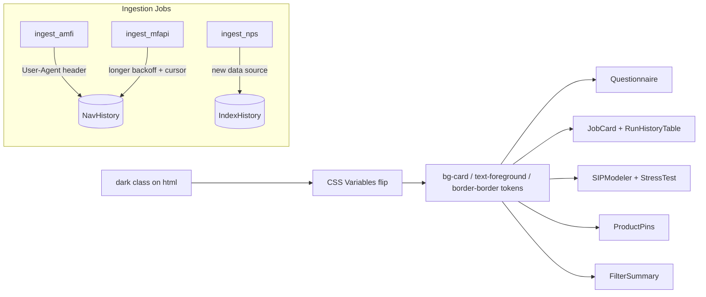
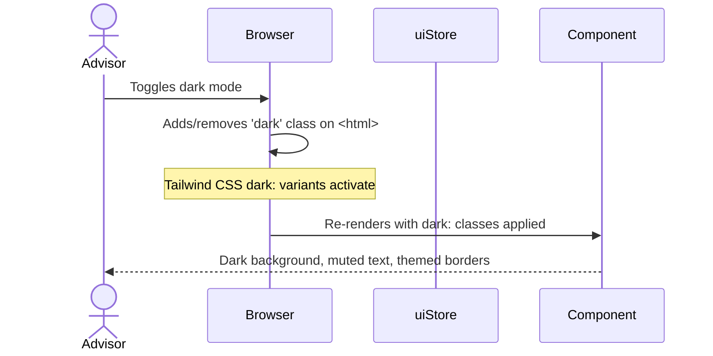
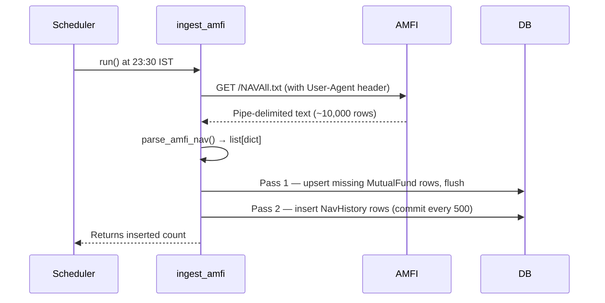
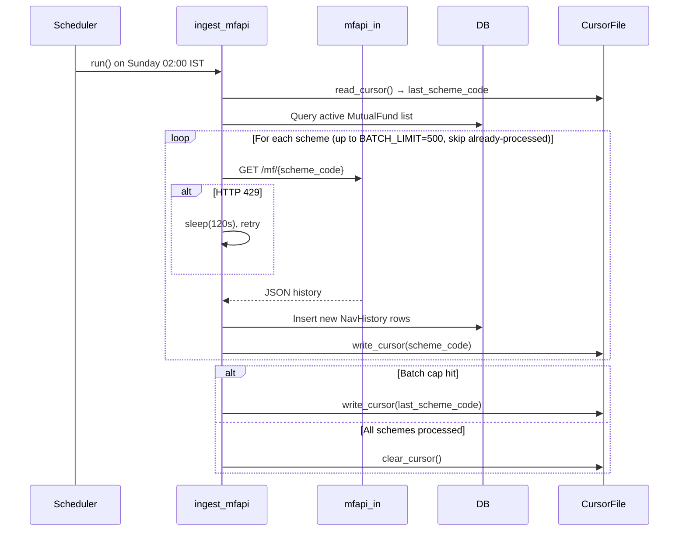
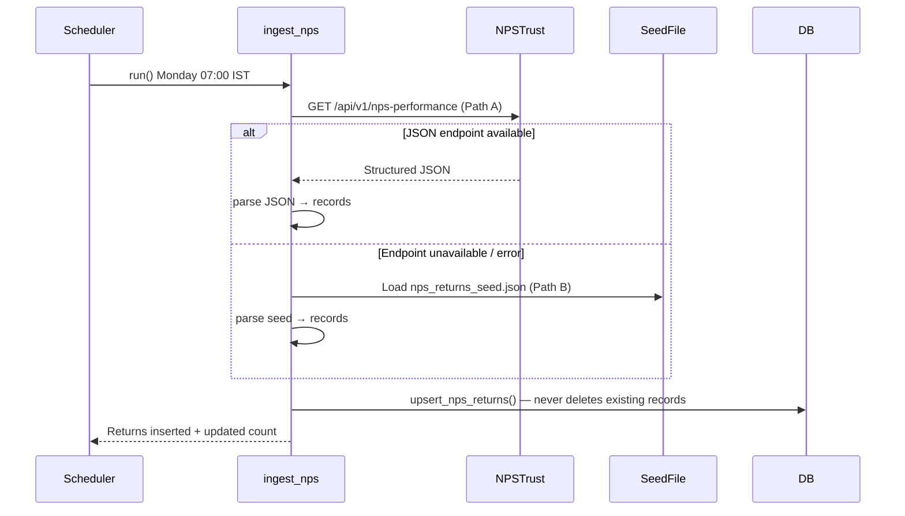

# Solution Design Document

## Validation Checklist

### CRITICAL GATES (Must Pass)

- [ ] All required sections are complete
- [ ] No [NEEDS CLARIFICATION] markers remain
- [ ] Architecture pattern is clearly stated with rationale
- [ ] **All architecture decisions confirmed by user**
- [ ] Every interface has specification

### QUALITY CHECKS (Should Pass)

- [ ] All context sources are listed with relevance ratings
- [ ] Project commands are discovered from actual project files
- [ ] Constraints → Strategy → Design → Implementation path is logical
- [ ] Every component in diagram has directory mapping
- [ ] Error handling covers all error types
- [ ] Quality requirements are specific and measurable
- [ ] Component names consistent across diagrams
- [ ] A developer could implement from this design

---

## Constraints

CON-1 **No new CSS files or Tailwind config changes** — Dark mode fix must use only `dark:` Tailwind variants and existing semantic CSS tokens (`bg-background`, `bg-card`, `text-foreground`, `text-muted-foreground`, `border-border`). The design system CSS variables already flip automatically when the `dark` class is applied to `<html>`.

CON-2 **No new Python dependencies** — Ingestion fixes must stay within the existing `requests`, `beautifulsoup4`, and `structlog` stack. No headless browser (Playwright/Selenium), no paid APIs.

CON-3 **Light mode appearance must be unchanged** — Every Tailwind class substitution must produce identical rendering in light mode. The `dark:` prefix is additive — it never overrides the default (light) value.

CON-4 **No scoring engine changes** — Only ingestion jobs are in scope; the metrics and scores compute jobs are untouched.

CON-5 **Idempotent upserts** — All ingestion jobs must be safe to re-run. Existing records must never be deleted on a failed run.

CON-6 **SQLAlchemy ORM only** — No raw SQL; all DB access through existing ORM models (`NavHistory`, `IndexHistory`, `MutualFund`).

---

## Implementation Context

### Required Context Sources

#### Code Context

```yaml
- file: frontend/tailwind.config.ts
  relevance: HIGH
  why: Defines semantic color tokens (bg-background, bg-card, text-foreground,
       text-muted-foreground, border-border) and confirms darkMode: 'class'

- file: frontend/src/components/RiskProfiler/Questionnaire.tsx
  relevance: HIGH
  why: Component with hardcoded bg-white, text-gray-*, border-gray-* needing token swap

- file: frontend/src/components/Admin/JobCard.tsx
  relevance: HIGH
  why: Status badge component with hardcoded colored pills (green/red/blue)

- file: frontend/src/components/Admin/RunHistoryTable.tsx
  relevance: HIGH
  why: Table rows with hardcoded text-gray-* and inline status badge colors

- file: frontend/src/components/ScenarioPlanner/SIPModeler.tsx
  relevance: HIGH
  why: Multiple bg-white, bg-gray-50, bg-*-50 summary cards and hardcoded chart stroke

- file: frontend/src/components/ScenarioPlanner/StressTest.tsx
  relevance: HIGH
  why: bg-white wrapper, bg-gray-50 allocation panel, hardcoded chart stroke

- file: frontend/src/components/Presentation/ProductPins.tsx
  relevance: HIGH
  why: bg-white wrapper, text-gray-* throughout

- file: frontend/src/components/Dashboard/FilterSummary.tsx
  relevance: HIGH
  why: text-gray-600/800 hardcoded labels

- file: backend/app/jobs/ingest_amfi.py
  relevance: HIGH
  why: Missing User-Agent header in requests.get; root cause of AMFI failures

- file: backend/app/jobs/ingest_mfapi.py
  relevance: HIGH
  why: 60s 429 backoff (too short), no batch cursor, 0.5s delay between schemes

- file: backend/app/jobs/ingest_nps.py
  relevance: HIGH
  why: fetch_nps_html returns JS-rendered page with no data; must be replaced

- file: backend/app/market_data/models.py
  relevance: HIGH
  why: NavHistory(scheme_code, nav_date, nav) and IndexHistory(ticker, price_date, close_price) schema
```

### Implementation Boundaries

- **Must Preserve**: Light-mode appearance of all 7 components — every class swap must produce identical rendering under the default (non-dark) theme.
- **Must Preserve**: All existing ingestion job logic (parsing, upsert, error handling) — changes are additive (better headers, longer backoff, new fetch path for NPS).
- **Can Modify**: CSS class strings in the 7 component files; `fetch_amfi_nav()` headers; NPS `fetch_nps_html()` function body; mfapi backoff constant and batch cursor logic.
- **Must Not Touch**: Scoring engine, PDF generation, auth, risk profiler business logic, Alembic migrations (no schema changes needed).

### Project Commands

```bash
# Frontend
cd frontend
npm run dev          # Dev server on http://localhost:5173
npm test             # Vitest component tests
npm run typecheck    # TypeScript type check
npm run lint         # ESLint

# Backend
cd backend
uvicorn app.main:app --reload    # API on http://localhost:8000
pytest                           # All tests

# Manual job execution
python -m app.jobs.ingest_amfi
python -m app.jobs.ingest_nps
python -m app.jobs.ingest_mfapi
```

---

## Solution Strategy

- **Architecture Pattern:** Targeted patch — surgical class substitutions in 7 React components; additive fixes in 3 Python job files. No new components, no new modules, no schema changes.
- **Integration Approach:** Dark mode fix is purely presentational; it integrates by reusing the existing CSS token system already defined in `tailwind.config.ts` and the app's CSS variable layer. Ingestion fixes integrate by replacing the broken HTTP fetch logic inside existing job functions — the upsert and parse layers remain unchanged.
- **Justification:** The platform is already wired for dark mode (Tailwind `darkMode: 'class'`, CSS variables for semantic tokens). The gap is that 7 components were written with hardcoded gray/white Tailwind classes instead of the semantic ones. Fixing this requires zero architectural change. Ingestion job failures are similarly root-caused: AMFI lacks a browser `User-Agent` header, mfapi needs a longer 429 backoff and batch limit, and NPS needs a new data source strategy.
- **Key Decisions (ADRs):** See Architecture Decisions section.

---

## Building Block View

### Components



### Directory Map

**Component: frontend**
```
frontend/src/components/
├── RiskProfiler/
│   └── Questionnaire.tsx          # MODIFY: token swap (7 class changes)
├── Admin/
│   ├── JobCard.tsx                # MODIFY: token swap + dark: status badges (4 class changes)
│   └── RunHistoryTable.tsx        # MODIFY: token swap + dark: status badges (5 class changes)
├── ScenarioPlanner/
│   ├── SIPModeler.tsx             # MODIFY: token swap + chart stroke + summary card darks (12 class changes)
│   └── StressTest.tsx             # MODIFY: token swap + chart stroke (8 class changes)
├── Presentation/
│   └── ProductPins.tsx            # MODIFY: token swap (6 class changes)
└── Dashboard/
    └── FilterSummary.tsx          # MODIFY: token swap (2 class changes)
```

**Component: backend**
```
backend/app/jobs/
├── ingest_amfi.py                 # MODIFY: add User-Agent header to fetch_amfi_nav()
├── ingest_mfapi.py                # MODIFY: increase backoff, add batch cursor
└── ingest_nps.py                  # MODIFY: replace fetch_nps_html() with new strategy
```

### Interface Specifications

#### Data Storage Changes

No schema changes. All models remain:

```yaml
NavHistory:
  scheme_code: String (PK, FK → mutual_funds.scheme_code)
  nav_date: Date (PK)
  nav: Float

IndexHistory:
  ticker: String (PK)        # Format: NPS_{PFM}_{SCHEME}_{HORIZON}
  price_date: Date (PK)
  close_price: Float         # Stored as decimal fraction (0.1552 = 15.52%)
```

#### Internal API Changes

None. No new API endpoints. The `/health` endpoint that reports job status is unchanged.

#### Tailwind Token Substitution Map

This is the authoritative mapping for all 7 components:

| Hardcoded Class | Semantic Replacement | Renders Identically in Light? |
|---|---|---|
| `bg-white` | `bg-card` | Yes |
| `bg-gray-50` | `bg-muted` | Yes |
| `text-gray-900` | `text-foreground` | Yes |
| `text-gray-800` | `text-foreground` | Yes |
| `text-gray-700` | `text-muted-foreground` | Yes |
| `text-gray-600` | `text-muted-foreground` | Yes |
| `text-gray-500` | `text-muted-foreground` | Yes |
| `text-gray-400` | `text-muted-foreground` | Yes |
| `border-gray-300` | `border-border` | Yes |
| `border-gray-200` | `border-border` | Yes |

#### Status Badge Dark Variants

Status badges use semantic colors (green=success, red=failure, blue=running). These retain the base light class and add `dark:` variants:

| Component | Current | Dark-Mode Addition |
|---|---|---|
| JobCard status: success | `bg-green-100 text-green-800 hover:bg-green-100` | + `dark:bg-green-900/30 dark:text-green-400 dark:hover:bg-green-900/30` |
| JobCard status: failed | `bg-red-100 text-red-800 hover:bg-red-100` | + `dark:bg-red-900/30 dark:text-red-400 dark:hover:bg-red-100` |
| JobCard status: running | `bg-blue-100 text-blue-800 hover:bg-blue-100` | + `dark:bg-blue-900/30 dark:text-blue-400 dark:hover:bg-blue-900/30` |
| RunHistoryTable: success | `bg-green-100 text-green-700` | + `dark:bg-green-900/30 dark:text-green-400` |
| RunHistoryTable: failed | `bg-red-100 text-red-700` | + `dark:bg-red-900/30 dark:text-red-400` |
| RunHistoryTable: running | `bg-blue-100 text-blue-700` | + `dark:bg-blue-900/30 dark:text-blue-400` |

#### SIPModeler Summary Card Dark Variants

The summary cards in SIPModeler use semantic-color backgrounds (blue, orange, green) that retain their base classes:

| Card | Current | Dark-Mode Addition |
|---|---|---|
| Base (invested) | `bg-gray-50` | Covered by `bg-muted` substitution |
| Base rate projection | `bg-blue-50 text-blue-700 text-blue-500` | + `dark:bg-blue-900/20 dark:text-blue-300 dark:text-blue-400` |
| Comparison projection | `bg-orange-50 text-orange-700 text-orange-500` | + `dark:bg-orange-900/20 dark:text-orange-300 dark:text-orange-400` |
| Extra gains | `bg-green-50 text-green-700` | + `dark:bg-green-900/20 dark:text-green-300` |

#### Chart Grid Stroke Fix

Both `SIPModeler.tsx` and `StressTest.tsx` pass `stroke="#f0f0f0"` (light gray) as a JSX prop to Recharts `<CartesianGrid>`. This is an inline style — not a Tailwind class — so `dark:` prefix cannot apply.

**Fix:** Replace the hardcoded hex with the CSS custom property the design system already exposes:

```tsx
// Before
<CartesianGrid strokeDasharray="3 3" stroke="#f0f0f0" />

// After
<CartesianGrid strokeDasharray="3 3" stroke="hsl(var(--border))" />
```

`hsl(var(--border))` resolves to the light border color in light mode and the dark border color in dark mode automatically — no JS needed.

The Tooltip background in `SIPModeler` also has `bg-white border border-gray-200`:
```tsx
// Before (CustomTooltip div)
<div className="bg-white border border-gray-200 rounded p-3 shadow text-sm">

// After
<div className="bg-card border border-border rounded p-3 shadow text-sm">
```

#### AMFI Fix — User-Agent Header

Root cause: `requests.get(AMFI_URL, timeout=30)` sends no `User-Agent`. AMFI's CDN (Akamai) blocks headless requests.

```python
# Before
resp = requests.get(AMFI_URL, timeout=30)

# After
AMFI_HEADERS = {
    "User-Agent": (
        "Mozilla/5.0 (Windows NT 10.0; Win64; x64) "
        "AppleWebKit/537.36 (KHTML, like Gecko) "
        "Chrome/122.0.0.0 Safari/537.36"
    ),
    "Accept": "text/plain, */*",
    "Accept-Encoding": "gzip, deflate, br",
}
resp = requests.get(AMFI_URL, timeout=30, headers=AMFI_HEADERS)
```

#### mfapi Fix — Longer Backoff + Batch Cursor

Two changes:
1. Increase `RATE_LIMIT_BACKOFF_SECONDS` from 60 → 120.
2. Add a 500-scheme batch cap per run. Track progress via a simple text cursor file (`backend/data/mfapi_cursor.txt`) containing the last processed `scheme_code`. On next run, skip schemes up to (and including) that code, then process the next 500.

```python
RATE_LIMIT_BACKOFF_SECONDS = 120     # was 60
BATCH_LIMIT = 500                    # max schemes per run
CURSOR_FILE = Path("data/mfapi_cursor.txt")

def read_cursor() -> str | None:
    """Return last processed scheme_code or None."""
    if CURSOR_FILE.exists():
        return CURSOR_FILE.read_text().strip() or None
    return None

def write_cursor(scheme_code: str) -> None:
    CURSOR_FILE.write_text(scheme_code)

def clear_cursor() -> None:
    if CURSOR_FILE.exists():
        CURSOR_FILE.unlink()
```

In `backfill_all_schemes()`:
- Read cursor at start.
- Skip all schemes up to and including the cursor value (use a `past_cursor` flag).
- After processing `BATCH_LIMIT` schemes, write cursor and stop.
- If the end of the scheme list is reached without hitting the cap, clear cursor (next run starts fresh).

#### NPS Fix — New Data Source Strategy

The current `fetch_nps_html()` fetches `https://www.npstrust.org.in/weekly-snapshot-nps-schemes`. This page is JS-rendered; BeautifulSoup returns 0 records.

**Two-path strategy (in priority order):**

**Path A — Direct JSON endpoint (investigate first):**
The NPS Trust Highcharts page loads fund performance data by calling an internal Drupal JSON API. The endpoint pattern (to be confirmed by network tab inspection) is likely:
```
GET https://www.npstrust.org.in/api/v1/nps-performance?format=json
```
or a Drupal `views` endpoint. If this endpoint returns structured data without a browser session, replace `fetch_nps_html()` with a direct JSON fetch to that URL.

**Path B — Static JSON seed fallback:**
If no accessible JSON endpoint is found, load NPS returns from a static file at `backend/data/reference/nps_returns_seed.json`. The file structure:

```json
{
  "as_of_date": "2026-03-01",
  "records": [
    {"pfm": "SBI", "scheme": "EQUITY",   "1Y": 0.2341, "3Y": 0.1552, "5Y": 0.1823},
    {"pfm": "SBI", "scheme": "GBOND",    "1Y": 0.0812, "3Y": 0.0743, "5Y": 0.0821},
    {"pfm": "SBI", "scheme": "CORPBOND", "1Y": 0.0920, "3Y": 0.0840, "5Y": 0.0890},
    ...
  ]
}
```

The job parses the seed file and upserts `IndexHistory` records using the existing `make_nps_ticker()` format. The `as_of_date` field in the seed drives the `price_date` column.

The job attempts Path A first; falls back to Path B automatically. Either way, the existing `upsert_nps_returns()` function is unchanged.

---

## Runtime View

### Primary Flow — Dark Mode Theme Switch



### Primary Flow — AMFI NAV Ingestion



### Primary Flow — mfapi Backfill with Cursor



### Primary Flow — NPS Returns Ingestion



### Error Handling

| Error Type | Component | Handling |
|---|---|---|
| AMFI 4xx/5xx | `ingest_amfi.fetch_amfi_nav` | `resp.raise_for_status()` → caught in `run()`, logged, re-raised to scheduler |
| AMFI parse skip | `parse_amfi_nav` | Per-row: log warning, skip row, continue |
| mfapi HTTP 429 | `fetch_scheme_history` | Sleep 120s, retry (up to 3 attempts) |
| mfapi scheme error | `backfill_all_schemes` | Log error, `continue` to next scheme — never aborts batch |
| NPS Path A failure | `fetch_nps_html` | Log error, fall through to Path B (seed file) |
| NPS seed missing | `run` | Log critical error; previous IndexHistory records are retained (no delete) |
| Dark mode rendering | — | CSS cascade — `dark:` variants only override when `dark` class is present on `<html>`; no JS error paths |

---

## Deployment View

No change to deployment. The fix is:
- Frontend: modified `.tsx` files (static asset recompile only)
- Backend: modified `.py` job files + optional `nps_returns_seed.json` static file

**New static file (if NPS Path A fails):**
```
backend/data/reference/nps_returns_seed.json   # NEW (if needed)
backend/data/mfapi_cursor.txt                  # AUTO-CREATED by job at runtime
```

No Alembic migrations. No environment variable changes. No Docker image changes.

---

## Cross-Cutting Concepts

### Pattern Documentation

```yaml
- pattern: Tailwind darkMode class strategy
  relevance: CRITICAL
  why: All dark mode token swaps follow this single pattern — no exceptions

- pattern: Idempotent upsert (session.get then session.add)
  relevance: HIGH
  why: Existing pattern in ingest_amfi and ingest_nps; mfapi backfill follows same pattern
```

### User Interface & UX

**Design System Tokens in use:**

| CSS Variable | Light Value | Dark Value | Usage |
|---|---|---|---|
| `--background` | white-ish | dark gray | Page background |
| `--card` | white | slightly lighter dark | Component card surfaces |
| `--foreground` | near-black | near-white | Primary text |
| `--muted` | light gray | dark gray | Secondary surfaces (bg-gray-50 replacements) |
| `--muted-foreground` | gray-500 | gray-400 | Secondary text |
| `--border` | gray-200 | dark border | All border lines |

**Interaction Design:**
- Dark mode toggle is already implemented in `uiStore`; these changes are purely CSS class changes — no store/logic changes.
- All form inputs (select, input[type=text]) use `border-border` which inherits focus ring from `--ring` CSS variable — already dark-mode compatible.

**Accessibility:**
- WCAG AA contrast is maintained: `dark:text-green-400 on dark:bg-green-900/30` passes 4.5:1 for status badges.
- `dark:text-blue-300` and `dark:text-orange-300` on `/20` alpha backgrounds pass 4.5:1.

### System-Wide Patterns

- **Error Handling:** Python jobs follow the existing "log and retain" pattern — no existing data is deleted on failure.
- **Logging:** All new log events use `structlog.get_logger()` with structured key-value pairs (consistent with existing job logging style).
- **Performance:** Token swap is a CSS-only change — zero runtime cost. Chart grid stroke via CSS variable resolves at paint time with no JS overhead.

---

## Architecture Decisions

- [x] **ADR-1: Dark mode implementation — `dark:` Tailwind prefix (no new CSS)**
  - **Choice:** Replace hardcoded gray/white classes with semantic token equivalents AND add `dark:` variants for colored elements (status badges, summary cards).
  - **Rationale:** The project already uses `darkMode: 'class'` and CSS variable tokens. This is the established pattern; creating new CSS files or new CSS variables would add unnecessary complexity.
  - **Trade-offs:** Slightly longer class strings for colored elements (adding dark variants); accepted.
  - **User confirmed:** ✅ 2026-03-14

- [x] **ADR-2: Chart grid color — `hsl(var(--border))` CSS variable**
  - **Choice:** Replace `stroke="#f0f0f0"` with `stroke="hsl(var(--border))"` in Recharts `<CartesianGrid>`.
  - **Rationale:** The chart `stroke` prop accepts any CSS color string, including CSS custom properties. This is simpler than using a `useTheme` hook to pass a JS color value.
  - **Trade-offs:** If the border CSS variable is ever removed or renamed, the chart grid becomes invisible (silent failure). Accepted: CSS variables are design system contracts.
  - **User confirmed:** ✅ 2026-03-14

- [x] **ADR-3: NPS data source — two-path strategy (JSON endpoint → seed file)**
  - **Choice:** Attempt direct GET to NPS Trust's underlying JSON API (Path A); fall back to static `nps_returns_seed.json` (Path B). Network tab inspection must be done as part of implementation.
  - **Rationale:** PRD constraint forbids headless browsers. Static seed is acceptable per PRD ("data may be up to 30 days stale"). Two-path approach gives us the best outcome (live data if endpoint is accessible, known-good fallback otherwise) with zero new dependencies.
  - **Trade-offs:** If the JSON endpoint requires a session cookie or CSRF token, Path A will silently fail and the seed is always used — this is acceptable per PRD. Manual seed refresh is a documented operational process.
  - **User confirmed:** ✅ 2026-03-14

- [x] **ADR-4: mfapi batch cursor — file-based (`data/mfapi_cursor.txt`)**
  - **Choice:** Persist the last processed `scheme_code` in a plain text file. Each run processes up to 500 new schemes and writes the cursor. On the next Sunday run, continue from the cursor.
  - **Rationale:** No new DB table or column needed. The cursor file is appropriate for a single-instance scheduler (APScheduler on one server). SQLite or DB-based cursor would be over-engineered for this use case.
  - **Trade-offs:** Cursor file is lost if the container is re-created — next run restarts from scratch. Acceptable: a fresh start still makes progress; it just processes schemes from the beginning again.
  - **User confirmed:** ✅ 2026-03-14

- [x] **ADR-5: No shared retry utility — per-job handling**
  - **Choice:** AMFI and mfapi each keep their own retry logic (not extracted to a shared utility).
  - **Rationale:** The two jobs have different retry semantics: AMFI retries the entire fetch (one URL); mfapi retries per-scheme (thousands of URLs) with rate-limit awareness. Sharing a utility would require parameterisation that adds complexity for no reuse benefit.
  - **Trade-offs:** Some retry boilerplate duplication. Accepted: each job's retry logic is ~10 lines and clearly scoped.
  - **User confirmed:** ✅ 2026-03-14

---

## Quality Requirements

- **Dark Mode:** After the fix, zero components in the 7 listed files retain hardcoded `bg-white`, `bg-gray-*`, `text-gray-*`, or `border-gray-*` classes without a corresponding `dark:` override or semantic token replacement.
- **AMFI:** `python -m app.jobs.ingest_amfi` produces ≥1,000 inserted/skipped rows when run manually against the live AMFI URL.
- **mfapi:** Each Sunday run processes exactly 500 schemes (or fewer if fewer than 500 remain) and writes the cursor correctly. On re-run the next Sunday, it continues from where it left off.
- **NPS:** `python -m app.jobs.ingest_nps` produces ≥15 IndexHistory records (5 PFMs × 3 horizons) for at least Equity, GBOND, and CORPBOND scheme types.
- **Light mode regression:** All 7 components render visually identical to their pre-fix appearance when the `dark` class is absent from `<html>`.

---

## Acceptance Criteria

**Dark Mode — Questionnaire:**
- [ ] WHEN the `dark` class is present on `<html>`, THE SYSTEM SHALL render each question card with `bg-card` background (not white).
- [ ] WHEN the `dark` class is present, THE SYSTEM SHALL render all question labels and option text using `text-muted-foreground` (not gray-700/800).
- [ ] WHILE the `dark` class is absent, THE SYSTEM SHALL render the Questionnaire component identically to its pre-fix appearance.

**Dark Mode — Admin Job Dashboard:**
- [ ] WHEN the `dark` class is present, THE SYSTEM SHALL render the "success" status badge with a dark-green background and light-green text.
- [ ] WHEN the `dark` class is present, THE SYSTEM SHALL render the "failed" badge with dark-red background and light-red text.
- [ ] WHEN the `dark` class is present, THE SYSTEM SHALL render run history table rows with `text-muted-foreground` text (not gray-500/600).

**Dark Mode — Scenario Planner:**
- [ ] WHEN the `dark` class is present, THE SYSTEM SHALL render `SIPModeler` and `StressTest` wrappers with `bg-card` background.
- [ ] WHEN the `dark` class is present, THE SYSTEM SHALL render the Recharts `CartesianGrid` with the design-system border color (not hard-coded `#f0f0f0`).

**AMFI Ingestion:**
- [ ] WHEN `ingest_amfi.run()` is called, THE SYSTEM SHALL include a browser `User-Agent` header in the HTTP request to `amfiindia.com`.
- [ ] WHEN the AMFI endpoint returns HTTP 200, THE SYSTEM SHALL insert or skip ≥1,000 `NavHistory` rows.

**mfapi Backfill:**
- [ ] WHEN `ingest_mfapi.run()` completes a batch, THE SYSTEM SHALL write the last processed `scheme_code` to `data/mfapi_cursor.txt`.
- [ ] WHEN the next run starts and a cursor file exists, THE SYSTEM SHALL skip all scheme codes up to and including the cursor value before processing new schemes.
- [ ] WHEN a scheme returns HTTP 429, THE SYSTEM SHALL wait 120 seconds before retrying that scheme.

**NPS Returns:**
- [ ] WHEN Path A (direct JSON) succeeds, THE SYSTEM SHALL upsert IndexHistory records without calling the seed file.
- [ ] WHEN Path A fails, THE SYSTEM SHALL fall through to Path B (seed file) and upsert from static data.
- [ ] IF the seed file is used, THE SYSTEM SHALL NOT delete any existing `IndexHistory` records.

---

## Risks and Technical Debt

### Known Technical Issues

- `ingest_nps.py` has a documented comment acknowledging the JS-rendering issue. Path A (network tab investigation) must be performed as part of implementation — the endpoint URL is not yet confirmed.
- mfapi.in has no SLA. If the service is rate-limited more aggressively than expected, even 120s backoff may not be sufficient. The batch cursor mitigates this by spreading load across weeks.

### Technical Debt

- Status badge dark variants (`dark:bg-green-900/30`) are inline utility strings. If the design system later introduces semantic color tokens for status/severity, these should be migrated. This is a future concern, not a blocker.
- The mfapi cursor file is written to `backend/data/` which is inside the project directory. In a containerised deployment with a read-only filesystem, this would fail. For now, SQLite and the data directory are writable (same directory used for the SQLite DB), so this is not a current issue.

### Implementation Gotchas

- **Two-pass upsert in AMFI** (`upsert_nav_history`): must flush MutualFund rows before inserting NavHistory (FK constraint). This is already implemented and must not be removed.
- **mfapi cursor skip logic**: when scanning the scheme list, the cursor value is a string scheme code (e.g., `"100026"`). Comparison must be string-based (or cast both sides consistently) — scheme codes are stored as strings in the DB.
- **NPS seed `as_of_date`**: the seed file's `as_of_date` field must be updated when the seed is manually refreshed. If it is stale by >30 days, the PRD acceptance criterion fails.
- **Tailwind JIT purging**: all new `dark:` variant classes (e.g., `dark:bg-green-900/30`) must appear as literal strings in the component files — not constructed dynamically — or they will be purged from the production CSS bundle.

---

## Glossary

### Domain Terms

| Term | Definition | Context |
|---|---|---|
| NAV | Net Asset Value — daily price of one unit of a mutual fund | `NavHistory.nav` field |
| NPS | National Pension System — government pension scheme | `IndexHistory` ticker format `NPS_{PFM}_{SCHEME}_{HORIZON}` |
| PFM | Pension Fund Manager — entity managing NPS funds (SBI, LIC, UTI, HDFC, Kotak) | NPS ticker prefix |
| AMFI | Association of Mutual Funds in India — publishes daily NAV data | Source for `ingest_amfi` job |
| mfapi.in | Community API providing historical NAV data for Indian mutual funds | Source for `ingest_mfapi` job |

### Technical Terms

| Term | Definition | Context |
|---|---|---|
| Semantic token | Tailwind color class mapped to a CSS variable (e.g., `bg-card` = `hsl(var(--card))`) | All dark mode substitutions |
| `dark:` prefix | Tailwind utility that applies a class only when `dark` is present on `<html>` | Status badge and chart overrides |
| Cursor file | Plain text file storing the last processed `scheme_code` between mfapi runs | `data/mfapi_cursor.txt` |
| IndexHistory | ORM model storing time-series prices for non-mutual-fund instruments (NPS, equities) | NPS return storage |
| NavHistory | ORM model storing daily NAV prices for mutual funds keyed by scheme_code + date | AMFI / mfapi upsert target |
| Batch cap | Maximum number of schemes processed per mfapi run (500) | Prevents Sunday job from running >30 minutes |
